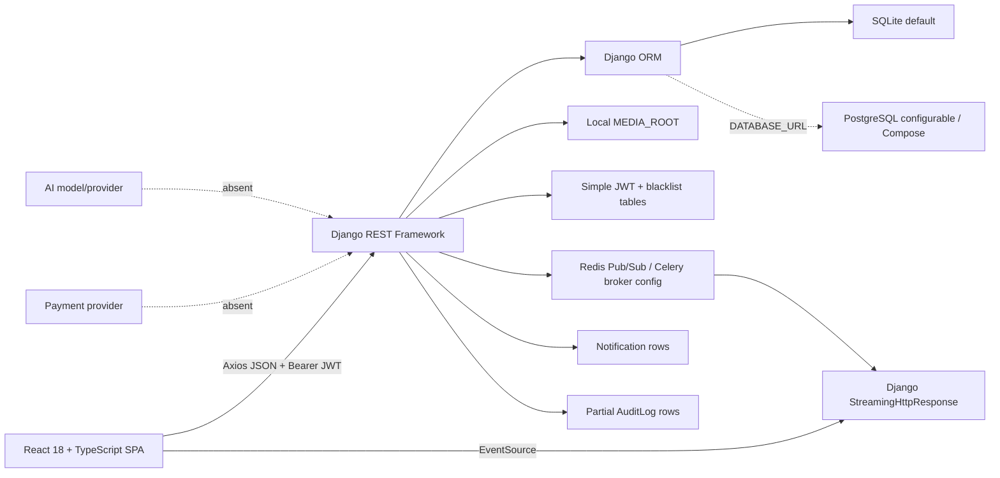
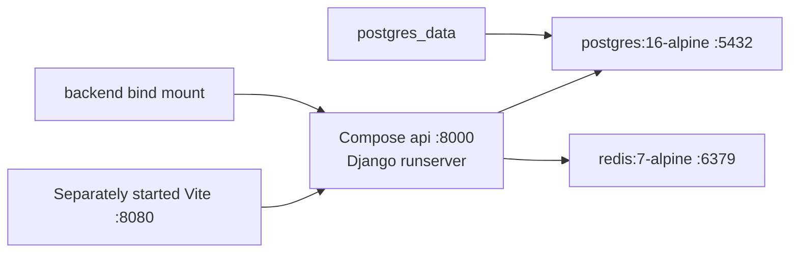

# Complete Sahmi System Knowledge

**Evidence date:** 25 July 2026  
**Evidence base:** current non-generated working tree, including uncommitted changes  
**Branch / HEAD:** `feature/backend-messaging-security-hardening` / `7a6cb1e57eb76c6fecfde015a1097c41ac69f6d3`  
**Claim boundary:** source-level implementation and recorded local evidence only; no production, payment, legal, security-certification, or user-acceptance claim

This is the implementation briefing for a writer without repository access. The working tree—not older project prose—is authoritative. Evidence paths are repository-relative.

## 1. System summary

Sahmi is a separated React single-page application and Django REST API. It currently implements:

- public browsing of active, verified, non-deleted project records;
- investor and entrepreneur registration, JWT login, refresh rotation, logout, profile/language/password actions, and password-reset code;
- English/Arabic resources and LTR/RTL document direction;
- entrepreneur project submission, editing, and soft deletion;
- staff project moderation and broad staff administration;
- internal pending/confirmed/canceled/completed investment records;
- calculation of project funding totals from confirmed records;
- Redis Pub/Sub and Server-Sent Events (SSE) for a confirmed-investment event;
- milestone and repayment record APIs;
- role-oriented dashboards based partly on real API data;
- participant-scoped persistent direct messaging;
- persistent in-app notifications and preferences;
- partial audit logging; and
- OpenAPI/Swagger and backend Docker artifacts.

Sahmi does not implement real payment processing, banking, settlement, refunds, escrow, disbursement, receipts, legal investment ownership, complete KYC, AI execution, production hosting, CI/CD, verified email notifications, or measured user/social/economic outcomes.

## 2. Repository structure and component connections

| Area | Purpose | Principal evidence |
|---|---|---|
| `src/` | React pages, components, hooks, i18n, API services, and frontend tests | `src/App.tsx`, `src/services/`, `src/pages/`, `src/test/` |
| `public/` | logos, hero image, favicon, robots file, one image named as a screenshot | `public/` |
| root frontend configuration | Vite, TypeScript, Tailwind, Vitest, ESLint, Playwright stubs | `package.json`, `vite.config.ts`, `vitest.config.ts`, `tailwind.config.ts`, `playwright.config.ts` |
| `backend/apps/users/` | custom account model, JWT/account/password APIs, staff user administration | models, serializers, views, tests |
| `backend/apps/projects/` | categories, projects, files, public/private serialization, moderation | models, serializers, views, admin views |
| `backend/apps/investments/` | investments, milestones, repayments, totals, Redis publication | models, serializers, views, services, signals |
| `backend/apps/messaging/` | conversations, participants, messages, participant actions | models, serializers, services, views |
| `backend/apps/notifications/` | in-app rows, preferences, read APIs, disabled email task | models, services, views, tasks |
| `backend/apps/audit/` | selected structured audit events and staff read API | models, services, views |
| `backend/apps/core/` | common model, JSON envelope, pagination, exceptions, throttling, admin router | models, renderers, pagination, throttling, `admin_urls.py` |
| `backend/config/` | settings, root routes, Celery, WSGI/ASGI | `settings/`, `urls.py`, `celery.py` |
| `backend/docker-compose.yml` | development API/PostgreSQL/Redis topology | Compose source |
| `docs/` and root documents | SRS, reports, audit, historical logs, OpenAPI snapshot | documentation only; not runtime authority |

Implemented connection:

The frontend defaults to `http://localhost:8000/api/v1/` (`src/services/api.ts:5`). Root backend routes mount auth, projects, investments, messaging, notifications, audit, and staff APIs (`backend/config/urls.py:7-18`). Django does not serve the React SPA.

## 3. Verified technology stack and versions

### 3.1 Frontend

Versions below were declared/locked and were also observed by the completed audit without installing packages:

| Technology | Version | Purpose/evidence |
|---|---:|---|
| React / React DOM | 18.3.1 | UI; `package.json:56-58` |
| TypeScript | 5.8.3 | typed frontend; `package.json:89` |
| Vite | 5.4.19 | dev/build; port 8080 at `vite.config.ts:8-11` |
| React Router DOM | 6.30.1 | nested public/protected routes |
| TanStack React Query | 5.83.0 | server state, mutations, polling |
| Axios | 1.15.0 | API/JWT client |
| i18next / react-i18next | 26.3.6 / 17.0.11 | bilingual resources |
| Tailwind CSS | 3.4.17 | styling |
| Radix/shadcn primitives | multiple packages | `src/components/ui/` |
| React Hook Form / Zod | 7.61.1 / 3.25.76 | form support; use varies by page |
| Framer Motion | 12.38.0 | UI animation |
| Recharts | 2.15.4 | dashboard charts |
| Vitest | 3.2.4 | frontend tests |
| Testing Library React | 16.3.2 observed | component tests |
| Playwright test | package declares `^1.57.0`; 1.59.1 observed | config stub only; no E2E cases |
| Node.js / npm | 24.14.1 / 11.11.0 observed | audit machine only; no repository engine pin |

Actual UI tokens use teal primary, blue secondary, amber accent, Inter for LTR, and Tahoma/Arial/optional Noto Sans Arabic fallback in RTL (`src/index.css:1-2,19-28,92-99,125-141`). Several generated design-system files prescribe incompatible purple, gold/dark, or blue palettes; they are not implementation authority.

### 3.2 Backend and services

Python dependencies use ranges rather than a lock. Local observations describe the audit environment only:

| Technology | Repository declaration | Observed local | Purpose/qualification |
|---|---|---:|---|
| Python | Docker `python:3.13-slim` | 3.14.4 | local/container differ |
| Django | `>=4.2,<5.3` | 5.2.16 | framework/ORM |
| Django REST Framework | `>=3.14,<3.16` | 3.15.2 | REST API |
| Simple JWT | `>=5.3,<6` | 5.5.1 | bearer JWT, rotation, blacklist |
| django-cors-headers | `>=4.4,<5` | 4.9.0 | origin allow-list |
| django-filter | `>=24.3` | 26.1 | API filters |
| drf-spectacular | `>=0.27,<0.28` | 0.27.2 | OpenAPI/Swagger |
| psycopg | `>=3.2,<4` | 3.3.4 | PostgreSQL driver |
| Pillow | `>=10.4,<11` | 12.2.0 | local environment violates declared upper bound |
| Celery | `>=5.4,<6` | 5.6.3 | configured; no active email workflow/Compose worker |
| Redis client | `>=5,<6` | 5.3.1 | Pub/Sub and broker |
| Gunicorn | `>=23,<24` | 23.0.0 | Dockerfile default process |
| PostgreSQL server | `postgres:16-alpine` | not run in audit | Compose only |
| Redis server | `redis:7-alpine` | not run in audit | Compose only |
| SQLite | default `DATABASE_URL` | database file exists but data not inspected | development default |

## 4. Users, roles, and authority

### 4.1 Role concepts

| Role | Stored representation | Intended use | Important qualification |
|---|---|---|---|
| Visitor | no authenticated user | public pages/projects/register/login | Public SSE currently exposes more than it should |
| Investor | `User.user_type="investor"` | record intended investment, own ledger/dashboard/messages/settings | Backend investment creation currently accepts any authenticated role |
| Entrepreneur | `User.user_type="entrepreneur"` | submit/manage own projects and see related records | Can currently create an investment because backend role restriction is absent |
| Staff/admin | Django `is_staff=True`; often `user_type="admin"` | moderation and `/api/v1/admin/*` | `is_staff` is the authority; `user_type=admin` alone is not |
| Superuser | Django `is_superuser=True` | Django/admin-level authority | Created/managed only through privileged paths |

The custom model deliberately no longer converts `user_type=admin` into staff inside `User.save()` (`backend/apps/users/models.py:62-73`). Public registration accepts only investor/entrepreneur (`users/serializers.py:68-77`), and the profile API makes role/staff/KYC/aggregate fields read-only (`users/serializers.py:13-29`; `users/views.py:147-179`).

### 4.2 Backend authority summary

- Public categories are readable; writes require staff.
- Public projects are active, verified, and non-deleted.
- An owner can retrieve a non-public own project; staff can retrieve all.
- Project creation requires entrepreneur or staff.
- Normal project updates/deletion require owner or staff; normal deletion is soft.
- Moderation actions require staff.
- Investment list/detail querysets are relation-scoped, but creation is any authenticated user.
- Investor owners can currently update/delete own investment records even after confirmation.
- Dedicated confirm is staff-only; dedicated cancel is pending-owner/staff.
- Milestones are staff/project-owner scoped.
- Repayments are staff/related investor/project-owner scoped.
- Conversation/message access is participant-scoped; staff has no automatic override.
- Notification rows/preferences are owner-scoped.
- Audit-log read API and all `/api/v1/admin/*` routes require staff.
- Frontend route protection is navigation convenience, not an authorization boundary.

## 5. Complete feature inventory

| Feature | Primary role | Status | Repository evidence | Exact qualification |
|---|---|---|---|---|
| Public landing/navigation | Visitor | **Verified and implemented** | `src/App.tsx:89-106`; `HomePage.tsx`; navbar/footer | Marketing metrics are hard-coded, not platform evidence |
| Homepage featured projects | Visitor | **Verified and implemented** | `HomePage.tsx`; `projectsService.listProjects` | Real API cards; surrounding counts/testimonials are not verified outcomes |
| Public project browse/search/filter/order | Visitor | **Verified and implemented** | `BrowseProjects.tsx`; `projectsService.ts:135`; `ProjectViewSet`/`ProjectFilter` | Backend filters public records to active+verified+non-deleted |
| Public project detail | Visitor | **Verified and implemented** | `ProjectDetails.tsx`; `projects/views.py:48-103`; `PublicProjectSerializer` | Public serializer minimizes owner/files; view count increments on each eligible retrieval |
| Recent confirmed-payment display | Authenticated user | **Partially implemented** | `ProjectDetails.tsx`; `projects/views.py:257-284` | Internal records only; any authenticated user can query any known non-deleted project slug; PII issue |
| Confirmed-investment live SSE | Visitor | **Partially implemented** | `ProjectDetails.tsx:73-180`; `projects/views.py:286-326`; `investments/services.py:39-79` | Public, includes investor name/amount/method, permits private-slug probing; Redis not operationally verified |
| Static project updates/team/FAQ/transparency copy | Visitor | **Frontend-only/static** | tabs in `ProjectDetails.tsx` | Not backed by dedicated update/review/team models |
| Category read | Visitor | **Verified and implemented** | category router/viewset/serializer | Public |
| Category management | Staff | **Verified and implemented** | normal staff writes; admin category page/service | Protected delete may return conflict |
| Registration | Visitor | **Verified and implemented** | `RegisterPage.tsx`; `RegisterView`; `RegisterSerializer` | Returns tokens at API level, but frontend registration redirects to login rather than entering authenticated state |
| Login/me/logout | User | **Verified and implemented** | `authService.ts`; `users/views.py` | JWT bearer; logout blacklists submitted refresh |
| JWT refresh rotation/blacklist | User | **Verified and implemented** | `settings/base.py:102-109`; `api.ts:105-142` | Frontend has no refresh single-flight; tokens in local storage |
| Profile update | User | **Verified and implemented** | `SettingsPage`; `MeView`; `UserSerializer` | Only permitted fields; avatar/KYC/email behavior is incomplete |
| Preferred language persistence | User/visitor | **Verified and implemented** | `src/i18n/index.ts`; `LanguageSwitcher.tsx`; `User.preferred_language` | Visitor uses local storage; authenticated switch attempts profile persistence |
| English/Arabic and RTL/LTR | All | **Partially implemented** | locale JSON, i18n config, `index.css:125-141` | Principal flows covered; complete translation/native review `[NOT VERIFIED]` |
| Password change | User | **Verified and implemented** | `SettingsPage.tsx`; `PasswordChangeSerializer/View` | Existing access JWTs are not explicitly revoked immediately |
| Password-reset request/confirm | Visitor | **Configured but not operationally verified** | forgot/reset pages; `users/views.py:193-258`; SMTP settings | Code/tests exist; actual delivery not verified and console backend produces no real mail |
| 2FA | User | **Frontend-only or mocked** | `SettingsPage.tsx` security UI | No backend secret, challenge, recovery-code, or verification API |
| Device sessions/revocation | User | **Frontend-only or mocked** | hard-coded settings device list | No session model/API |
| Login history/recovery email | User | **Frontend-only or mocked** | hard-coded Settings rows/fields | Includes fictional IP/timestamp/“Password + 2FA” values |
| Role-protected client routes | User/staff | **Verified and implemented** | `ProtectedRoute.tsx`; `App.tsx:53-105` | Backend remains authoritative |
| Project submission wizard | Entrepreneur/staff | **Verified and implemented** | `StartProject.tsx`; `ProjectViewSet.perform_create`; multipart serializer | Creates owned draft/unverified record; terms checkbox is not persisted legal consent |
| Project edit | Owner/staff | **Verified and implemented** | `EditProject.tsx`; project PATCH | Moderation/aggregate fields read-only in normal serializer |
| Project soft deletion | Owner/staff normal API | **Verified and implemented** | `projects/views.py:137-146`; `deleted_at` | Admin-prefixed REST deletion is hard, creating a policy inconsistency |
| Project moderation normal route | Staff | **Verified and implemented** | `ProjectViewSet.verify/reject/set_status` | Audit, notification, scoped throttle included |
| Project moderation admin-prefixed route | Staff | **Partially implemented** | `projects/admin_views.py:85-139` | Same state changes but omits normal route audit/notifications/throttle |
| Project images/documents | Owner upload fields/staff child CRUD | **Partially implemented** | project model file fields; admin asset panels/viewsets | Local/public media design; no explicit size/MIME/signature/malware/private download/retention controls |
| Internal investment creation | Any authenticated user | **Partially implemented** | `ProjectDetails.tsx`; `InvestmentViewSet.perform_create`; serializer | Not money movement; entrepreneur role allowed; zero amount bypasses minimum check |
| Own/related investment list | Investor/entrepreneur/staff | **Verified and implemented** | `InvestmentViewSet.get_queryset`; dashboards/services | Some UI totals include non-confirmed statuses and may mislabel “paid” |
| Investment cancel | Investor owner/staff | **Verified and implemented** | `/investments/{id}/cancel/` | Pending only |
| Investment confirm | Staff | **Partially implemented** | `/investments/{id}/confirm/`; staff admin finance UI | Internal status only; no provider/receipt proof; admin UI often uses broad CRUD |
| Investment edit/delete | Investor owner/staff | **Backend-only and integrity-defective** | normal viewset update/delete; permission | Investor can alter/delete a confirmed financial record; no correction ledger |
| Funding aggregate | System | **Verified and implemented in source** | `services.get_project_funding_snapshot/sync_project_totals`; signals | Sum/distinct count uses confirmed rows; runtime Redis/DB behavior not rerun in handoff |
| Expected return calculation | System | **Partially implemented** | `Investment.save`, models.py:40-43 | Calculated when falsey at save; can become stale after later amount/ROI changes |
| Milestone records | Project owner/staff API; staff UI | **Partially implemented / backend-oriented** | `MilestoneViewSet`; staff admin page | No entrepreneur-facing workflow; status/release workflow only broad admin |
| Repayment records | Related parties/staff; staff UI | **Partially implemented / backend-oriented** | `RepaymentViewSet`; staff page | Records only; no payment/schedule engine; related parties can author descriptive financial fields |
| Investor dashboard and transaction ledger | Investor | **Verified and implemented with caveats** | investor dashboard/transaction page; investment/project services | Real records; some totals/status labels may imply money movement |
| Entrepreneur dashboard/analytics | Entrepreneur | **Verified and implemented with caveats** | entrepreneur pages; projects/investments queries | Client-derived charts; not a validated analytics method |
| Entrepreneur investor directory | Entrepreneur | **Frontend-only or mocked** | `InvestorsPage.tsx:57-168` | Queries may occur, but displayed records use `mockInvestors` with fabricated PII/amounts/status |
| Entrepreneur recent-message card | Entrepreneur | **Frontend-only or mocked** | `EntrepreneurDashboard.tsx` | Hard-coded preview despite a real messaging page |
| Persistent direct conversation | Authenticated users | **Verified and implemented** | `MessagesPage.tsx`; messaging service; conversation models/views | HTTP polling, direct create/reuse, participant scope |
| Message send/read/edit/delete | Participant/sender | **Verified and implemented** | messaging views/services/models | Plain text; sender server-derived; sender-only edit/soft-delete |
| Mute/archive conversation | Participant | **Backend-only** | conversation actions | Main UI does not expose all controls |
| Project/group conversation | Authenticated users | **Backend-only and partial** | model kinds; create serializer | Main UI direct only; project visibility/relationship validation is incomplete; group flow not fully exposed |
| User search for messaging | Authenticated users | **Verified and implemented** | `ConversationViewSet.user_search` | Active minimal user data, excludes self; project create path still has relationship gaps |
| In-app notifications | Authenticated owner | **Verified and implemented** | notification model/views/service; dashboard poll | Polls about every 30 seconds |
| Notification preferences | Authenticated owner | **Verified and implemented** | `NotificationPreference`; Settings/service | Category/in-app toggles; system-event code contradicts its comment |
| Email notifications | User | **Planned/future work** | `tasks.send_notification_email` returns `{"status":"disabled"}` | Celery configured but no Compose worker/delivery |
| Audit log model/read API | Staff reader | **Partially implemented** | audit model/service/viewset | Selected auth/project/payment-view calls only; no tamper evidence or complete mutation coverage |
| Admin users CRUD/reset | Staff | **Verified and implemented** | admin user viewset/service/page/tests | Self/last-admin safeguards; deletion permanent |
| Admin projects/categories/assets | Staff | **Verified and implemented** | admin routers/pages/services | Powerful hard-delete/full-field paths; audit incomplete |
| Admin investments/milestones/repayments | Staff | **Verified and implemented as record CRUD** | admin finance viewsets/pages | Not evidence of financial processing; broad state mutation |
| Contact submission | Visitor | **Frontend-only or mocked** | `ContactPage.tsx:107-116` | Waits 1.5 seconds, clears, reports success; no API/persistence/delivery |
| Wallet balance/deposit/withdraw | User | **Frontend-only or mocked** | `SettingsPage.tsx:115,238-260,977-1013` | Starts with local 25,000; no ledger/money movement |
| Cards and billing history | User | **Frontend-only or mocked** | `SettingsPage.tsx:1094-1178` | Hard-coded Visa/Mastercard and transactions |
| KYC fields/admin flag | User/staff | **Partially implemented/storage only** | user model KYC fields/file; admin serializers/UI | No complete submission/review/private storage/legal standard/retention |
| AI fields | Staff/data model | **Backend-only storage** | `Project.ai_*`; admin project form | No model/provider/task/inference/recommendation |
| Payment gateway/webhook/receipts/refunds/escrow/disbursement | Intended product | **Claimed but not found in code / future** | no implementation found | Payment-method/status strings do not constitute integration |
| Platform outcomes (`230+`, `$2.4M`, `12,000+`, `89%`) | Marketing | **Frontend-only hard-coded** | `HomePage.tsx:61-63`; `AboutPage.tsx:78-80` | Never use as academic result |
| Sample projects dataset | None in current flows | **Dormant/static** | `src/data/sampleProjects.ts`; no import found | Not evidence of persisted projects |
| Docker backend topology | Operator | **Configured but not operationally verified** | Dockerfile; Compose | Compose is development-oriented and omits frontend/worker/proxy/TLS |
| Production settings | Operator | **Configured but not operationally verified** | `settings/prod.py` | HTTPS redirect, secure cookies/HSTS only; no deployment proof |
| CI/CD | Team/operator | **Claimed in documents but not found in code** | no GitHub workflow/pipeline | Future |
| Playwright E2E | QA | **Configured but non-operational** | Playwright stubs import undeclared `lovable-agent-playwright-config`; no cases | No E2E result |

## 6. Frontend route catalogue

Routes are declared in `src/App.tsx:51-113`.

| Route | Access presented by client | Page/behavior | Backend connection and actual status |
|---|---|---|---|
| `/` | public | homepage | project/category API plus hard-coded marketing content |
| `/projects` | public | browse | public project/category APIs |
| `/projects/:id` | public | detail/contribution form | project detail, authenticated payments, investment create, public SSE |
| `/start-project` | entrepreneur/admin client guard | five-step submission | `POST /projects/`; backend entrepreneur or staff |
| `/projects/:id/edit` | any authenticated client guard | edit | backend enforces owner/staff |
| `/about` | public | static marketing | no authoritative outcome API |
| `/contact` | public | simulated form | no backend endpoint |
| `/how-it-works` | public | static marketing/FAQ | contains unsupported/contradictory funding claims |
| `/login` | public | login | `/auth/login/` |
| `/forgot-password` | public | reset request | `/auth/password-reset/` |
| `/reset-password` | public | token confirmation | `/auth/password-reset/confirm/` |
| `/register` | public | registration | `/auth/register/` |
| `/dashboard` | authenticated | role redirect | resolves client user/staff state |
| `/dashboard/investor` | investor/admin client guard | investor dashboard | investments/projects |
| `/dashboard/investor/transactions` | investor/admin | ledger | investments |
| `/dashboard/investor/messages` | investor/admin | persistent direct messages | conversations/messages |
| `/dashboard/investor/settings` | investor/admin | mixed settings | profile/password/notification/language real; security/wallet/billing mock |
| `/dashboard/entrepreneur` | entrepreneur/admin | dashboard | own projects/related investments; hard-coded message preview |
| `/dashboard/entrepreneur/analytics` | entrepreneur/admin | charts | client-derived project/investment data |
| `/dashboard/entrepreneur/investors` | entrepreneur/admin | investor display | displayed `mockInvestors` |
| `/dashboard/entrepreneur/messages` | entrepreneur/admin | messages | same persistent direct messaging |
| `/dashboard/entrepreneur/settings` | entrepreneur/admin | mixed settings | same qualification as investor settings |
| `/dashboard/admin` | staff guard | summary | projects/categories |
| `/dashboard/admin/projects` | staff | project list/moderation | `/api/v1/admin/projects/*` |
| `/dashboard/admin/projects/new` | staff | create | staff project API |
| `/dashboard/admin/projects/:projectId/edit` | staff | full edit/assets | staff project/media APIs |
| `/dashboard/admin/categories` | staff | category CRUD | staff API |
| `/dashboard/admin/users` | staff | user CRUD/reset | staff API |
| `/dashboard/admin/investments` | staff | record CRUD | staff finance API |
| `/dashboard/admin/milestones` | staff | record CRUD | staff finance API |
| `/dashboard/admin/repayments` | staff | record CRUD | staff finance API |
| `/dashboard/admin/settings` | staff | mixed settings | same profile/mocked sections |
| any other route | public wrapper | not-found page | none |

## 7. Backend API catalogue

All DRF router URLs use trailing slashes. Standard ModelViewSet routes expose collection `GET/POST` and detail `GET/PUT/PATCH/DELETE` subject to permissions.

### 7.1 Framework

- `/admin/` — Django admin, staff/permission controlled.
- `GET /api/schema/` — drf-spectacular schema.
- `GET /api/docs/` — Swagger UI.

### 7.2 Accounts

- `POST /api/v1/auth/register/` — public, registration throttle.
- `POST /api/v1/auth/login/` — public, login throttle.
- `POST /api/v1/auth/refresh-token/` — public token holder, refresh throttle.
- `POST /api/v1/auth/logout/` — authenticated; blacklists submitted refresh.
- `GET/PATCH /api/v1/auth/me/` — authenticated self.
- `POST /api/v1/auth/change-password/` — authenticated and throttled.
- `POST /api/v1/auth/password-reset/` — public, throttled, enumeration-safe response.
- `POST /api/v1/auth/password-reset/confirm/` — public, throttled.

Evidence: `backend/apps/users/urls.py:14-23`.

### 7.3 Projects and categories

- `GET /api/v1/categories/`, `GET /api/v1/categories/{uuid}/` — public.
- category `POST/PUT/PATCH/DELETE` — staff.
- `GET /api/v1/projects/` — public active/verified/non-deleted; staff receives all.
- `POST /api/v1/projects/` — entrepreneur or staff.
- `GET /api/v1/projects/{slug}/` — public active/verified; owner/staff exception.
- `PUT/PATCH/DELETE /api/v1/projects/{slug}/` — owner/staff; normal delete soft.
- `POST /api/v1/projects/{slug}/verify/` — staff, audit/notification/throttle.
- `POST /api/v1/projects/{slug}/reject/` — staff, audit/notification/throttle.
- `POST /api/v1/projects/{slug}/set-status/` — staff.
- `GET /api/v1/projects/my/` — authenticated own; staff all.
- `GET /api/v1/projects/{slug}/payments/` — any authenticated account; privacy defect.
- `GET /api/v1/projects/{slug}/events/` — public SSE; privacy defect.

Evidence: `backend/apps/projects/urls.py`; `projects/views.py`.

### 7.4 Investments, milestones, and repayments

- `GET/POST /api/v1/investments/` — authenticated; relation-scoped list, any role create.
- `GET/PUT/PATCH/DELETE /api/v1/investments/{uuid}/` — staff or related party according to action; owner-investor mutation is too broad.
- `POST /api/v1/investments/{uuid}/cancel/` — owner investor/staff; pending only.
- `POST /api/v1/investments/{uuid}/confirm/` — staff; pending only.
- ModelViewSet CRUD under `/api/v1/milestones/` and `/{uuid}/` — staff/project owner; normal workflow fields read-only.
- ModelViewSet CRUD under `/api/v1/repayments/` and `/{uuid}/` — staff/related investor/project owner; normal workflow fields read-only but descriptive financial fields writable.

Evidence: `backend/apps/investments/urls.py`; views/permissions/serializers.

### 7.5 Messaging

- `GET/POST /api/v1/conversations/` — authenticated participant list/create.
- `GET /api/v1/conversations/{uuid}/` — participant.
- `POST .../{uuid}/archive/`, `unarchive/`, `mute/`, `unmute/`, `mark-read/` — participant.
- `GET /api/v1/conversations/unread-count/` — authenticated.
- `GET /api/v1/conversations/user-search/?q=` — authenticated, active minimal results.
- `GET/POST /api/v1/conversations/{uuid}/messages/` — participant.
- `PATCH /api/v1/messages/{uuid}/` — sender.
- `DELETE /api/v1/messages/{uuid}/` — sender soft-delete.

Evidence: `backend/apps/messaging/urls.py`; `messaging/views.py`.

### 7.6 Notifications and audit

- `GET /api/v1/notifications/` — authenticated current user.
- `GET /api/v1/notifications/unread-count/`.
- `POST /api/v1/notifications/{uuid}/mark-read/`.
- `POST /api/v1/notifications/mark-all-read/`.
- `GET/PUT/PATCH /api/v1/notifications/preferences/`.
- `GET /api/v1/audit-logs/`, `GET /api/v1/audit-logs/{uuid}/` — staff, read-only.

Evidence: notification/audit URL and view modules.

### 7.7 Staff REST administration

All are under `/api/v1/admin/` and use DRF `IsAdminUser` (`is_staff`):

- full CRUD `users/`, plus `users/{uuid}/reset-password/`;
- full CRUD `categories/`;
- full CRUD `projects/`, plus `verify/`, `reject/`, `set-status/`;
- full CRUD `project-images/` and `project-documents/`;
- full CRUD `investments/`, `milestones/`, and `repayments/`.

Evidence: `backend/apps/core/admin_urls.py:17-31`.

## 8. Persistent data model summary

Every domain model except `User` inherits `UUIDTimestampModel` (`id`, `created_at`, `updated_at`). `User` extends Django `AbstractUser` with a UUID ID. Complete fields appear in `02-requirements-architecture-and-data.md`.

| Entity | Core purpose | Key relationships and concerns |
|---|---|---|
| User | account, role/profile, KYC and aggregate fields | owns projects/investments; participates/messages; receives notifications; many aggregate/KYC fields have no complete workflow |
| ProjectCategory | project taxonomy | protected by projects on delete |
| Project | campaign record, moderation, files, totals, AI placeholders | entrepreneur/category/verifier; images/docs/investments/milestones/conversations |
| ProjectImage | additional image | child of project; local media |
| ProjectDocument | supporting file | child of project; local media |
| Investment | intended contribution/internal financial record | investor + project; has repayments; no provider relation |
| Milestone | project target/release record | project |
| Repayment | schedule/payment record | investment; not an executed payment |
| Conversation | direct/project/group-capable thread | creator, optional project, participants/messages |
| ConversationParticipant | per-user thread state | unique conversation/user |
| Message | plain-text persistent message | conversation + sender; soft deletion |
| Notification | in-app event row | recipient/optional actor; logical target strings |
| NotificationPreference | per-user toggles | one-to-one user |
| AuditLog | selected security/domain event | optional actor; logical target strings and sanitized JSON |

`Notification.target_type/target_id` and `AuditLog.target_type/target_id` are strings, not database foreign keys.

## 9. Major workflows and rules

### 9.1 Account flow

1. Public registration validates password and restricts account type to investor/entrepreneur.
2. Registration API creates a normalized lowercase-email user and returns access/refresh/user.
3. The frontend registration page reports success and directs the person to login.
4. Login returns short-lived access and rotating refresh tokens.
5. Axios stores tokens/user in local storage, attaches bearer access, and attempts one refresh after 401.
6. Refresh rotation blacklists the old refresh token.
7. Logout submits refresh for blacklist and clears client state in `finally`.

Access lifetime is 15 minutes and refresh lifetime seven days (`settings/base.py:102-109`).

### 9.2 Project flow

1. Entrepreneur/staff creates an owned draft, unverified project.
2. The system records a project-submitted audit event and in-app notices for owner/staff through the normal path.
3. Staff verifies to `is_verified=true`, `status=active`, verifier/time/notes, or rejects to `failed`.
4. Staff may set `active`, `paused`, `closed`, or `successful`; active requires verified.
5. Owner/staff may edit.
6. Normal owner delete sets `deleted_at`; staff admin REST delete is hard.
7. Public list/detail exposes only active+verified+non-deleted, using a reduced serializer.

The source does not enforce a complete legal/business transition graph. Some broad staff state assignments are technically possible.

### 9.3 Investment-record flow

1. Any authenticated account can currently submit a record for an active, verified project.
2. The server assigns `investor=request.user` and defaults status to `pending`.
3. Staff may call dedicated confirm; owner investor or staff may cancel a pending record.
4. Confirmed rows contribute to `Project.funded_amount` and distinct `investor_count`.
5. Signals recalculate totals after save/delete and for old/new projects after reassignment.
6. A transition into confirmed schedules a Redis publication after transaction commit.
7. The public SSE stream relays that payload; the detail UI updates or falls back to polling after SSE failure.

This is an internal record workflow, not proof of money. Current owner update/delete and staff CRUD paths allow financial-integrity changes that lack an append-only correction design.

### 9.4 Messaging flow

1. User searches active accounts with a minimum query length.
2. Direct-create reuses a deterministic pair key.
3. Two participant rows establish access.
4. Participant sends a nonblank plain-text message; sender comes from request user.
5. Message persists, conversation last-message time changes, and a generic recipient notification is scheduled.
6. UI polls active messages approximately every five seconds.
7. Mark-read updates participant time/unread count.
8. Sender may edit or soft-delete; deleted serialization hides body.

Project conversation relation checks and invalid pagination handling remain incomplete.

### 9.5 Notification flow

Selected domain events call `notify_on_commit`; the service loads/creates preferences and writes a delivered-in-app row when allowed. The dashboard polls about every 30 seconds. Users list/count/mark/read and update preferences through self-scoped endpoints. Email delivery is disabled.

### 9.6 Audit flow

Selected user/project/payment-view handlers call the explicit audit service. It strips password/token/authorization/secret/message/document-content keys recursively and stores request ID/IP/user-agent. Coverage is incomplete, rows are mutable database records, and forwarded-IP trust is not formally configured.

## 10. Validation and business rules

### 10.1 Enforced rules

- public registration: investor/entrepreneur only;
- staff authority: `is_staff`, server controlled;
- email normalization and password validation;
- public project visibility: active + verified + non-deleted;
- project create: entrepreneur/staff and server-owned;
- normal project moderation/aggregate fields: read-only to ordinary clients;
- normal project delete: soft;
- project normal serializer checks goal, minimum investment, and funding period are positive;
- investment project must be active and verified;
- normal investment status/return fields are read-only;
- dedicated cancel/confirm require pending and proper owner/staff authority;
- confirmed rows alone drive project totals;
- direct messages: participant access, server-derived sender, nonblank/trimmed/plain text, maximum 5,000 characters;
- message edit/delete: sender only;
- notifications/preferences: current owner only;
- staff APIs: `is_staff`;
- pagination default 12, max 100 (`core/pagination.py`).

### 10.2 Incomplete or defective rules

- `if project and amount` means decimal zero bypasses the minimum check (`investments/serializers.py:34-40`);
- investment creation is not restricted to investor-role accounts;
- investors can edit/delete own confirmed records;
- no model-level positive amount/check constraint;
- no `minimum_investment <= goal_amount` constraint;
- ROI/date consistency and complete project transition rules are absent;
- expected return can become stale;
- milestone percentage totals/release bounds are absent;
- repayment amount/schedule authority is not a real finance engine;
- every eligible project retrieval increments `view_count`, so it is not a unique-person metric;
- payment history and SSE object visibility are too broad;
- project conversations validate IDs more than business relationships;
- self-conversation/error and invalid message-pagination paths can produce uncontrolled errors;
- system notification preference comment conflicts with execution order;
- `milestone_count`, several User aggregate fields, project ratings/review counts, and AI fields have no authoritative calculation/execution path;
- funding/refund/fee/return/disbursement policy is undefined.

## 11. Integrations

| Integration | Source state | Operational conclusion |
|---|---|---|
| Browser ↔ REST API | implemented through Axios | Local contract present |
| JWT / blacklist | implemented | Source/tests exist; local storage leaves XSS risk |
| Redis Pub/Sub | implemented in source | Server not run during completed audit; privacy payload defect |
| Celery | configured | no worker in Compose; notification-email task disabled |
| SMTP password reset | environment configurable | real delivery `[NOT VERIFIED]` |
| PostgreSQL | configurable/Compose | not run in completed audit |
| SQLite | default | local DB file present; its records were not used as evidence |
| Local media | implemented | private production storage absent |
| OpenAPI/Swagger | configured; historical schema generated | current live generation not performed in handoff |
| Payment provider | absent | no provider/webhook/receipt/settlement |
| AI model/provider | absent | fields only |
| Push notifications | absent | UI wording only |
| Object storage/CDN | absent | future |
| Monitoring/log aggregation | absent | future |

## 12. Infrastructure and deployment configuration

`backend/Dockerfile` uses Python 3.13, installs requirements, copies backend source, exposes 8000, and defaults to Gunicorn. `backend/docker-compose.yml` overrides the API command with Django `runserver`, bind-mounts the source, and starts PostgreSQL 16 and Redis 7.

Configured development topology:

Limitations:

- no frontend service in Compose;
- no Celery worker;
- no reverse proxy, TLS termination, static delivery, or private media;
- no health/readiness checks, resource limits, or release/migration job;
- sample backend environment uses SQLite and `redis://localhost`, not Compose service names;
- root sample says frontend port 5173 while Vite uses 8080;
- Compose contains simple development database credentials;
- production settings add SSL redirect, secure session/CSRF cookies, and one-year HSTS, but no verified deployment;
- no infrastructure as code, CI/CD, secret store, database backup/restore, observability, incident response, or live URL.

The repository-configured topology must be called **development configuration**, not a deployed architecture.

## 13. Schema and reproducibility status

Tracked user migrations stop at `0002_add_preferred_language.py`. Current `User` includes `website` and `timezone`, and an untracked file `backend/apps/users/migrations/0003_user_timezone_user_website.py` adds them. A clone of the tracked commit alone therefore cannot reproduce the working model schema. No migration was applied or generated by this handoff.

The Python dependency file contains ranges rather than exact locks, and the observed local Pillow version violates the declared range. Frontend has `package-lock.json`, plus Bun lock artifacts; Node/Python engine versions are not pinned consistently.

## 14. Principal current limitations

### Critical privacy/integrity

- public SSE subscribes to any known non-deleted project and includes investor name, amount, date, and payment method;
- authenticated payment history is not relation-scoped;
- zero-value investment can bypass the minimum check;
- confirmed investment records can be modified/deleted by their owner;
- staff administration can broadly mutate finance state without a correction ledger.

### Security/privacy

- token/user data in local storage; no Content Security Policy;
- upload controls/private storage/retention absent;
- audit coverage and immutability incomplete;
- X-Forwarded-For trust not formally bounded;
- per-process default cache may make throttles inconsistent across multiple instances;
- weak development secret fallback and no production fail-closed enforcement;
- no complete KYC/privacy/data-subject workflow;
- no formal blocking/reporting/moderation/retention policy for messages.

### Product truth

- wallet, cards, billing, 2FA, sessions, login history, contact delivery, investor network, and some dashboard messages are simulated;
- secure-payment, refund, KYC, review-SLA, and platform-statistics copy is unsupported or contradictory;
- real payment and AI integrations are absent.

### Quality/operations

- no current backend execution in the completed graduation audit;
- no functioning E2E suite, coverage result, CI/CD, verified deployment, load/accessibility/penetration result, or production evidence;
- schema migration is untracked;
- container and sample environment values conflict;
- `normalise_roles` writes `updated_at`, but `User` has no such field, so non-dry-run is expected to fail;
- no complete Arabic/native-speaker or dense-admin visual review.

## 15. Safe wording for the report

Use:

> The repository implements an internal investment-record workflow.

Do not use:

> Sahmi securely processes payments.

Use:

> A staff action changes a pending record to the internal `confirmed` state, after which confirmed records contribute to the displayed funding total.

Do not use:

> The payment was received, settled, or verified by a bank/provider.

Use:

> Persistent direct messaging and in-app notifications are implemented; messaging uses HTTP polling, and email notification delivery is disabled.

Do not use:

> Sahmi provides real-time chat and multichannel notifications.

Use:

> Docker, PostgreSQL, Redis, Gunicorn, and production security flags are configured in source but were not operationally verified.

Do not use:

> Sahmi is deployed in production.

