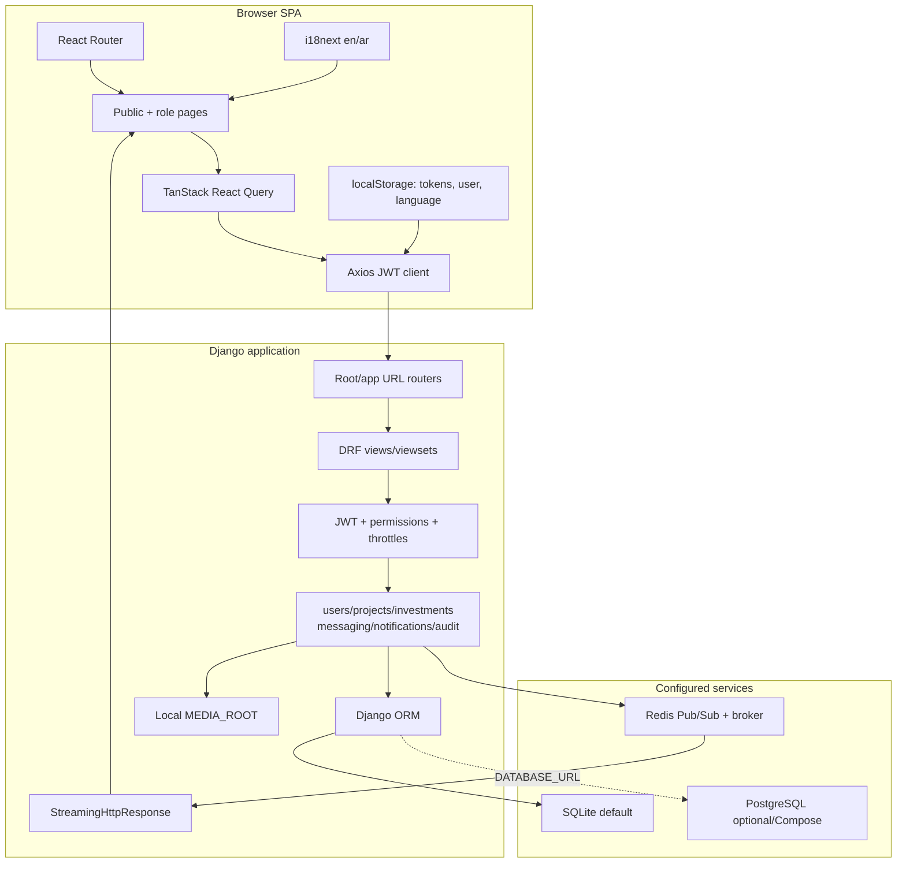
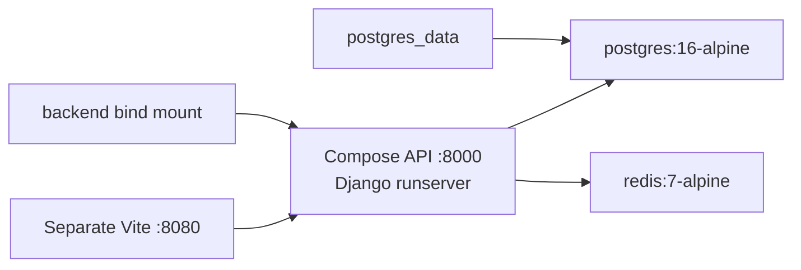
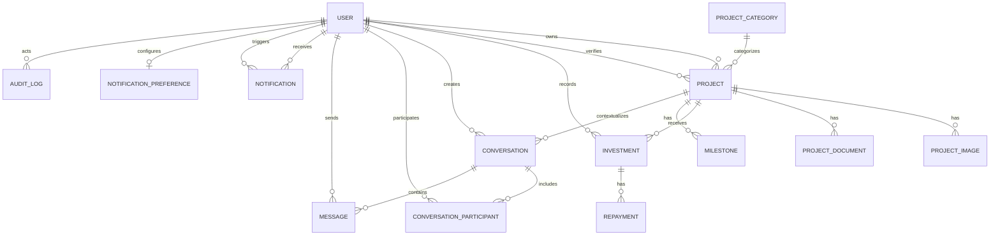
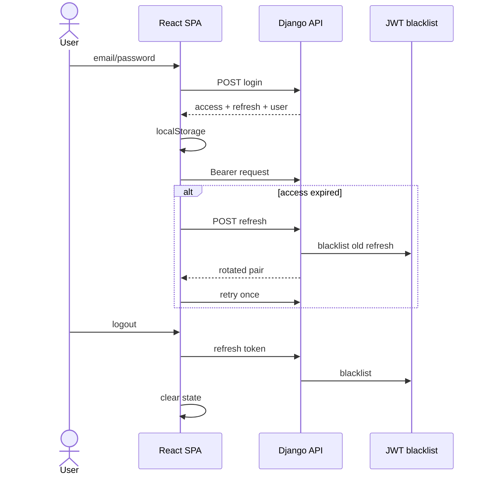
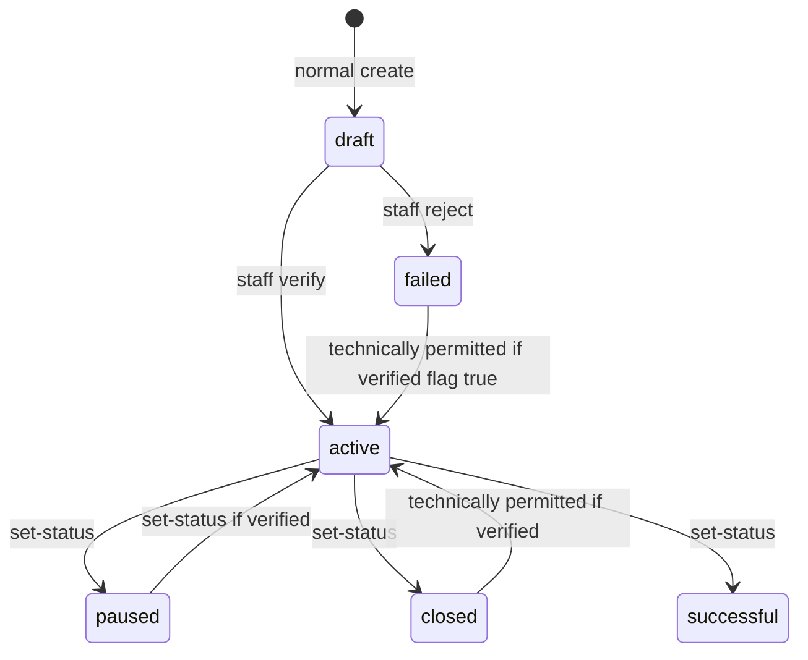
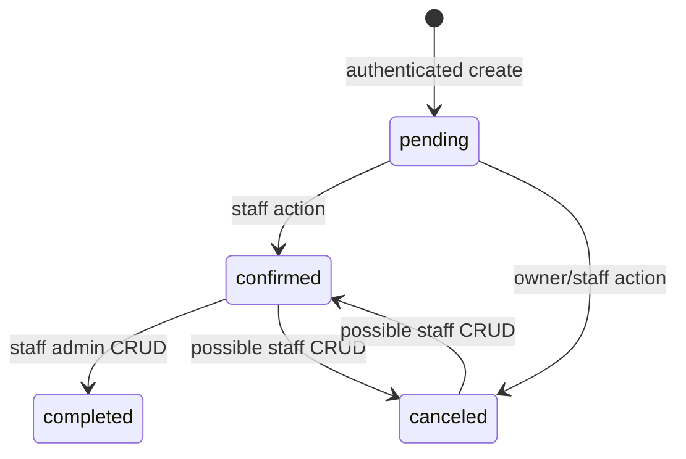
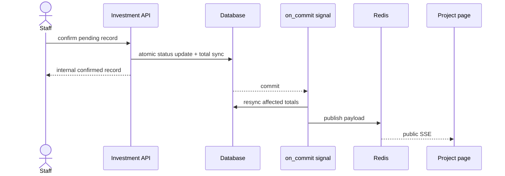
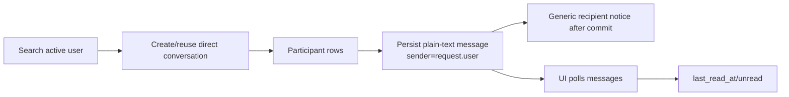
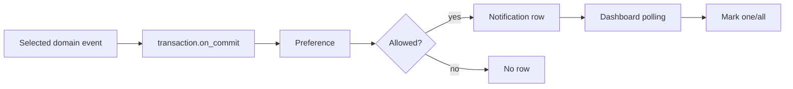

# Sahmi Requirements, Architecture, and Data Reference

**Specification basis:** repository working tree on 25 July 2026  
**Branch / HEAD:** `feature/backend-messaging-security-hardening` / `7a6cb1e57eb76c6fecfde015a1097c41ac69f6d3`  
**Rule:** requirement language identifies required behavior; it is not proof that the requirement is satisfied

## 1. Status and actors

| Status | Meaning |
|---|---|
| Verified and implemented | Current source supplies the material behavior across the relevant layers |
| Partially implemented | Some behavior exists, but an important layer, control, or invariant is absent/defective |
| Frontend-only or mocked | UI exists without an authoritative backend workflow |
| Backend-only | Model/API exists without a complete main-UI workflow |
| Configured but not operationally verified | Configuration exists; service/result was not exercised |
| Planned/future work | Valid requirement is not implemented |
| `[NOT VERIFIED]` | Evidence is absent |

| Actor/stakeholder | Repository-supported interest | Boundary |
|---|---|---|
| Visitor | public verified projects, static information, registration/login | SSE currently exposes excessive data |
| Investor account | intended-contribution records, own ledger/dashboard, messaging, real profile/preferences | settings also contain mocks |
| Entrepreneur account | submit/manage projects, related records/analytics, messaging | investor directory/message preview partly mocked |
| Staff/admin | moderation, domain administration, audit read | broad authority and incomplete audit |
| Team/developers | maintain code/schema/docs | repository evidence |
| Supervisor/examiners | assess method/evidence | academic, not runtime actor |
| Provider/regulator/data controller | future governance/integration | `[TEAM CONFIRMATION REQUIRED]` |

Verified constraints include a separate React SPA/Django API, `/api/v1/`, bearer JWT in local storage, slug project lookup, UUID domain records, multipart project uploads, confirmed-only funding totals, SQLite default/PostgreSQL configuration, Redis Pub/Sub, local media, and absence of real payment/AI/production operation.

Unverified assumptions include the legal meaning of investment/support, funding model/currency/fees/refunds/disbursement/returns, KYC standard, production provider/targets, accessibility target, performance target, and stakeholder/human-evaluation history.

## 2. Functional requirements

| ID | Requirement | Current status | Primary evidence |
|---|---|---|---|
| FR-001 | Visitors shall list active, verified, non-deleted projects with supported filtering/order. | Implemented | `ProjectViewSet.get_queryset`; BrowseProjects/service |
| FR-002 | Public detail shall be active/verified; owner/staff may retrieve authorized non-public own records. | Implemented | project queryset/serializer selection |
| FR-003 | Public project data shall omit owner contact/KYC, verification notes, and private documents. | Implemented | `PublicProjectSerializer`; privacy test |
| FR-004 | English/Arabic resources, persisted selection, and LTR/RTL direction shall be available. | Partial | `src/i18n/`; LanguageSwitcher; CSS; native review absent |
| FR-005 | Platform-outcome statistics shall derive from authoritative data. | Future | Home/About values hard-coded |
| FR-006 | Public registration shall create investor/entrepreneur only, validate password, and normalize unique email. | Implemented | RegisterSerializer/User/tests |
| FR-007 | Email/password login shall return access, rotating refresh, and user. | Implemented | login/JWT source |
| FR-008 | Client shall attach bearer access and make one eligible refresh attempt after 401. | Implemented | `src/services/api.ts` |
| FR-009 | Logout shall attempt refresh blacklist and clear local credentials. | Implemented | LogoutView/authService |
| FR-010 | User shall read/update permitted own profile without changing privileged/KYC/aggregate fields. | Implemented | UserSerializer/MeView |
| FR-011 | User shall change password with valid current and matching replacement. | Implemented | password serializer/view |
| FR-012 | Visitor shall request/confirm enumeration-safe password reset. | Configured, not operationally verified | reset views/pages/tests; SMTP unverified |
| FR-013 | 2FA, recovery email, sessions/revocation, and login history shall appear active only after backend implementation. | Mocked | Settings only |
| FR-014 | Entrepreneur/staff shall create an owned draft/unverified project. | Implemented | IsEntrepreneur/perform_create |
| FR-015 | Owner/staff shall update while ordinary clients cannot write moderation/aggregate/AI fields. | Implemented | permission/read-only fields |
| FR-016 | Owner/staff shall soft-delete through normal API. | Implemented | `perform_destroy`; `deleted_at` |
| FR-017 | Staff shall verify/activate, reject/fail, and set allowed operational status. | Partial | normal actions strong; admin-prefixed side effects weaker |
| FR-018 | Staff shall manage project categories/images/documents. | Implemented | staff viewsets/pages |
| FR-019 | Project amounts, ROI, duration, and dates shall enforce coherent ranges/cross-field rules. | Partial | positive checks; cross-field/model constraints absent |
| FR-020 | Project views shall have a documented counting rule and not imply unique users. | Partial | every eligible retrieve increments |
| FR-021 | Only authorized investor-role user shall create pending record for active/verified project with positive amount meeting minimum. | Partial | state/minimum checks; any role accepted; zero bypass |
| FR-022 | Normal clients shall not set investment status/return workflow fields. | Implemented | InvestmentSerializer read-only fields |
| FR-023 | Investor sees own, entrepreneur owned-project records, staff all. | Implemented | InvestmentViewSet queryset |
| FR-024 | Owner investor cancels only owned pending; staff confirms only pending through dedicated actions. | Implemented | cancel/confirm |
| FR-025 | Investor shall not alter submitted/confirmed financial metadata without a correction workflow. | Partial | owner update/delete remains allowed |
| FR-026 | Funding amount/count shall derive from confirmed rows and resynchronize on relevant saves/deletes. | Implemented in source | services/signals/tests |
| FR-027 | Transition into confirmed shall publish when Redis is available without rolling back DB state on Redis failure. | Partial/configured | after-commit publication; not operationally run |
| FR-028 | Live totals shall cover all aggregate changes or reconcile independently of SSE health. | Partial | only entry into confirmed publishes; fallback polling conditional |
| FR-029 | Payment-history details shall follow approved privacy/project-relationship rules. | Partial | any authenticated known-slug access |
| FR-030 | Internal confirmed record shall not be called provider-confirmed money without proof. | Future | no provider/webhook/receipt |
| FR-031 | Owner/staff shall manage milestone descriptive data. | Backend-only/partial | MilestoneViewSet; staff UI |
| FR-032 | Milestone completion/status/release shall use explicit workflow and aggregate constraints. | Future | broad staff CRUD; no owner transition/total constraint |
| FR-033 | Related investors/owners/staff shall retrieve scoped repayment records. | Backend-only | RepaymentViewSet |
| FR-034 | Repayment schedules/amounts/paid proof shall be server-authoritative. | Partial | no payment engine; related parties author descriptive fields |
| FR-035 | Authenticated user shall search active users and create/reuse direct conversation. | Implemented | messaging views/services/UI |
| FR-036 | Only participants shall access/send/read/mute/archive conversation data. | Implemented | participant querysets/checks |
| FR-037 | Only sender shall edit/soft-delete; deleted body shall not return. | Implemented | MessageViewSet/serializer |
| FR-038 | Project conversations shall require approved relation to visible project. | Partial | ID existence more than business relation |
| FR-039 | Self-conversation and malformed pagination shall return controlled 4xx. | Partial | uncaught ValueError/raw integer parsing paths |
| FR-040 | User shall list/count/read owner notifications and persist preferences. | Implemented | notification model/API/UI |
| FR-041 | Email/push shall be called active only after delivery implementation/verification. | Future | email task disabled; no push |
| FR-042 | Staff shall manage users while preventing self-lockout/last-admin removal. | Implemented | AdminUserViewSet/tests |
| FR-043 | Staff shall manage principal project/finance records through staff APIs. | Implemented as record CRUD | admin routers/pages/tests |
| FR-044 | Security/finance changes shall create sanitized, immutable, queryable audit events. | Partial | audit source; incomplete producers/no tamper evidence |
| FR-045 | Contact success shall correspond to actual persistence/delivery. | Mocked | local delay; no API |
| FR-046 | KYC submission/storage/review/retention/deletion shall follow approved policy. | Future | fields/admin flags only |
| FR-047 | AI classification/recommendation shall have model/provider, invocation, review, and evaluation. | Backend storage only | `Project.ai_*`; no execution |

## 3. Non-functional requirements

| ID | Requirement | Status |
|---|---|---|
| NFR-001 | Backend shall authorize every protected operation independent of UI. | Partial: payment/SSE/conversation gaps |
| NFR-002 | Staff authority shall use server-controlled `is_staff`. | Implemented |
| NFR-003 | Access shall be short-lived; refresh shall rotate/blacklist. | Implemented: 15 minutes/7 days |
| NFR-004 | Credential storage shall have explicit XSS/CSP decision. | Partial: local storage; no CSP |
| NFR-005 | High-risk endpoints shall have configurable shared-cache rate limiting. | Configured; shared operation unverified |
| NFR-006 | Public/API data shall minimize personal/financial/document data. | Partial: safer serializer; SSE/payment disclosure |
| NFR-007 | Uploads shall enforce size/type/signature/private access/malware/retention. | Future |
| NFR-008 | Decimal finance values shall have API/model invariants. | Partial |
| NFR-009 | Principal workflows shall provide loading/empty/error/retry feedback. | Partial |
| NFR-010 | English/Arabic shall support logical RTL/LTR without changing codes. | Partial; native review absent |
| NFR-011 | Principal workflows shall meet an approved accessibility target. | `[NOT VERIFIED]` |
| NFR-012 | Lists shall paginate and cap page size. | Generally implemented; manual message paging weak |
| NFR-013 | Related loading shall reduce obvious N+1 patterns. | Partial; no benchmark |
| NFR-014 | Failures shall use structured/redacted logging. | Partial; Redis prints/no central logging |
| NFR-015 | Production shall enforce secrets/hosts/TLS/headers/backups/private storage/monitoring. | Partial configuration only |
| NFR-016 | Dependencies/schema shall be reproducible. | Partial: Python ranges, local drift, untracked migration |
| NFR-017 | Critical authorization/privacy/finance rules shall have regressions. | Partial |
| NFR-018 | Performance/availability/concurrency targets shall be agreed/measured before claim. | `[NOT VERIFIED]` |

## 4. Business rules

| ID | Rule | Status |
|---|---|---|
| BR-001 | Public accounts are investor/entrepreneur only. | Enforced |
| BR-002 | `is_staff`—not `user_type=admin` alone—is administrative authority. | Enforced |
| BR-003 | Only entrepreneur/staff creates normal project. | Enforced |
| BR-004 | New normal project is draft/unverified; staff verification makes active/verified. | Enforced |
| BR-005 | Public project is active+verified+non-deleted, with owner/staff exception. | Enforced |
| BR-006 | Normal deletion soft; staff admin REST deletion hard. | Inconsistent; team decision required |
| BR-007 | Normal clients cannot write project moderation/aggregate fields. | Enforced |
| BR-008 | Normal investment starts pending and status is server-controlled. | Enforced normally |
| BR-009 | Confirmed rows alone drive funded amount/distinct investor count. | Enforced |
| BR-010 | `confirmed` is internal state, not settlement. | Required interpretation |
| BR-011 | Only owned pending record may be canceled by investor. | Enforced |
| BR-012 | Dedicated confirm is staff-only. | Enforced |
| BR-013 | Amount must be positive and meet project minimum. | Not fully enforced; zero bug |
| BR-014 | Confirmed-record changes require auditable correction. | Not enforced |
| BR-015 | Participants access messages; sender edits/deletes. | Enforced |
| BR-016 | Notification read/preferences are owner-scoped. | Enforced |
| BR-017 | Funding model/fees/refunds/disbursement/returns/currency are undefined. | Team confirmation required |
| BR-018 | KYC/verification meaning requires approved standard/authority. | Team confirmation required |

## 5. Use cases, stories, and acceptance criteria

| ID | Use case | Actor | Result/status |
|---|---|---|---|
| UC-001 | Browse public projects | Visitor | implemented active/verified catalogue |
| UC-002 | Register/authenticate | Visitor | implemented account/JWT |
| UC-003 | Maintain profile/language/password | User | partial account maintenance |
| UC-004 | Submit/manage project | Entrepreneur/staff | implemented draft/edit/soft delete |
| UC-005 | Review/moderate project | Staff | implemented; side-effect parity partial |
| UC-006 | Record intended investment | Authenticated user currently | pending internal record; role/zero gaps |
| UC-007 | Confirm/cancel record | Staff/investor | internal state/totals/notice |
| UC-008 | View dashboards/ledger | Role account | real derived data mixed with mock/misleading portions |
| UC-009 | Direct message | Authenticated user | persistent participant thread |
| UC-010 | Manage notifications | Authenticated user | owner-scoped in-app |
| UC-011 | Administer records | Staff | broad CRUD; incomplete audit |
| UC-012 | Contact support | Visitor | simulated |

Key stories:

- As a visitor, I want only public verified projects.
- As an Arabic-speaking visitor, I want Arabic/RTL principal workflows.
- As an entrepreneur, I want to submit/revise an owned project for review.
- As staff, I want to approve/reject with accountable notes.
- As an investor account, I want an intended-contribution record and internal status.
- As a user, I want persistent participant-scoped messages and owner notices.
- As an examiner, I want every feature classified and evidenced.

| ID | Acceptance criterion | Current result |
|---|---|---|
| AC-001 | Anonymous project list/detail excludes draft/unverified/deleted. | Source/test supports; backend not freshly run |
| AC-002 | Public detail omits contact/KYC/private files/notes. | Source/test exists |
| AC-003 | Public admin/staff registration gives no privilege. | Source/test exists |
| AC-004 | Login/rotation/logout manage valid tokens. | Source/tests; frontend relevant tests passed |
| AC-005 | Entrepreneur creates draft; staff moderates; ordinary user cannot. | Source/static tests support |
| AC-006 | Zero/negative/below-minimum rejected. | **Not met:** zero may pass |
| AC-007 | Client cannot confirm; staff pending-confirm action can. | Met normal API |
| AC-008 | Investor cannot edit confirmed amount/method. | **Not met** |
| AC-009 | Aggregate equals confirmed sum/distinct investors after changes. | Source/static tests support |
| AC-010 | Unrelated users cannot read payments/private events. | **Not met** |
| AC-011 | Non-participant denied; sender derived; deleted body empty. | Source/static tests support |
| AC-012 | Notifications/preferences affect current owner only. | Source/tests |
| AC-013 | Every admin/finance mutation creates sanitized audit event. | **Not met** |
| AC-014 | Contact success has persisted/delivered evidence. | **Not met** |
| AC-015 | Language changes `lang`/`dir`, persists, renders principal Arabic. | Frontend tests passed; native review absent |
| AC-016 | Critical suites run in CI with approved coverage. | **Not met** |
| AC-017 | Production passes security/config/backup/restore gates. | `[NOT VERIFIED]` |

## 6. Implemented logical architecture

Evidence: `src/App.tsx`, `src/services/api.ts`, `backend/config/urls.py`, `settings/base.py`, domain apps, investment services/signals, and project SSE action.

Configured development deployment:

No frontend container, worker, proxy/TLS, private storage, health checks, production secret store, monitoring, backup/restore, or verified deployment exists.

## 7. ERD

Notification/audit logical target strings are not foreign keys.

## 8. Data dictionary

`UUIDTimestampModel` supplies UUID `id`, `created_at`, and `updated_at` to every domain entity below except `User`.

| Entity | Complete repository field set | Relationships/constraints/qualification |
|---|---|---|
| User | AbstractUser fields (`username`, password, first/last names, active/staff/superuser, groups/permissions, last login/date joined); UUID `id`; unique lowercase `email`; `preferred_language`; `full_name`; phone; `user_type`; profile picture; bio; country/city; website; timezone; generic/KYC flags/document/time; investor tier; invested/returned/average ROI/risk fields; business name/registration/date/address; funded/repaid/reputation fields | owns projects/investments; messages/participants/notices/audit; many aggregate/KYC fields lack full workflow; website/timezone migration untracked; no common `updated_at` |
| ProjectCategory | common fields; unique name/slug; description | slug generated if blank; protects related projects |
| Project | common; owner; title/global unique slug; long/short descriptions; category; location/governorate; goal/funded/minimum/expected ROI; funding days/start/end; status; verified flag/verifier/time/notes; business plan/financial projections/ownership proof/cover/video; four AI storage fields; milestone count; repayment status/total/next date; view/investor counts; rating/review count; deleted time | category/owner/verifier; images/docs/investments/milestones/conversations; no DB finance/date checks; normal soft delete |
| ProjectImage | common; project; image; alt text | local media, cascade |
| ProjectDocument | common; project; file; title | local media, cascade; excluded from public serializer |
| Investment | common; investor; project; amount; quantity; investment date; pending/confirmed/canceled/completed status; transaction ID; card/bank_transfer/paypal label; expected/actual return; return time; notes | no provider relation/positive DB check; expected return can become stale; has repayments |
| Milestone | common; project; title/description; target/actual dates; pending/in-progress/completed/delayed; deliverables; percentage; funding released; order | no aggregate percentage/release constraint |
| Repayment | common; investment; amount; scheduled/actual dates; pending/paid/overdue/canceled; payment-method label; transaction ID; notes | record only; no payment engine |
| Conversation | common; direct/project/group kind; title; creator; optional project; unique direct key; archive flag; last-message time | direct dedupe; project authorization incomplete |
| ConversationParticipant | common; conversation; user; joined/read times; muted/archived | unique conversation/user |
| Message | common; conversation; sender; plain-text body max 5,000; edit/delete times | sender derived; soft deletion |
| Notification | common; recipient; optional actor; type; title/body; logical target type/id; read time; delivery status | owner-scoped; target lacks referential integrity |
| NotificationPreference | common; one-to-one user; in-app/email and category toggles | email delivery disabled |
| AuditLog | common; optional actor; action; logical target; success/failure/denied; JSON metadata; request ID; IP; user agent | partial producers; ordinary mutable row; no retention/tamper evidence |

### 8.1 Important field choices/defaults

- Project status: `draft`, `active`, `closed`, `successful`, `failed`, `paused`.
- Project repayment summary: `on_track`, `delayed`, `completed`.
- Investment status: `pending`, `confirmed`, `canceled`, `completed`.
- Payment-method labels: `card`, `bank_transfer`, `paypal`; labels do not prove integrations.
- Milestone status: `pending`, `in_progress`, `completed`, `delayed`.
- Repayment status: `pending`, `paid`, `overdue`, `canceled`.
- Conversation kind: direct/project/group.
- User product roles: investor/entrepreneur/admin; `is_staff` is authority.
- Notification types cover message, project submission/verification/rejection, investment creation/status, milestone/repayment, and system.

## 9. API catalogue

DRF router endpoints use trailing slashes.

### Framework and accounts

| Method | Path | Access/behavior |
|---|---|---|
| Django | `/admin/` | staff/permission admin |
| GET | `/api/schema/`, `/api/docs/` | OpenAPI/Swagger |
| POST | `/api/v1/auth/register/` | public/throttled; investor/entrepreneur |
| POST | `/api/v1/auth/login/` | public/throttled; JWT/user |
| POST | `/api/v1/auth/refresh-token/` | token holder/throttled; rotate/blacklist |
| POST | `/api/v1/auth/logout/` | authenticated; blacklist submitted refresh |
| GET/PATCH | `/api/v1/auth/me/` | current user |
| POST | `/api/v1/auth/change-password/` | current user/throttled |
| POST | `/api/v1/auth/password-reset/` | public/throttled; generic response |
| POST | `/api/v1/auth/password-reset/confirm/` | public/throttled |

### Projects/categories

| Method | Path | Access/behavior |
|---|---|---|
| GET | `/api/v1/categories/`, `/{uuid}/` | public |
| POST/PUT/PATCH/DELETE | `/api/v1/categories/...` | staff |
| GET | `/api/v1/projects/` | public safe; staff all |
| POST | `/api/v1/projects/` | entrepreneur/staff; owned draft |
| GET | `/api/v1/projects/{slug}/` | public active/verified; owner/staff exception |
| PUT/PATCH/DELETE | `/api/v1/projects/{slug}/` | owner/staff; normal delete soft |
| POST | `/api/v1/projects/{slug}/verify/`, `reject/`, `set-status/` | staff; normal route audit/throttle/notice semantics |
| GET | `/api/v1/projects/my/` | own; staff all |
| GET | `/api/v1/projects/{slug}/payments/` | any authenticated account; privacy gap |
| GET | `/api/v1/projects/{slug}/events/` | public SSE; privacy gap |

### Investments/milestones/repayments

| Method | Path | Access/behavior |
|---|---|---|
| GET/POST | `/api/v1/investments/` | authenticated; scoped list/any role create |
| GET/PUT/PATCH/DELETE | `/api/v1/investments/{uuid}/` | staff/related party; owner mutation too broad |
| POST | `/api/v1/investments/{uuid}/cancel/` | owner investor/staff; pending |
| POST | `/api/v1/investments/{uuid}/confirm/` | staff; pending |
| CRUD | `/api/v1/milestones/`, `/{uuid}/` | staff/project owner; workflow fields read-only normally |
| CRUD | `/api/v1/repayments/`, `/{uuid}/` | staff/related parties; workflow fields read-only normally |

### Messaging

| Method | Path | Access/behavior |
|---|---|---|
| GET/POST | `/api/v1/conversations/` | authenticated participant list/create |
| GET | `/api/v1/conversations/{uuid}/` | participant |
| POST | conversation `archive`, `unarchive`, `mute`, `unmute`, `mark-read` actions | participant |
| GET | `/api/v1/conversations/unread-count/` | authenticated |
| GET | `/api/v1/conversations/user-search/?q=` | authenticated/minimal active users |
| GET/POST | `/api/v1/conversations/{uuid}/messages/` | participant |
| PATCH/DELETE | `/api/v1/messages/{uuid}/` | sender edit/soft-delete |

### Notifications/audit/staff

| Path | Access/behavior |
|---|---|
| `GET /api/v1/notifications/` | owner list |
| `GET /api/v1/notifications/unread-count/` | owner count |
| `POST /api/v1/notifications/{uuid}/mark-read/` | owner/throttled |
| `POST /api/v1/notifications/mark-all-read/` | owner/throttled |
| `GET/PUT/PATCH /api/v1/notifications/preferences/` | owner |
| `GET /api/v1/audit-logs/`, `/{uuid}/` | staff read-only |
| `/api/v1/admin/users/` plus reset-password | staff CRUD/action |
| `/api/v1/admin/categories/` | staff CRUD |
| `/api/v1/admin/projects/` plus moderation actions | staff CRUD/actions; weaker side-effect parity |
| `/api/v1/admin/project-images/`, `project-documents/` | staff CRUD |
| `/api/v1/admin/investments/`, `milestones/`, `repayments/` | staff full record CRUD |

## 10. RBAC matrix

Legend: R read, C create, U update, D delete, A action.

| Resource/action | Visitor | Investor | Entrepreneur | Staff |
|---|---:|---:|---:|---:|
| Public projects/categories | R | R | R | R + all |
| Non-public own project | — | owner only, atypical | R own | R |
| Project create | — | — | C | C |
| Normal project update/soft delete | — | — | U/D own | U/D |
| Moderation/category mutation | — | — | — | A/CRUD |
| Investment create | — | C currently | C currently (gap) | C |
| Investment list/detail | — | R own | R owned-project records | R all |
| Investment update/delete | — | U/D own currently | generally — | U/D |
| Cancel/confirm | — | cancel own pending | — | cancel/confirm |
| Milestones | — | — | CRUD own project | CRUD |
| Repayments | — | CRUD if related | CRUD if related | CRUD |
| Payment history | — | R any known non-deleted slug | R same | R |
| Project SSE | R any known non-deleted slug | R | R | R |
| Messages | — | participant | participant | participant, no staff override |
| Notifications | — | own | own | own |
| Audit/admin API | — | — | — | R/CRUD |

Frontend gating is not a security control.

## 11. Sequences and state transitions

### Authentication

### Project state

The API permits assignments rather than a complete transition graph.

### Investment state

### Confirmation/aggregate/SSE

The event currently includes investor name/amount/date/method and is a critical privacy finding.

### Messaging/notifications

## 12. Frontend/API/data traceability

| Requirement | UI | Service/API | Backend symbol | Data | Evidence/status |
|---|---|---|---|---|---|
| FR-006 | RegisterPage | auth register | RegisterView/Serializer | User | tests exist |
| FR-007–009 | Login/auth hook/nav | login/refresh/logout | JWT views/settings | User/blacklist | frontend tests + backend assets |
| FR-014 | StartProject | createProject | perform_create | Project | backend tests |
| FR-017 | admin project pages | normal/admin actions | two project view modules | Project | parity gap |
| FR-021 | ProjectDetails | createInvestment | investment serializer/view | Investment | zero/role gaps |
| FR-026 | cards/charts | project/investment reads | services/signals | Investment→Project | source/tests |
| FR-027 | ProjectDetails | events | SSE/publication | no event store | privacy gap |
| FR-031/034 | staff pages | CRUD | milestone/repayment views | Milestone/Repayment | backend/staff UI partial |
| FR-035–037 | MessagesPage | messaging service | views/services | Conversation/Participant/Message | implemented direct |
| FR-040 | dashboard/settings | notification service | views/services | Notification/Preference | implemented in-app |
| FR-044 | no principal UI | audit list | explicit service calls | AuditLog | partial |
| FR-045 | ContactPage | none | none | none | mock |
| FR-046 | settings/admin | user fields | no workflow | KYC fields | storage only |
| FR-047 | admin project form | staff CRUD | no classifier | AI fields | storage only |

| Research item | Requirements/evidence | Finding |
|---|---|---|
| RQ-01 / OBJ-01–02 | FR/NFR/BR, routes, models, architecture, RBAC | coherent source-derived bilingual role architecture; stakeholder elicitation unverified |
| RQ-02 / OBJ-03 | feature/source/test traceability | substantial mixed-status prototype |
| RQ-03 / OBJ-04 | AC results, security/testing/config review | critical limits prevent production claim; human evaluation absent |

## 13. Interpretation controls

- a requirement is not an implementation claim;
- a payment-method enum is not payment integration;
- KYC fields are not identity assurance;
- AI fields are not AI execution;
- Docker/prod settings are not deployment;
- UI route guards are not backend authorization;
- internal `confirmed` is not provider settlement;
- a historical pass is not a current pass;
- conceptual figures/mocks are not executed workflows.

