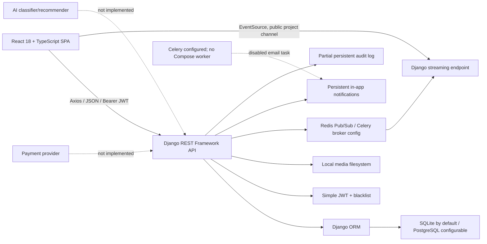

# Sahmi Repository Audit and Evidence Map

**Audit date:** 25 July 2026  
**Scope:** the complete non-generated repository working tree  
**Claim boundary:** this is a source and local-test audit, not proof of deployment, payment processing, legal compliance, security certification, or user acceptance.

## 1. Repository and Git baseline

| Item | Recorded value |
|---|---|
| Repository root | `C:\Users\Dell\OneDrive\Documents\MyProjects\Sahmi` |
| Branch | `feature/backend-messaging-security-hardening` |
| HEAD commit | `7a6cb1e57eb76c6fecfde015a1097c41ac69f6d3` |
| Remote | `origin` → `https://github.com/AdnanQasem/Sahmi.git` |
| Working tree before this audit's files | Dirty: 81 entries; 75 modified, 1 staged addition, 5 untracked |
| Audit basis | The working tree as found, including its uncommitted changes—not HEAD alone |
| Audit-created path | `docs/graduation-audit/` only |

The pre-audit untracked items were:

- `ahmi-backups` (an 8,354-byte patch/stat-like text artifact, not a runtime directory);
- `backend/apps/users/migrations/0003_user_timezone_user_website.py`;
- `src/pages/ForgotPasswordPage.tsx`;
- `src/pages/ResetPasswordPage.tsx`;
- `src/test/password-reset.test.tsx`.

The staged pre-audit addition was `docs/backend-repair-start.patch`. The 75 modified entries covered `.env.example`, `.gitignore`, selected backend security/authentication/investment/messaging/settings files, many frontend pages/components/locales/services, and frontend tests. None was changed by this audit.

## 2. Repository coverage

The inventory contained 309 paths after excluding generated/vendor material. The principal audited areas were:

- frontend application: `src/`, `public/`, `index.html`, Vite/TypeScript/Tailwind/Vitest/Playwright configuration, package manifests and locks;
- backend application: `backend/apps/`, `backend/config/`, URL routing, settings, requirements, migrations, tests, Dockerfile and Compose;
- data model and API: users, projects, investments, milestones, repayments, messaging, notifications and audit;
- documentation and evidence: root Markdown/Word documents, `docs/`, scripts, OpenAPI and historical command reports;
- repository and environment: Git branch/commit/status, sample environment files, local declared/locked versions.

Excluded as generated, vendor, cache, build, virtual-environment, or extracted-figure material:

- `.git/`;
- `node_modules/`;
- `venv/`;
- `dist/`;
- `**/__pycache__/`;
- `.tmp_figures_24_32/`;
- `.tmp_sahmi_figures_6b5fd451/`;
- compiled/cache files.

Root image previews and `ahmi-backups` were inventoried but are not application capabilities.

## 3. High-level implementation map

### Component connections

- `src/services/api.ts:84-143` creates the Axios client, attaches local-storage JWTs, unwraps the backend response envelope, and performs one refresh attempt.
- `backend/config/urls.py:8-17` mounts admin, schema, auth, project, investment, messaging, audit, and notification routes.
- `backend/config/settings/base.py:125-155` configures JWT authentication, permissions, pagination, filtering, throttling, exception handling, and the standard renderer.
- Django models persist domain records; there is no separate service or external database abstraction.
- confirmed-investment transitions trigger database total synchronization and one Redis publication through `backend/apps/investments/signals.py:21-39` and `services.py:39-79`;
- `src/pages/ProjectDetails.tsx:73-180` connects EventSource and falls back to eight-second polling only after SSE fails;
- messaging and notifications use HTTP polling, not WebSockets: `MessagesPage.tsx:38-53` and `DashboardLayout.tsx:178-181`.

## 4. Feature evidence table

| Feature | Role | Frontend evidence | API/backend evidence | Database evidence | Test evidence | Status | Notes |
|---|---|---|---|---|---|---|---|
| Public landing and navigation | Visitor | `src/App.tsx:89-106`; `HomePage.tsx` | None required | None | `localization.test.tsx` | Verified and implemented | Marketing statistics at `HomePage.tsx:61-63` are hard-coded and not factual evidence. |
| Public project browse/filter/order | Visitor | `BrowseProjects.tsx`; `projectsService.ts:135` | `ProjectViewSet`, `projects/views.py:67-83` | `Project`, `ProjectCategory` | Public category/privacy tests in `projects/tests.py` | Verified and implemented | Public list is active, verified and non-deleted. |
| Public project detail | Visitor; owner/staff receive richer view | `ProjectDetails.tsx:50-69` | `projects/views.py:48-103`; public serializer at `projects/serializers.py:172-210` | Project/media relationships | `PublicProjectPrivacyTests` | Verified and implemented | Repeated detail requests increment `view_count`; no uniqueness/session rule. |
| Category reads and staff management | Visitor read; staff write | public/admin category pages and services | `projects/permissions.py:14-25`; admin router | `ProjectCategory` | `ProjectCategoryPermissionTests`; admin CRUD tests | Verified and implemented | Backend—not frontend visibility—is authoritative. |
| Registration | Visitor | `RegisterPage.tsx`; `useAuth.tsx:56-63` | `RegisterView`; `RegisterSerializer` public roles only | `User` | `AuthenticationPrivilegeTests` | Verified and implemented | Registration does not log the user into frontend state; login follows. |
| Login, me, logout | Authenticated | `authService.ts:64-100`; `useAuth.tsx` | auth views in `users/views.py`; JWT blacklist | `User`; token blacklist tables | backend JWT/logout tests; frontend logout tests | Verified and implemented | Tokens are stored in local storage. |
| JWT rotation/refresh | Authenticated | `api.ts:105-142` | `settings/base.py:102-109`; refresh view | blacklist tables | `token-rotation.test.ts`; backend JWT test | Verified and implemented | No refresh-request concurrency lock; stale `user` key is not cleared by interceptor failure. |
| Password change | Authenticated | `SettingsPage.tsx:187-204` | `ChangePasswordView`; `PasswordChangeSerializer` | `User.password` | static backend test coverage | Verified and implemented | No fresh backend execution in this audit. |
| Password reset | Visitor | forgot/reset pages and `authService.ts:107-112` | `users/views.py:193-258` | `User` token state | frontend reset tests passed; backend tests exist | Configured but not operationally verified | Console email backend returns 503; real SMTP/delivery not tested. |
| Profile and language preference | Authenticated | Settings save at `SettingsPage.tsx:135-186`; language switcher/i18n | `MeView`; `UserSerializer` | user profile, website, timezone, preferred language | frontend language/preferences tests passed; backend tests exist | Partially implemented | Website/timezone model fields depend on an untracked migration. Email edit/avatar/KYC controls are not fully wired. |
| English/Arabic and RTL/LTR | All | `src/i18n/`, `LanguageSwitcher.tsx`, `index.css` | preferred-language API | user preference | current localization tests passed | Partially implemented | Infrastructure and principal flows exist; native-speaker/full-copy review is `[NOT VERIFIED]`. |
| Role-based frontend routing | Investor/entrepreneur/staff | `App.tsx:53-105`; `ProtectedRoute.tsx` | API permissions throughout | `User.user_type`, `is_staff` | current admin route tests passed | Verified and implemented | UI gating is convenience only; backend permissions remain authority. |
| Project submission | Entrepreneur/staff | `StartProject.tsx:42-67` | `ProjectViewSet.perform_create`; `IsEntrepreneur` | Project and optional files | project/admin tests exist | Verified and implemented | Creates draft/unverified record; frontend terms acceptance is not a persisted legal consent. |
| Owner project edit and soft delete | Owner/staff | `EditProject.tsx`; detail controls | `projects/views.py:67-90,105-146` | `deleted_at` | project/admin tests exist | Verified and implemented | Admin API deletion is hard delete, unlike normal owner delete. |
| Staff project moderation | Staff | admin projects UI/services | normal actions `projects/views.py:148-243`; parallel admin actions `admin_views.py:85-139` | verification/status fields | project/admin tests exist | Partially implemented | Admin-prefixed actions omit the normal actions' audit, notifications and scoped throttle. |
| Investment record submission | Any authenticated user | `ProjectDetails.tsx:188-204` | `InvestmentViewSet.perform_create` | `Investment` | investment tests exist | Partially implemented | Not restricted to investor role; amount `0` bypasses minimum check; this is not payment processing. |
| Investment list/dashboard/transactions | Investor own; entrepreneur project records; staff all | investor/entrepreneur dashboards and transaction page | `investments/views.py:21-34` | Investment/project aggregates | frontend coverage is limited | Verified and implemented | Several totals sum pending/canceled records; labels such as “Total Paid” can mislead. |
| Investment update/delete/cancel | Owner investor; staff | No general edit/cancel UI | `investments/views.py:63-109` | Investment, synchronized totals | backend tests exist | Backend-only | Investor may edit amount/metadata after confirmation; integrity rule is incomplete. |
| Investment confirmation | Staff | admin investment CRUD UI | `/investments/{id}/confirm/`; admin CRUD serializer | status and aggregates | confirmation/signal tests exist | Partially implemented | Admin UI uses broad CRUD rather than dedicated confirm action; no payment-provider proof. |
| Funding aggregate synchronization | System/staff workflow | funding cards and charts | signals/services in investments app | `Project.funded_amount`, `investor_count` | backend signal/totals tests exist | Verified and implemented | Only confirmed records count; operational Redis/database behavior not freshly run. |
| Confirmed-investment SSE | Visitor/public channel | `ProjectDetails.tsx:73-180` | `projects/views.py:286-326`; Redis publish service | no event store | backend publish test exists | Partially implemented | Public/private project probing and investor-name/amount disclosure; only entry into confirmed publishes. |
| Recent confirmed payments | Authenticated user | `ProjectDetails.tsx:363-401` | `projects/views.py:257-284` | confirmed Investment rows | no focused frontend authorization test found | Partially implemented | Any authenticated user can access any non-deleted project's payment details, including private project slug. |
| Milestone CRUD | Owner/staff API; staff UI | admin milestones page | public and admin milestone viewsets | `Milestone` | admin/related-party tests exist | Partially implemented | Non-admin serializer makes workflow fields read-only; no owner-facing page or transition action. |
| Repayment CRUD | Related investor/owner; staff | staff admin page only | public and admin repayment viewsets | `Repayment` | admin/related-party tests exist | Partially implemented | Related parties can create/edit amount/schedule; no authoritative payment/schedule engine. |
| Direct persistent messaging | Authenticated users | `MessagesPage.tsx`; `messagingService.ts:49-61` | participant-scoped conversation/message APIs | Conversation, Participant, Message | current four messaging UI tests passed; backend tests exist | Verified and implemented | HTTP polling only; frontend omits edit/delete/mute/archive/project conversation controls. |
| Project conversation API | Authenticated users | No frontend connection | create serializer/service | Conversation.project | no focused authorization test found | Backend-only | Any authenticated user can attach any project/user; project relationship is not validated. |
| In-app notifications and preferences | Authenticated owner | `DashboardLayout.tsx:178-195`; Settings | notification views/services | Notification, Preference | current notification/preferences tests passed; backend tests exist | Verified and implemented | Polling at 30 s. System-event preference code contradicts its comment. |
| Notification email | User | email toggle only | Celery task returns `{"status":"disabled"}` | delivery-status fields | none | Planned/future work | Celery is configured; Compose has no worker. |
| Audit logging | Staff reader | No dedicated audited frontend found | audit model/service/read API | `AuditLog` | access/sanitization tests exist | Partially implemented | Explicit events cover only selected auth/project/payment-view paths; admin, messaging, investments and many changes are absent. |
| Admin user CRUD/reset | Staff | `AdminUsersPage.tsx`; service | `AdminUserViewSet` | User/auth relationships | admin API tests exist | Verified and implemented | Last-admin/self protections exist; destructive delete is permanent. |
| Admin finance/project/media CRUD | Staff | admin pages/services | admin routers | domain models/files | extensive admin API tests exist | Verified and implemented | Administrative writes are powerful; audit logging is incomplete. |
| Contact submission | Visitor | `ContactPage.tsx:107-116` | No endpoint | None | none | Frontend-only or fixture-backed | Delays 1.5 seconds, clears the form, and reports success; no message is sent/persisted. |
| Wallet, deposits, withdrawals | Investor/entrepreneur settings | `SettingsPage.tsx:115,238-256,977-1013` | None | None | none | Frontend-only or fixture-backed | Local state begins at 25,000; no money movement. |
| Payment cards and billing history | Investor/entrepreneur settings | `SettingsPage.tsx:1094-1178` | None | None | none | Frontend-only or fixture-backed | Hard-coded Visa/Mastercard and transactions. |
| 2FA, sessions, login history, recovery email | Authenticated settings | `SettingsPage.tsx:107-110,723-883` | None | None | none | Frontend-only or fixture-backed | Includes hard-coded devices, IPs and “Password + 2FA” history. |
| Entrepreneur investor network | Entrepreneur | `InvestorsPage.tsx:57-168` | Queries are made but display uses `fixtureInvestors` | Investment rows not aggregated into UI | none | Frontend-only or fixture-backed | Displays fabricated names/emails/amounts and “premium” status. |
| Entrepreneur recent message preview | Entrepreneur | `EntrepreneurDashboard.tsx:538-582` | Persistent messaging exists elsewhere | Message rows | none | Frontend-only or fixture-backed | Dashboard card is hard-coded despite real messages page. |
| KYC | User/admin fields and badges | settings/admin fields | user model/admin serializer | KYC fields/file | admin tests touch user data generally | Partially implemented | Storage/admin flags only; no complete user submission, policy, privacy or verification workflow. |
| AI classification/recommendation | Staff-editable fields | admin project fields | no classifier/task/provider | four Project AI fields | admin field CRUD test only | Backend-only | Storage fields are not AI execution. |
| Payment gateway/webhooks/refunds/disbursement | Intended investor/founder | Misleading marketing and settings UI | No provider/webhook/payment service | method/status/transaction labels only | none | Claimed in documentation but not found in code | Must not be described as implemented. |
| Docker backend stack | Operator | Frontend not containerized | Dockerfile + Compose API/DB/Redis | PostgreSQL volume configured | no current container execution | Configured but not operationally verified | Compose runs development server; sample env points to SQLite and localhost Redis. |
| Production deployment | Operator | Vite build configuration | Gunicorn image and minimal prod settings | deployment DB not evidenced | no deployment smoke | Planned/future work | No live URL, frontend service, proxy, storage, monitoring, backup or IaC evidence. |
| CI/CD | Team | None | None | None | no workflow found | Claimed in documentation but not found in code | Existing document correctly labels it planned in one section, but no pipeline exists. |
| E2E browser automation | QA | Playwright stubs | None | None | no E2E cases | Configured but not operationally verified | Config imports an undeclared `lovable-agent-playwright-config` package. |

## 5. Frontend route-to-backend evidence

| Frontend route | UI evidence | Backend connection | Actual authorization |
|---|---|---|---|
| `/`, `/about`, `/how-it-works`, `/contact` | `App.tsx:90,99-101` | Projects on home only; contact has no backend | Public |
| `/projects` | Browse page | `GET /api/v1/projects/`, categories | Public active/verified list |
| `/projects/:id` | Detail/invest form | project, payments, investment create, public SSE | Mixed; payment endpoint authenticated, event endpoint public |
| `/start-project` | five-step form | `POST /projects/` | Backend entrepreneur or staff |
| `/projects/:id/edit` | edit form | `PATCH /projects/{slug}/` | Backend owner or staff |
| `/login`, `/register`, forgot/reset | auth pages | auth endpoints | Public, with throttles |
| `/dashboard/investor*` | dashboards, transactions, messages, settings | investment/project/message/notification/auth APIs | Frontend user-type guard plus backend object rules |
| `/dashboard/entrepreneur*` | dashboard, analytics, investors, messages, settings | project/investment/message/notification/auth APIs | Investor-network display remains fixture |
| `/dashboard/admin*` | admin workspace | `/api/v1/admin/*` | `is_staff` via DRF `IsAdminUser` |

## 6. Repository-derived implementation findings

### 6.1 What Sahmi currently implements

Sahmi is a bilingual React/Django platform that presently implements:

- public discovery of active, verified projects;
- investor and entrepreneur registration/login with JWT sessions;
- role-oriented dashboards backed partly by real project/investment data;
- entrepreneur project submission, editing and soft deletion;
- staff CRUD and project moderation;
- pending internal investment records, staff-controlled normal status actions, and confirmed-total calculation;
- milestone and repayment records/APIs;
- persistent direct messaging with participant scope;
- persistent in-app notifications and preferences;
- password change/reset code;
- partial audit logging;
- Redis-based confirmed-investment SSE with a client polling fallback;
- OpenAPI endpoints and backend Docker artifacts;
- English/Arabic direction and locale support.

It does **not** establish real payment, refund, escrow, return, disbursement, KYC, AI, production hosting, legal compliance, or measured impact.

### 6.2 Critical and high-priority gaps

| Priority | Observation | Evidence | Consequence |
|---|---|---|---|
| Critical | Public SSE is available for any non-deleted project slug and carries investor name, amount and method | `projects/views.py:84-85,286-326`; `investments/services.py:54-66` | Private-project probing and financial/person-name disclosure |
| High | Authenticated payment-history endpoint has no project relationship rule | `projects/views.py:257-284` | Any account can retrieve confirmed payment details for any known non-deleted slug |
| High | Investment amount zero bypasses minimum check | `investments/serializers.py:34-40` | Invalid pending financial record |
| High | Any authenticated role may create an investment and investor owners may edit confirmed amount/metadata | permissions and view/serializer code | Financial-record integrity and business-role ambiguity |
| High | Settings and public copy imply secure payments, refunds, verification, wallet and 2FA | locale strings and Settings page | Misrepresentation of platform controls |
| High | Uploads lack explicit size, MIME/extension, malware, quarantine, private-storage and retention controls | model File/ImageFields; no validators found | Security/privacy/operational risk |
| High | Admin-prefixed moderation bypasses normal action audit/notification/throttle | `projects/admin_views.py:85-139` vs `projects/views.py:148-243` | Inconsistent control and traceability |
| High | Untracked user migration creates schema/code mismatch | `users/models.py:40-41`; untracked `0003...py` | Fresh checkout or unapplied environment may fail on profile fields |

### 6.3 Medium-priority correctness gaps

- `normalise_roles` saves `updated_at` on `User`, which does not define that field (`backend/apps/users/management/commands/normalise_roles.py:46-55`); non-dry-run execution is likely defective.
- A direct self-conversation raises uncaught `ValueError` through the create path; malformed message page values are cast with `int()` without validation (`messaging/services.py:39-40`; `messaging/views.py:214-224`).
- Project conversations verify only that user/project IDs exist, not that they are active, public, related, or authorized (`messaging/serializers.py:121-148`).
- Notification `_allowed` says system events remain allowed, but returns false first when in-app notifications are disabled (`notifications/services.py:29-49`).
- SSE only publishes on a transition into confirmed; edits/deletes/transitions out resynchronize stored totals without publishing (`investments/signals.py:21-44`).
- `view_count` increments on every eligible retrieval, including owner access and refetching; analytics should not present it as unique audience.
- Investment dashboards commonly sum every status, so pending/canceled records can be labelled invested/paid.
- expected return is calculated only when falsy in `Investment.save`; later amount/ROI changes do not reliably recompute it (`investments/models.py:40-43`).
- milestone percentages and financial ranges have no aggregate/model constraints.
- local Python environment contains Pillow 12.2.0 although `requirements.txt:10` declares `<11`, so the local environment has dependency drift.

## 7. Tests and execution evidence

### Freshly executed in this audit

| Command | Result | Interpretation |
|---|---|---|
| `npm test -- --run` | Exit 0; 11 files, 24 tests passed | Current frontend unit/component test result for this working tree |
| `npx --no-install tsc --noEmit` | Exit 0 | Current TypeScript static check passed |

The first sandboxed Vitest launch failed because esbuild could not traverse a host directory. The identical read-only command was rerun with local filesystem permission and passed; this was an environment startup issue, not a failed test.

### Not freshly executed

Backend tests were not run because Django test database setup applies migrations, which the audit rules explicitly prohibit. The repository currently contains 64 discovered backend `test_` methods. Dated repository reports record earlier passes, including 60 backend tests and 21 frontend tests during localization work, but those logs predate further uncommitted changes and are not reported as current passes.

No current E2E, coverage, performance, accessibility, penetration, Docker, deployment, SMTP, Redis, PostgreSQL, or external-provider execution was performed.

## 8. Major documentation-versus-code mismatches

- `Sahmi_Documentation_Corrected.docx` and root `SRS.md` still say messaging, notification APIs, audit logging and password reset are missing; current code implements them.
- Those documents preserve old privilege, category, public-detail and investment-status defects that current serializers/permissions have fixed.
- Existing testing prose says coverage is nearly absent and TypeScript fails; the current frontend suite and no-emit check pass, and backend test assets are extensive.
- Marketing UI claims 230+ projects, $2.4M, 12,000+ users and 89% without data sources.
- UI copy promises secure providers, bank-level encryption, review SLAs, refunds or keep-funds behavior, and worldwide contribution support without implementation or evidence.
- The current document's abstract says the interface is English-only; current i18n implements English/Arabic and RTL/LTR.
- Root `SRS.md` says `user_type=admin` should imply staff, while current hardened design deliberately separates the descriptive role from server-controlled `is_staff`.
- Root `SRS.md` marks public project payments as public; the current endpoint requires authentication but remains too broad.

## 9. Audit verdict

**Platform status:** substantial development-stage platform, suitable for supervised demonstration with synthetic data after its fixture-backed controls are disclosed.  
**Academic evidence status:** useful but requires the accompanying academic gap report and rewritten final draft.  
**Production/financial status:** **not ready**. Privacy/authorization, financial integrity, upload security, operational deployment, legal rules, and end-to-end evaluation remain unresolved.

