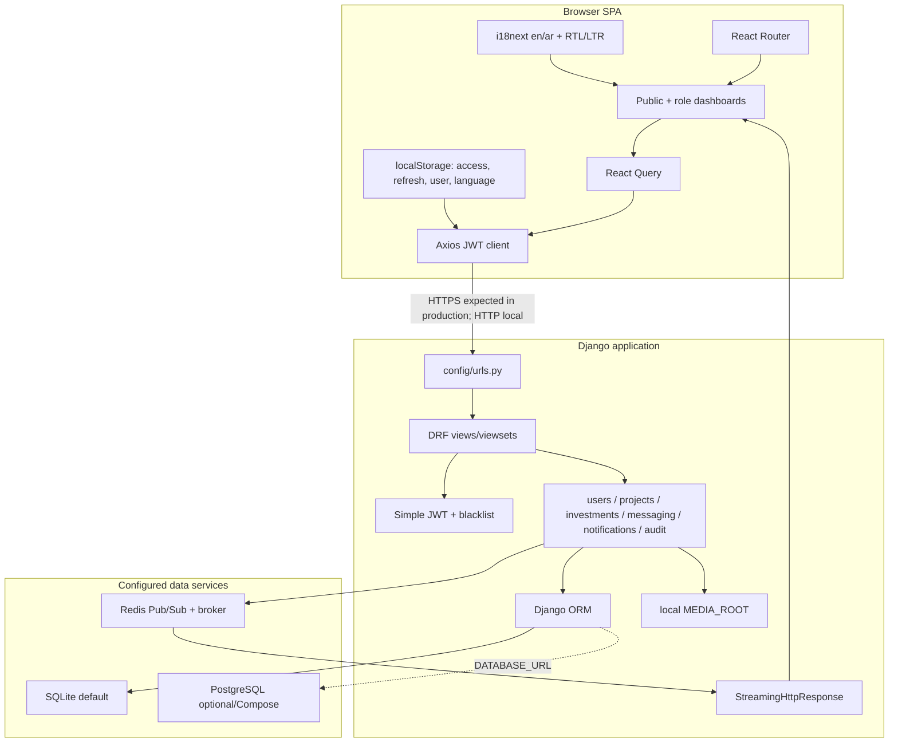
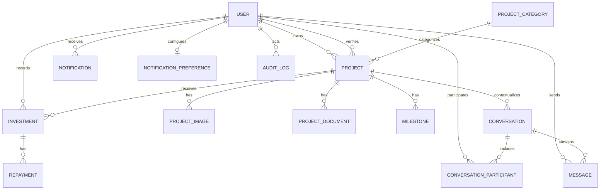
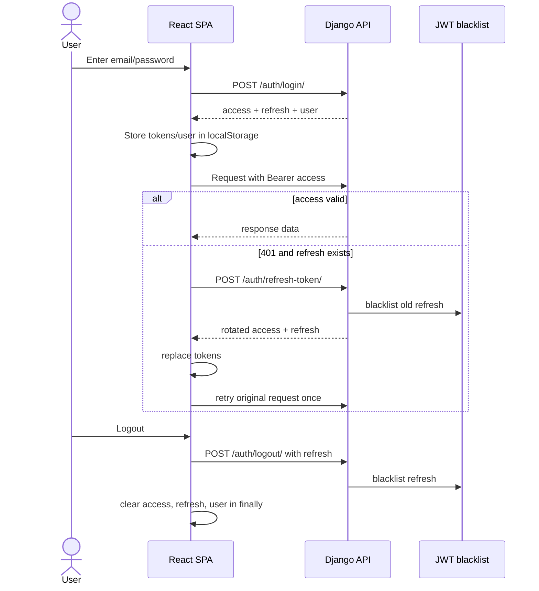
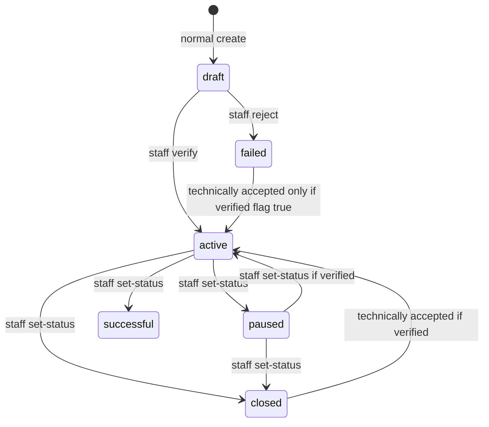
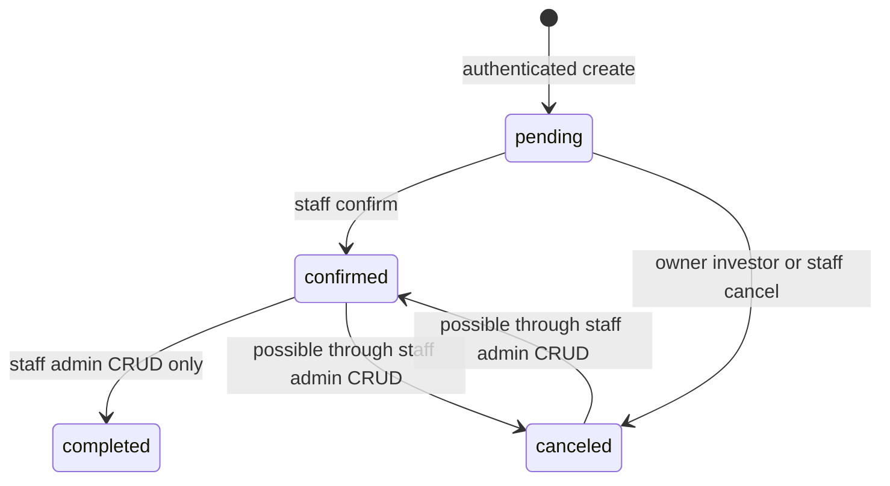
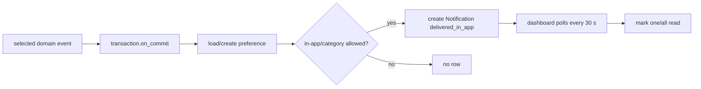
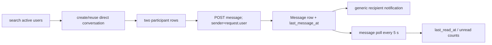
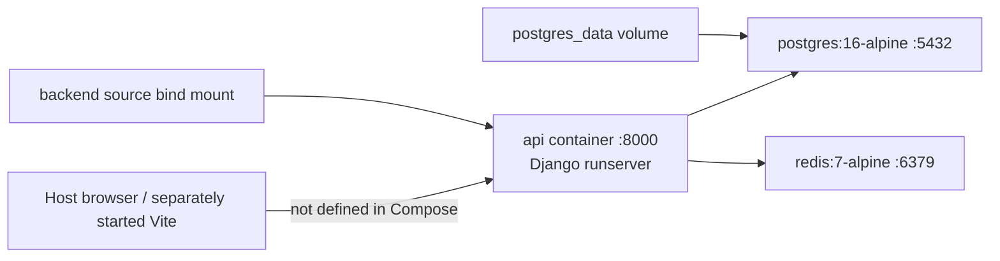
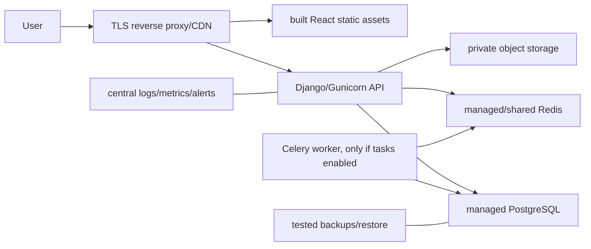

# Sahmi Technical Documentation

**Evidence snapshot:** 25 July 2026 working tree  
**Branch/HEAD:** `feature/backend-messaging-security-hardening` / `7a6cb1e57eb76c6fecfde015a1097c41ac69f6d3`  
**Architecture label:** implemented development architecture unless explicitly marked proposed.

## 1. Verified technology stack and versions

### 1.1 Frontend

The installed/locked local dependency tree was read with `npm ls --depth=0`; no package was installed.

| Technology | Audited version | Evidence/use |
|---|---:|---|
| Node.js | 24.14.1 local tool | local audit environment, not a repository runtime requirement |
| npm | 11.11.0 local tool | local audit environment |
| React / React DOM | 18.3.1 | `package.json`; installed tree |
| TypeScript | 5.8.3 | compile-time typing |
| Vite | 5.4.19 | development/build tool; dev port 8080 in `vite.config.ts` |
| React Router DOM | 6.30.1 | client routing and protected route nesting |
| TanStack React Query | 5.83.0 | server-state queries, mutations and polling |
| Axios | 1.15.0 | JSON/JWT API client |
| Tailwind CSS | 3.4.17 | styling |
| Radix/shadcn components | multiple locked packages | component primitives under `src/components/ui/` |
| i18next / react-i18next | 26.3.6 / 17.0.11 | English/Arabic resources and direction |
| Framer Motion | 12.38.0 | UI animation |
| Recharts | 2.15.4 | dashboard charts |
| Vitest | 3.2.4 | unit/component tests |
| Testing Library React | 16.3.2 installed | component tests |
| Playwright test | 1.59.1 installed | stubs exist; no functioning repository E2E suite established |

### 1.2 Backend

`backend/requirements.txt` defines ranges rather than a lock. The observed local virtual environment is evidence of this audit machine only.

| Technology | Declared range/image | Observed local version | Role/qualification |
|---|---|---:|---|
| Python | Docker `python:3.13-slim` | 3.14.4 | runtime; local and container versions differ |
| Django | `>=4.2,<5.3` | 5.2.16 | web framework/ORM |
| Django REST Framework | `>=3.14,<3.16` | 3.15.2 | API |
| Simple JWT | `>=5.3,<6` | 5.5.1 | bearer tokens, rotation, blacklist |
| django-cors-headers | `>=4.4,<5` | 4.9.0 | CORS |
| django-filter | `>=24.3` | 26.1 | API filtering |
| drf-spectacular | `>=0.27,<0.28` | 0.27.2 | OpenAPI/Swagger |
| psycopg | `>=3.2,<4` | 3.3.4 | PostgreSQL driver |
| Pillow | `>=10.4,<11` | 12.2.0 | image handling; local environment violates declared upper bound |
| Celery | `>=5.4,<6` | 5.6.3 | configured background task framework; no active email task |
| Redis client | `>=5,<6` | 5.3.1 | Pub/Sub and Celery broker |
| Gunicorn | `>=23,<24` | 23.0.0 | Dockerfile default server |
| PostgreSQL | Compose `postgres:16-alpine` | Not run | optional configured database |
| Redis server | Compose `redis:7-alpine` | Not run | configured Pub/Sub/broker |
| SQLite | Django default URL | Not inspected/mutated | default development database |

## 2. Implemented system architecture

### Architectural characteristics

- The frontend and backend are separate applications; Django does not render the React UI.
- The frontend defaults to `http://localhost:8000/api/v1/` (`src/services/api.ts:5`).
- DRF uses a JSON envelope renderer and a custom exception handler (`settings/base.py:125-155`).
- Domain logic is split across serializers, views, services and signals; no payment or AI integration layer exists.
- Database operations are synchronous. Celery is configured, but `send_notification_email` explicitly returns disabled.
- Media files use local filesystem paths; production private media/object storage is absent.
- Redis failure is caught for investment publication/SSE, but errors are printed rather than centrally logged.

## 3. API endpoint catalog

DRF router routes use trailing slashes. Standard router CRUD means:

- collection `GET` list and `POST` create;
- detail `GET`, `PUT`, `PATCH`, `DELETE`, subject to each viewset's methods and permissions.

### 3.1 Framework and documentation endpoints

| Method | Path | Access | Implementation |
|---|---|---|---|
| framework | `/admin/` | Django staff/permissions | Django admin |
| GET | `/api/schema/` | settings/default behavior | drf-spectacular schema |
| GET | `/api/docs/` | settings/default behavior | Swagger UI |

### 3.2 Authentication and account

| Method | Path | Access | Behavior |
|---|---|---|---|
| POST | `/api/v1/auth/register/` | Public, throttled | Create investor/entrepreneur |
| POST | `/api/v1/auth/login/` | Public, throttled | Email login; JWT pair/user |
| POST | `/api/v1/auth/refresh-token/` | Public token holder, throttled | Rotate access/refresh and blacklist old refresh |
| POST | `/api/v1/auth/logout/` | Authenticated | Blacklist submitted refresh |
| GET/PATCH | `/api/v1/auth/me/` | Authenticated | Read/update permitted own fields |
| POST | `/api/v1/auth/change-password/` | Authenticated, throttled | Validate current/replacement password |
| POST | `/api/v1/auth/password-reset/` | Public, throttled | Enumeration-safe request; requires non-console email configuration |
| POST | `/api/v1/auth/password-reset/confirm/` | Public, throttled | UID/token/password confirmation |

Evidence: `backend/apps/users/urls.py:14-22`, `users/views.py`, `users/serializers.py`.

### 3.3 Projects and categories

| Method | Path | Access | Behavior/qualification |
|---|---|---|---|
| GET | `/api/v1/categories/` | Public | List categories |
| GET | `/api/v1/categories/{uuid}/` | Public | Retrieve category |
| POST/PUT/PATCH/DELETE | `/api/v1/categories/...` | Staff | Category mutation |
| GET | `/api/v1/projects/` | Public; staff sees all | Public active+verified+non-deleted; staff all |
| POST | `/api/v1/projects/` | Entrepreneur or staff | Create owned draft |
| GET | `/api/v1/projects/{slug}/` | Public active/verified; owner/staff exception | Public-safe or full serializer; increments views |
| PUT/PATCH/DELETE | `/api/v1/projects/{slug}/` | Owner/staff | Update; normal delete soft-deletes |
| POST | `/api/v1/projects/{slug}/verify/` | Staff, scoped throttle | Verify and activate; notify and audit |
| POST | `/api/v1/projects/{slug}/reject/` | Staff, scoped throttle | Unverify and fail; notify and audit |
| POST | `/api/v1/projects/{slug}/set-status/` | Staff, scoped throttle | active/paused/closed/successful with validation |
| GET | `/api/v1/projects/my/` | Authenticated | Own projects; staff receives all |
| GET | `/api/v1/projects/{slug}/payments/` | Any authenticated account | Confirmed investor name/amount/date/method; overly broad |
| GET | `/api/v1/projects/{slug}/events/` | Public | Redis SSE for any non-deleted known slug; privacy gap |

Evidence: `backend/apps/projects/urls.py`, `projects/views.py`.

### 3.4 Investments, milestones and repayments

| Method | Path | Access | Behavior/qualification |
|---|---|---|---|
| GET/POST | `/api/v1/investments/` | Authenticated | Scoped list; any authenticated user may create |
| GET/PUT/PATCH/DELETE | `/api/v1/investments/{uuid}/` | Staff or scoped related party | Investor reads/updates/deletes own; owner reads project records |
| POST | `/api/v1/investments/{uuid}/cancel/` | Owner investor or staff | Pending → canceled |
| POST | `/api/v1/investments/{uuid}/confirm/` | Staff | Pending → confirmed |
| CRUD | `/api/v1/milestones/` and `/{uuid}/` | Staff or project owner | Workflow fields read-only on normal serializer |
| CRUD | `/api/v1/repayments/` and `/{uuid}/` | Staff or related investor/project owner | Workflow fields read-only; descriptive financial fields writable |

Evidence: `backend/apps/investments/urls.py`, `investments/views.py`, serializers/permissions.

### 3.5 Messaging

| Method | Path | Access | Behavior |
|---|---|---|---|
| GET/POST | `/api/v1/conversations/` | Authenticated | Participant list; create direct/project conversation |
| GET | `/api/v1/conversations/{uuid}/` | Participant | Retrieve |
| POST | `/api/v1/conversations/{uuid}/archive/` | Participant | Per-participant archive |
| POST | `/api/v1/conversations/{uuid}/unarchive/` | Participant | Undo archive |
| POST | `/api/v1/conversations/{uuid}/mute/` | Participant | Per-participant mute |
| POST | `/api/v1/conversations/{uuid}/unmute/` | Participant | Undo mute |
| POST | `/api/v1/conversations/{uuid}/mark-read/` | Participant | Set last-read time |
| GET | `/api/v1/conversations/unread-count/` | Authenticated | Total unread |
| GET | `/api/v1/conversations/user-search/?q=` | Authenticated | Active users, minimal fields, min query length 2 |
| GET/POST | `/api/v1/conversations/{uuid}/messages/` | Participant | Manual page/list and persistent send |
| PATCH | `/api/v1/messages/{uuid}/` | Sender | Edit body |
| DELETE | `/api/v1/messages/{uuid}/` | Sender | Soft-delete |

Evidence: `backend/apps/messaging/urls.py`, `messaging/views.py`.

### 3.6 Notifications and audit

| Method | Path | Access | Behavior |
|---|---|---|---|
| GET | `/api/v1/notifications/` | Authenticated owner | Filtered/paginated list |
| GET | `/api/v1/notifications/unread-count/` | Authenticated owner | Count |
| POST | `/api/v1/notifications/{uuid}/mark-read/` | Owner, throttled | Mark one |
| POST | `/api/v1/notifications/mark-all-read/` | Owner, throttled | Mark all |
| GET/PATCH/PUT | `/api/v1/notifications/preferences/` | Authenticated owner | Retrieve/update preferences |
| GET | `/api/v1/audit-logs/` | Staff | Read-only list/filter/search/order |
| GET | `/api/v1/audit-logs/{uuid}/` | Staff | Read-only detail |

### 3.7 Staff REST admin API

All paths below are under `/api/v1/admin/` and require DRF `IsAdminUser` (`is_staff`).

| Resource/path | Methods/actions | Notes |
|---|---|---|
| `users/`, `users/{uuid}/` | full CRUD | Self/last-admin protections |
| `users/{uuid}/reset-password/` | POST | Validates matching strong password |
| `categories/`, `categories/{uuid}/` | full CRUD | Category delete may be protected by relations |
| `projects/`, `projects/{uuid}/` | full CRUD | Uses UUID rather than public slug; delete is hard |
| `projects/{uuid}/verify/`, `reject/`, `set-status/` | POST | Does not mirror normal action audit/notifications/throttle |
| `project-images/`, `project-images/{uuid}/` | full CRUD | Local media |
| `project-documents/`, `project-documents/{uuid}/` | full CRUD | Local media |
| `investments/`, `investments/{uuid}/` | full CRUD | Staff may set workflow/financial fields |
| `milestones/`, `milestones/{uuid}/` | full CRUD | Staff workflow |
| `repayments/`, `repayments/{uuid}/` | full CRUD | Staff workflow |

Evidence: `backend/apps/core/admin_urls.py:18-31` and domain `admin_views.py`.

## 4. Data dictionary

All domain models except `User` define or inherit UUID/timestamps. `User` inherits Django `AbstractUser` and has a UUID primary key but not `UUIDTimestampModel`.

| Entity | Key fields | Relationships | Status/constraints/concerns |
|---|---|---|---|
| User | email, full_name, user_type, preferred_language, profile/contact, is_verified, is_kyc_verified, investor/business aggregates | owns projects/investments; participates/messages; receives notifications; audit actor | Email unique/normalized; administrative truth is `is_staff`; website/timezone migration untracked |
| ProjectCategory | name, slug, description | has projects | name/slug unique |
| Project | title/slug/descriptions, category/location, goal/funded/minimum/ROI, dates, status, verification fields, files/media, AI storage fields, repayment summary, views/investors/rating, deleted_at | entrepreneur; category; verifier; images/docs; investments/milestones | slug globally unique; positive validation mainly serializer-level; no comprehensive finance/date constraints |
| ProjectImage | image, alt_text | project | local file |
| ProjectDocument | file, title | project | local file; normal public serializer excludes it |
| Investment | investor, project, amount, quantity, status, transaction ID, method, expected/actual return, notes | user/project; has repayments | no payment-provider relation; zero validation bug; mutable confirmed data |
| Milestone | title/description, dates, status, deliverables, percentage, released funding, order | project | no aggregate percentage constraint |
| Repayment | amount, scheduled/actual dates, status, method, transaction ID, notes | investment | record only; no schedule/payment engine |
| Conversation | kind, title, created_by, project, direct_key, last_message_at | participants/messages; optional project | direct key unique; project relation authorization incomplete |
| ConversationParticipant | joined/read dates, muted/archived flags | user + conversation | unique pair |
| Message | sender, body, edited_at, deleted_at | conversation + user | body max 5,000; soft-delete hides serialized body |
| Notification | recipient, actor, type, title/body, target, read time, delivery status | users; logical target only | in-app only; target has no foreign-key integrity |
| NotificationPreference | in-app/email and category toggles | one-to-one user | email toggle has no active delivery |
| AuditLog | actor, action, target strings, result, JSON metadata, request ID, IP, user agent | optional actor | read API staff-only; partial producers; no immutability/retention guarantee |

### 4.1 Repository-derived ERD

Logical `Notification.target_type/target_id` and `AuditLog.target_type/target_id` are not database foreign keys and therefore are omitted as enforced ERD relationships.

## 5. Authentication and token flow

Security observations:

- access lifetime 15 minutes, refresh lifetime 7 days (`settings/base.py:102-109`);
- local-storage tokens are exposed to successful XSS;
- there is no Content Security Policy configuration;
- simultaneous 401 responses can issue parallel refreshes because there is no single-flight lock;
- refresh interceptor failure clears tokens but not the cached `user` key;
- if no refresh token exists, the interceptor rejects without its explicit logout redirect path;
- password validators and endpoint throttles are configured;
- CSRF middleware protects Django session/admin surfaces; JWT bearer API authorization does not use cookie credentials.

## 6. Role-based access-control matrix

Legend: **R** read, **C** create, **U** update, **D** delete, **A** action, `—` denied/not exposed. “Staff” means `is_staff`, not merely `user_type=admin`.

| Resource/action | Visitor | Investor | Entrepreneur | Staff |
|---|---:|---:|---:|---:|
| Public active/verified projects/categories | R | R | R | R (plus all projects) |
| Non-public owned project detail | — | only if owner (normally not) | R own | R |
| Create project | — | — | C | C |
| Update/soft-delete normal project | — | — | U/D own | U/D |
| Verify/reject/set status | — | — | — | A |
| Category mutation | — | — | — | C/U/D |
| Create investment | — | C currently | C currently (gap) | C |
| Investment list/detail | — | R own | R for owned projects | R all |
| Investment update/delete | — | U/D own currently | — | U/D |
| Cancel pending | — | A own | — | A |
| Confirm pending | — | — | — | A |
| Milestones normal API | — | — | CRUD own project | CRUD |
| Repayments normal API | — | CRUD if related investor | CRUD if related project owner | CRUD |
| Confirmed project payments | — | R any known non-deleted slug | R same | R |
| Project SSE | R any known non-deleted slug | R | R | R |
| Conversations/messages | — | participant scope | participant scope | participant scope; staff is not an override |
| Notifications/preferences | — | own | own | own |
| Audit-log API | — | — | — | R |
| `/api/v1/admin/*` | — | — | — | CRUD/actions |

The frontend route matrix is narrower in places, but it is not a security control. For example, only investor UI presents contribution submission, while the backend accepts any authenticated role.

## 7. Major workflows and state transitions

### 7.1 Project lifecycle

The explicit set-status serializer allows `active`, `paused`, `closed`, and `successful`; it does not define a strict transition graph beyond “active requires verified.” Therefore arrows other than create/verify/reject should be treated as API-permitted assignments, not a proven business lifecycle.

### 7.2 Investment lifecycle

Normal API status is read-only. The staff admin serializer/viewset can set state broadly. A transition into confirmed triggers the Redis event; other aggregate-changing edits do not.

### 7.3 Notification flow

The service comment says system/security events should remain allowed, but its current ordering disables them when `in_app_enabled` is false.

### 7.4 Messaging flow

## 8. Frontend routes and backend connections

| Route | Page | Main connections | Data status |
|---|---|---|---|
| `/` | Home | projects/categories | Project cards real; metrics hard-coded |
| `/projects` | Browse | project/category list | Real public API |
| `/projects/:id` | Detail | project, payments, investment create, SSE | Real with privacy/integrity gaps; static updates/team/FAQ content |
| `/start-project` | StartProject | project create/categories | Real |
| `/projects/:id/edit` | EditProject | project retrieve/update | Real; backend owns authorization |
| `/login`, `/register` | auth pages | login/register | Real |
| `/forgot-password`, `/reset-password` | reset pages | reset request/confirm | Code complete; delivery not operationally verified |
| `/about`, `/how-it-works` | marketing | none | Static; includes unsupported operational claims |
| `/contact` | contact | none | Recorded submit |
| `/dashboard/investor` | investor dashboard | investments/projects | Real records; status totals may mislead |
| `/dashboard/investor/transactions` | transaction ledger | investments | Real records |
| `/dashboard/investor/messages` | MessagesPage | conversation/message APIs | Real persistent direct messages |
| `/dashboard/investor/settings` | Settings | me/password/notification prefs/language | Mixed real and fixture-backed |
| `/dashboard/entrepreneur` | entrepreneur dashboard | my projects/investments | Real aggregates; hard-coded message preview |
| `/dashboard/entrepreneur/analytics` | analytics | projects/investments | Client-derived real data; no validated analytics method |
| `/dashboard/entrepreneur/investors` | InvestorsPage | queries made, displayed `fixtureInvestors` | Fixture display |
| entrepreneur messages/settings | shared pages | same services | Mixed as above |
| `/dashboard/admin` | admin summary | projects/categories | Real |
| `/dashboard/admin/projects*` | project admin | admin project/assets/categories APIs | Real |
| `/dashboard/admin/users` | user admin | admin users API | Real |
| admin investments/milestones/repayments | finance admin | admin finance API | Real record CRUD, not money movement |

## 9. Docker and deployment architecture

### 9.1 Repository-configured development topology

Configuration facts:

- Dockerfile uses Python 3.13, installs requirements and defaults to Gunicorn.
- Compose overrides this with `python manage.py runserver 0.0.0.0:8000`.
- Compose defines API, PostgreSQL and Redis only.
- no React frontend, Celery worker, reverse proxy or TLS service exists;
- `backend/.env.example` selects SQLite and `redis://localhost`, which does not address Compose service names from inside the API container;
- its CORS origins list port 5173, while Vite is configured for 8080;
- no health checks, resource limits, migration release step, secret store, production media, backup or observability are defined.

Docker/Compose were not run during this audit.

### 9.2 Proposed production topology — **not implemented**

This proposed view is a requirement illustration, not a statement of deployment. Provider, region, legal controls, availability targets and ownership require `[TEAM CONFIRMATION REQUIRED]`.

## 10. Technical limitations summary

- no real payment, receipt, settlement, refund, escrow, disbursement or return-processing system;
- no complete KYC, private upload, retention or data-subject workflow;
- no AI invocation or evaluation;
- no operational email notifications; password-reset email depends on external SMTP configuration;
- partial audit event coverage and no tamper-evidence;
- public SSE and overly broad payment-history disclosure;
- investment validation/mutability weaknesses;
- inconsistent normal/admin moderation side effects;
- no working repository E2E configuration, CI/CD or verified deployment;
- no fresh backend execution due the no-migration constraint;
- untracked schema migration and Python environment drift.

