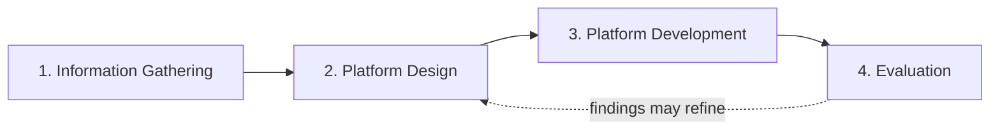
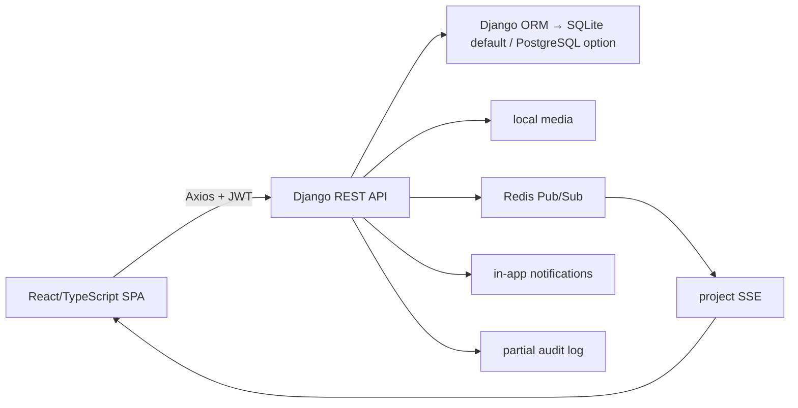

# Sahmi: A Bilingual Role-Oriented Project Funding-Record and Communication Platform

## Front matter

### Title page

**University of Palestine** `[TEAM CONFIRMATION REQUIRED]`  
**Software Engineering and Artificial Intelligence / Software Engineering** `[TEAM CONFIRMATION REQUIRED]`

**Sahmi: A Bilingual Role-Oriented Project Funding-Record and Communication Platform**

A graduation project submitted in partial fulfilment of the requirements for the degree/program `[TEAM CONFIRMATION REQUIRED]`.

**Contributors listed in the current project document**

- Adnan Qasem — 120211953
- Ahmed Qudaih — 120210025
- Moomen Jibril — 120210102
- Abdullah Alotti — 120211678
- Mohammed Almadhoun — 120210381
- Ikrayyem Alabadla — 320200012

All names, spellings, student identifiers, order and contribution statements are `[TEAM CONFIRMATION REQUIRED]`.

**Supervisors listed in the current project document:** Dr. Eyad Almassri and Dr. Alaa AbuZaiter `[TEAM CONFIRMATION REQUIRED]`  
**Submission year:** 2026 `[TEAM CONFIRMATION REQUIRED]`

### Certification/approval

`[OFFICIAL UNIVERSITY CERTIFICATION PAGE REQUIRED]`

### Declaration and permission to use

`[SUPERVISOR/UNIVERSITY TEMPLATE REQUIRED]`

### Dedication

`[OPTIONAL TEAM-AUTHORED TEXT]`

### Acknowledgements

`[TEAM-AUTHORED TEXT REQUIRED; DO NOT INVENT CONTRIBUTORS OR SUPPORT]`

### English abstract

Sahmi is a development-stage bilingual web platform intended to organize the presentation, moderation, and tracking of entrepreneurial project funding records. The project investigates how a role-oriented information system can support public project discovery, entrepreneur project submission, staff review, internal investment records, user dashboards, direct messaging, and in-app notifications while making its implementation and limitations traceable to source code.

The study uses a four-phase Research and Development methodology: Information Gathering, Platform Design, Platform Development, and Evaluation. Information gathering in the current evidence package consists of analysis of the project documents, methodology references, and software repository; stakeholder interviews or surveys were not verified. Platform design covers user roles, requirements, routes, API boundaries, domain entities, and security rules. Platform development uses a React and TypeScript frontend with a Django REST Framework backend. Agile iteration may describe activity within this development phase, but available repository evidence does not independently verify the proposed sprint history. Evaluation combines a repository audit, requirements traceability, security review, source-test inspection, and safe frontend execution.

The repository implements English/Arabic interfaces; JWT account flows; public active and verified project discovery; entrepreneur project management; staff administration and moderation; pending and confirmed internal investment states; confirmed-total synchronization; milestone evidence/revision; server-authoritative repayment schedules and totals; persistent direct messaging; in-app notifications and preferences; password reset; partial audit logging; and Redis/Celery-supported status updates. On 16 August 2026, the complete Django suite passed 132 of 132 tests and the frontend suite passed 82 of 82 tests across 36 files; the production frontend build, funding-integrity audit and migration-drift check also passed.

Sahmi does not implement provider-verified payment, refunds, escrow, disbursement, a complete KYC process, AI execution, operational email notifications, or a verified production deployment. Privacy, investment-integrity, upload-security, test, and operational gaps remain. The result is therefore a substantial academic platform and traceable engineering baseline, not a production financial service.

**Keywords:** Research and Development; bilingual information system; project funding records; role-based access control; React; Django REST Framework; repository audit.

### Arabic abstract — draft for native and supervisor review

`[ARABIC LANGUAGE AND SUPERVISOR REVIEW REQUIRED]`

سهمي هو منصة ثنائي اللغة في مرحلة التطوير، يهدف إلى تنظيم عرض مشاريع ريادة الأعمال ومراجعتها وتتبع سجلات التمويل المرتبطة بها. يبحث المشروع في كيفية دعم نظام معلومات قائم على الأدوار لاكتشاف المشاريع بصورة عامة، وتقديم المشاريع من قبل رواد الأعمال، ومراجعتها من قبل الإدارة، وتسجيل طلبات الاستثمار الداخلية، وعرض لوحات المعلومات، وتوفير المراسلة المباشرة والإشعارات داخل النظام، مع ربط الادعاءات المتعلقة بالتنفيذ بأدلة واضحة من الشيفرة المصدرية.

تعتمد الدراسة منهجية البحث والتطوير من خلال أربع مراحل: جمع المعلومات، وتصميم المنصة، وتطوير المنصة، والتقييم. يقتصر جمع المعلومات المثبت في حزمة الأدلة الحالية على تحليل وثائق المشروع ومراجع المنهجية ومستودع البرمجيات؛ ولم يتم التحقق من إجراء مقابلات أو استبيانات مع أصحاب المصلحة. يشمل التصميم تحديد المستخدمين والمتطلبات والمسارات وواجهات البرمجة والكيانات وقواعد الحماية. نُفّذت الواجهة باستخدام React وTypeScript، بينما نُفّذت الواجهة الخلفية باستخدام Django REST Framework. ويمكن استخدام التطوير الرشيق داخل مرحلة التطوير، إلا أن سجل الدورات المقترح يحتاج إلى تأكيد من الفريق.

ينفّذ المستودع واجهتين باللغتين الإنجليزية والعربية، والمصادقة باستخدام JWT، وعرض المشاريع النشطة والمتحقق منها، وإدارة المشاريع ومراجعتها، وسجلات الاستثمار الداخلية، وتحديث إجماليات التمويل المؤكدة، وإثبات إنجاز المراحل ومراجعتها، وجداول السداد وإجمالياتها المحسوبة في الخادم، والمراسلة الدائمة، والإشعارات داخل النظام، واستعادة كلمة المرور، وسجل تدقيق جزئي، وتحديثات مرتبطة بـ Redis وCelery. في 16 أغسطس 2026 نجحت جميع اختبارات Django وعددها 132، ونجحت جميع اختبارات الواجهة الأمامية وعددها 82 ضمن 36 ملف اختبار، كما نجح بناء الواجهة الإنتاجي وفحص سلامة سجلات التمويل وفحص توافق النماذج مع عمليات الترحيل.

لا يوفّر سهمي معالجة دفع مؤكدة من مزود خارجي، أو استرداداً أو ضماناً أو تحويلاً للأموال، أو إجراءً متكاملاً للتحقق من الهوية، أو تنفيذاً فعلياً للذكاء الاصطناعي، أو نشراً إنتاجياً موثقاً. ولذلك فإن النتيجة منصة أكاديمي وقاعدة هندسية قابلة للتتبع، وليست خدمة مالية جاهزة للإنتاج.

### Contents and lists

Generate the following automatically after the approved word-processing layout is complete:

- Table of Contents
- List of Figures
- List of Tables
- List of Abbreviations

Suggested abbreviations: API, CI/CD, CORS, CSRF, DRF, ERD, HSTS, JWT, KYC, NFR, R&D, RBAC, REST, RTL, SPA, SRS, SSE, UI, UUID.

---

# Chapter 1: Introduction

## 1.1 Background

Digital platforms can organize project presentation, communication, and transaction-related records. Whether such a platform improves trust, access, or economic outcomes is an empirical question and requires appropriate literature and evaluation `[SOURCE REQUIRED]`. This report therefore avoids treating those expected benefits as established outcomes.

The Sahmi team proposes a localized platform through which entrepreneurs may present projects and users may record an intention to support or invest. The repository implements a web platform around this idea. Because the current software does not contact a payment provider or move money, the academically accurate term in this report is **internal investment record**. “Payment,” “funding,” and “return” refer to stored project-domain fields unless external settlement evidence is explicitly identified.

Sahmi's current engineering contribution is the integration of a bilingual browser interface, a REST API, persistent domain models, role-oriented pages, and selected security controls. The report evaluates what the platform actually implements and which trust boundaries remain incomplete.

## 1.2 Motivation

The project is motivated by the team's stated intention to provide a structured experience for Palestinian entrepreneurial projects. Empirical claims about the scale of unmet financing, adoption of informal transfers, regional provider availability, or stakeholder demand require verified academic, regulator, or official-provider sources `[SOURCE REQUIRED]`.

At the engineering level, the motivation is evidence-based: a platform must distinguish public and private project data, restrict administrative actions, maintain consistent totals, protect messages, disclose recorded behavior, and avoid representing database status as real payment. These needs can be examined directly through the repository.

## 1.3 Problem statement

The research and development problem is:

> How can a bilingual, role-oriented web platform organize project discovery, project submission and review, internal investment records, communication, and traceability while exposing—rather than concealing—the limits of its security, testing, and operational readiness?

This formulation does not assume that Sahmi has solved a regional market problem or produced economic impact. It focuses on design, implementation, and technical evaluation that the available evidence can support.

## 1.4 Research questions

- **RQ-01:** What repository-verifiable requirements and architecture support a bilingual, role-oriented project funding-record platform?
- **RQ-02:** To what extent does the current Sahmi platform implement project discovery, submission, moderation, investment records, dashboards, messaging, and notifications?
- **RQ-03:** What technical, security, testing, usability, and operational limitations remain before real-world use?

A research question about measured user satisfaction or adoption is excluded because no approved human-evaluation dataset was found.

## 1.5 Research objectives

- **OBJ-01:** Gather, classify, and document system and stakeholder requirements using available documents and repository evidence.
- **OBJ-02:** Design a bilingual, role-oriented platform architecture, domain model, interfaces, and access boundaries.
- **OBJ-03:** Develop and trace the platform's public, entrepreneur, investor, staff, messaging, notification, and record-management modules.
- **OBJ-04:** Evaluate the platform through repository audit, requirements traceability, source-test inspection, safe frontend checks, and documented limitations.

Objective–question alignment:

| Question | Objectives |
|---|---|
| RQ-01 | OBJ-01, OBJ-02 |
| RQ-02 | OBJ-02, OBJ-03 |
| RQ-03 | OBJ-04 |

## 1.6 Significance

The report may be significant in three bounded ways:

1. **Engineering:** it documents a non-trivial full-stack platform and its trust boundaries.
2. **Academic:** it demonstrates how repository evidence can constrain graduation-project claims.
3. **Practical learning:** it identifies a prioritized path from platform behavior to more defensible operation.

No claim is made that Sahmi has achieved financial inclusion, reduced fraud, created employment, generated returns, or produced social impact. Those outcomes require separate theory, data, and evaluation `[SOURCE REQUIRED]`.

## 1.7 Scope

Included:

- public pages and active/verified project discovery;
- English/Arabic localization and RTL/LTR direction;
- investor and entrepreneur account registration/login;
- profile, password, reset, token and language code;
- entrepreneur project submission/editing/deletion;
- staff users/projects/categories/assets/finance administration;
- internal investment states and project aggregate calculation;
- milestone and repayment record APIs;
- persistent direct messages;
- in-app notifications and preferences;
- partial audit records;
- backend Docker/Compose configuration;
- automated-test assets and current safe frontend checks.

Excluded or not verified:

- real payment, refund, escrow, disbursement or settlement;
- financial advice, ownership, guaranteed return or legal investment contract;
- complete KYC and identity assurance;
- AI classification/recommendation execution;
- operational notification email;
- live production deployment, monitoring and backups;
- legal/regulatory compliance;
- completed user/usability study;
- measured performance, accessibility conformance, security certification, market demand or impact.

## 1.8 Limitations

The audit examined a materially dirty working tree rather than a clean release. A dated implementation addendum on 16 August 2026 executed the complete backend and frontend automated suites, the frontend production build, migration-drift check and funding-integrity audit. These checks strengthen source-level confidence but do not prove production deployment, external integrations, human usability or real financial operation. Prior test results in repository logs remain historical evidence for their respective snapshots.

## 1.9 Chapter organization

Chapter 2 defines the literature needs and conceptual background. Chapter 3 presents the four-phase R&D method and system design. Chapter 4 describes the repository-verified implementation. Chapter 5 presents technical evaluation, findings, and discussion. Chapter 6 prioritizes future work. Chapter 7 answers the research questions and concludes the report.

---

# Chapter 2: Literature Review

## 2.1 Introduction

A literature review should synthesize prior knowledge relevant to the problem, identify a gap, and provide concepts against which findings can be discussed. The current Sahmi document relies mainly on vendor documentation and unsourced platform descriptions. This draft therefore distinguishes verified project evidence from literature still requiring verified sources.

## 2.2 Crowdfunding, impact investment, and platform models

The final submission should define and distinguish donation, reward, lending, equity, and impact-investment models using peer-reviewed or authoritative sources `[SOURCE VERIFICATION REQUIRED]`. This distinction is essential because the current interface uses the terms “invest,” “contribute,” “return,” and “repayment,” while the intended legal and business relationship has not been confirmed.

The literature review should address:

- platform intermediation and information asymmetry `[SOURCE REQUIRED]`;
- trust and verification mechanisms `[SOURCE REQUIRED]`;
- project disclosure and contributor decision-making `[SOURCE REQUIRED]`;
- financial inclusion and the Palestinian context `[SOURCE REQUIRED]`;
- payment-provider and cross-border constraints based on current official sources `[SOURCE REQUIRED]`;
- privacy, fraud prevention, and consumer/investor protection `[SOURCE REQUIRED]`.

No statistic, fee, provider-availability statement, fraud rate, or market conclusion should appear until its source is verified.

## 2.3 Trust, verification, transparency, and privacy

Sahmi's proposed value includes staff project review and visible funding records. Literature is needed to establish how verification and transparency affect trust and what risks arise when personal or financial data is displayed `[SOURCE REQUIRED]`.

The repository demonstrates that “verification” is not a single concept. A staff user can set a project flag after review, while KYC fields separately exist on users. There is no defined identity, legal, business-plan, source-of-funds, or payment-verification standard. The literature and final requirements must therefore avoid equating an internal Boolean flag with certified authenticity.

Privacy is equally important. Data minimization is implemented in the public project serializer, but the public event stream and broad authenticated payment-history route reveal investor-related information. The literature review should discuss privacy-by-design and access control using appropriate academic/standards sources `[SOURCE REQUIRED]`.

## 2.4 Bilingual and right-to-left usability

The platform provides English and Arabic resources, persists locale choice, and changes document direction. Research on bilingual interfaces, RTL layout, translation quality, accessibility and culturally appropriate evaluation is required `[SOURCE REQUIRED]`. The existence of translated resource keys does not demonstrate comprehension or usability.

## 2.5 Secure role-oriented web architecture

The implemented architecture uses a React single-page application and a Django REST API. Official documentation may support framework-specific descriptions, while academic or recognized security sources should support token storage, RBAC, API privacy, upload security and threat analysis `[SOURCE VERIFICATION REQUIRED]`.

Important conceptual distinctions are:

- frontend route visibility versus backend authorization;
- descriptive account type versus administrative authority;
- authentication versus object-level permission;
- internal status versus external payment proof;
- configured security option versus operationally verified control.

## 2.6 Related systems

The current project document discusses Kickstarter, GoFundMe, and informal local transfers. Their business models, supported countries, fees, refund rules, payment providers and verification procedures can change. Each comparison requires a current official source and, where interpretation is academic, supporting literature.

| Dimension | International reward platform | Personal/donation platform | Informal direct transfer | Sahmi current repository |
|---|---|---|---|---|
| Business model | `[SOURCE VERIFICATION REQUIRED]` | `[SOURCE VERIFICATION REQUIRED]` | `[SOURCE REQUIRED]` | Internal project/investment records; intended model `[TEAM CONFIRMATION REQUIRED]` |
| Payment settlement | `[SOURCE VERIFICATION REQUIRED]` | `[SOURCE VERIFICATION REQUIRED]` | varies `[SOURCE REQUIRED]` | Not implemented |
| Project review | `[SOURCE VERIFICATION REQUIRED]` | `[SOURCE VERIFICATION REQUIRED]` | `[SOURCE REQUIRED]` | Staff project status workflow |
| Messaging | `[SOURCE VERIFICATION REQUIRED]` | `[SOURCE VERIFICATION REQUIRED]` | channel-dependent | Persistent direct messages |
| Localization | `[SOURCE VERIFICATION REQUIRED]` | `[SOURCE VERIFICATION REQUIRED]` | context-dependent | English/Arabic resources and RTL/LTR |
| Empirical effectiveness | `[SOURCE REQUIRED]` | `[SOURCE REQUIRED]` | `[SOURCE REQUIRED]` | Not evaluated with users or outcomes |

## 2.7 Research gap

The defensible gap addressed by this study is an engineering and documentation gap: the design and evidence-based evaluation of a bilingual, role-oriented platform that integrates project records, moderation, internal investment states, messages, notifications and traceability while separating implemented functionality from future financial operation.

This is not evidence that no comparable product exists or that Sahmi has a unique market position. A novelty or market-gap claim requires a systematic and current related-work review `[SOURCE REQUIRED]`.

## 2.8 Chapter conclusion

The literature needed for final submission extends beyond technology manuals. The final review must connect platform models, trust, privacy, localization, secure design and platform evaluation using verified sources. The repository can answer implementation questions, but it cannot supply empirical regional or user evidence.

---

# Chapter 3: Research Methodology and System Design

## 3.1 Introduction

Following Alzaza's information-technology research guidance [1] and the organizational example of the 2014 proposal [2], this study adopts Research and Development with four phases. Agile iteration is limited to the Platform Development phase.

## 3.2 Research approach

The approach combines:

- document analysis;
- repository and source-code analysis;
- requirements engineering;
- platform design and development;
- technical verification;
- gap and traceability analysis.

It does not currently include a verified human-subject study. Any later questionnaire, interview, observation, or usability test must be approved, documented and reported separately.

## 3.3 Phase 1: Information Gathering

### 3.3.1 Sources used

- the current Sahmi graduation document;
- Alzaza's methodology book;
- the 2014 proposal sample;
- the complete non-generated Sahmi repository;
- Git metadata and repository-provided historical command reports.

### 3.3.2 Procedure

The researcher:

1. inventoried repository structure and excluded generated/vendor material;
2. recorded branch, commit and dirty status;
3. read all three academic references completely;
4. mapped frontend routes and services;
5. mapped backend URLs, permissions, serializers, models, services, signals and tests;
6. classified each feature;
7. recorded contradictions and unknowns.

### 3.3.3 Stakeholder research boundary

No interview transcript, survey instrument, consent form, raw response, Trello export, meeting minutes, or requirements-signoff record was found. Therefore stakeholder needs in this draft derive from intended roles and implemented behavior, not from a completed empirical needs study. Team evidence may be added only after verification.

## 3.4 Phase 2: Platform Design

### 3.4.1 Actors and boundaries

The design contains four main runtime actors:

- visitor;
- investor account;
- entrepreneur account;
- staff administrator.

The backend `is_staff` flag is the administrative authority. `user_type` supports account-oriented routing but does not itself grant staff.

### 3.4.2 Functional design

The platform is organized into:

- public discovery;
- account/session management;
- project lifecycle;
- investment-record lifecycle;
- milestone and repayment records;
- role dashboards;
- messaging;
- notifications;
- administration and audit.

Detailed requirements and acceptance criteria are provided in `02-sahmi-srs.md`.

### 3.4.3 Architectural design

### 3.4.4 Data design

Core entities are User, ProjectCategory, Project, ProjectImage, ProjectDocument, Investment, Milestone, Repayment, Conversation, ConversationParticipant, Message, Notification, NotificationPreference and AuditLog. The repository-derived ERD and data dictionary are in `03-technical-documentation.md`.

### 3.4.5 Security design principles

- administrative actions are backend-controlled;
- public representations use reduced field sets;
- normal investment/project status fields are server-controlled;
- messages are participant-scoped and sender-derived;
- notifications are owner-scoped;
- audit metadata is sanitized;
- endpoint throttling is configurable.

The evaluation found exceptions to these principles, reported in Chapter 5.

## 3.5 Phase 3: Platform Development

### 3.5.1 Development stack

The frontend uses React 18.3.1, TypeScript 5.8.3, Vite 5.4.19, React Router, React Query, Axios, Tailwind/Radix components and i18next. The backend declares Django, Django REST Framework, Simple JWT, PostgreSQL support, Redis/Celery support and Gunicorn.

### 3.5.2 Iterative development

Agile practices may have supported iteration within this phase. However, the current repository does not prove the document's exact Sprint 1–12 history, Trello states, deployment sprint, or feedback sprint. Those claims remain `[TEAM CONFIRMATION REQUIRED]`.

An evidence-based iteration description is:

1. construct public/auth/project/investment foundations;
2. add admin and financial-record workspaces;
3. harden roles, public project privacy and status control;
4. add persistent messaging, notifications and audit records;
5. add English/Arabic localization and password reset;
6. expand tests and documentation.

This sequence is inferred from repository artifacts and reports; commit-level chronology should be confirmed before final submission.

## 3.6 Phase 4: Evaluation

### 3.6.1 Technical evaluation

The evaluation methods were:

- requirement-to-code traceability;
- frontend/backend/data/API/deployment inspection;
- static test inventory;
- security/privacy review;
- complete backend Django and frontend Vitest execution;
- frontend production build, funding-integrity audit and migration-drift check;
- TypeScript no-emit checking;
- comparison with dated repository command reports.

### 3.6.2 Evaluation limitations

- no coverage measurement;
- no E2E, accessibility, load, penetration or production test;
- no external payment, SMTP-delivery or deployed-service execution;
- no participant usability evaluation;
- the tested working tree was uncommitted and not a tagged release.

### 3.6.3 Proposed human evaluation — future, not executed

If approved, a usability evaluation may measure effectiveness, efficiency, learnability and satisfaction across representative tasks. The instrument, sample, recruitment, consent, data protection and analysis plan require supervisor approval. No participant count, score or result is included because none was verified.

## 3.7 Ethical and data considerations

Future evaluation must avoid real KYC, payment and private-message data. Screenshots should use synthetic accounts. Participant studies require informed consent and anonymization. The product itself requires a privacy notice, retention/deletion policy, access/export process and legal determination before real personal or financial use `[TEAM CONFIRMATION REQUIRED]`.

## 3.8 Chapter conclusion

The four-phase R&D method connects requirements, design, development and bounded evaluation. It supports what can be concluded from the repository while leaving human and operational evaluation explicitly incomplete.

---

# Chapter 4: System Implementation

## 4.1 Introduction

This chapter describes the audited working tree, not an idealized target architecture. Status classifications prevent backend-only fields, recorded UI and configured services from being reported as complete operations.

## 4.2 Public interface and project discovery

The application routes `/`, `/projects`, `/projects/:id`, `/about`, `/contact` and `/how-it-works` publicly. The public API list is restricted to active, verified, non-deleted projects. Public detail uses a reduced entrepreneur representation and omits private documents, contact fields, KYC data and verification notes. Owners and staff may retrieve richer non-public project details.

The home and About pages display hard-coded statistics—230+, $2.4M, 12,000+ and 89%—without a data source. They are presentation fixture data and must not appear as research results.

The Contact page records an API request with a delay, clears the form and reports success. No contact message is sent or persisted.

## 4.3 Accounts, authentication and localization

Public registration accepts investor or entrepreneur only. Email is normalized and is the login identifier. Login returns access/refresh tokens and user data. The client stores access token, refresh token and user data in local storage, attaches the bearer token, and attempts one refresh after a 401.

Refresh tokens rotate and are blacklisted; logout submits the refresh token for blacklist and clears local credentials. Password change is connected from Settings. Password-reset request and confirmation pages/API exist, but actual delivery depends on configured SMTP; the default console backend is treated as not configured by the reset view.

English and Arabic resources, persisted language choice, document `lang`/`dir`, logical alignment and locale formatting are implemented. Full native-language quality, accessibility and visual completeness have not been evaluated.

Settings has mixed status:

- **real:** profile fields, language, password change, notification preferences;
- **fixture-backed:** recovery email, 2FA, sessions, login history, provider connections, wallet, deposit/withdrawal, auto-invest, cards, billing history, invoice download, and several verification claims.

## 4.4 Project submission and moderation

Entrepreneurs/staff submit project title, descriptions, category, location, goal, minimum, expected ROI, duration, optional image and video. The backend assigns the authenticated owner. Projects remain draft/unverified until staff action.

Owners/staff update projects through the normal API; moderation and aggregate fields are read-only. Owner deletion is soft. The staff REST admin supports full project/media/category CRUD and hard deletion.

Two staff moderation paths exist:

- normal `/projects/{slug}/verify|reject|set-status`, which has audit, notifications and scoped throttle;
- `/admin/projects/{uuid}/...`, used by the admin UI, which changes state but does not provide those same side effects.

This inconsistency is a traceability and control gap.

## 4.5 Investment records and live totals

The project page currently posts an amount and a `bank_transfer` label. Only investor-role accounts may create investments. The backend creates a pending `Investment` row, reserves it against the remaining campaign capacity and sends in-app notifications. Status, expected return, actual return and settlement time are server-controlled. Staff can confirm a pending record; an investor can cancel an owned pending record. Confirmed records cannot be changed through the normal investor workflow.

Confirmed/completed rows are reconciled into `Project.funded_amount`; distinct funded investors form `investor_count`. Server services resynchronize funding totals, reject overfunding and expire stale pending reservations. A transition into confirmed publishes a Redis event containing refreshed totals; the project page consumes the event and falls back to polling after an SSE error.

The payment-method model includes card, PayPal and bank-transfer labels, but the investor interface still submits bank transfer and no external provider is contacted. There is no signed payment webhook, investor receipt-upload step, automatic charge, automatic refund or bank reconciliation. Consequently, “confirmed” means that an administrator confirmed the internal investment record; it is not evidence that Sahmi transferred money.

## 4.6 Dashboards and analytics

Investor dashboards and transaction pages use real investment/project API data. Their calculations sometimes include every status in total invested/paid/expected figures. Pending or canceled records can therefore be presented with stronger financial wording than the data supports.

Entrepreneur dashboard and analytics pages use real owned-project and related-investment records for many totals/charts. Project views are raw request counts rather than unique users. The entrepreneur dashboard's recent-message card and the separate investor-network page use hard-coded people, emails, amounts and premium statuses.

No analytics value is a verified business KPI unless its formula and eligible statuses are explicitly defined.

## 4.7 Milestones and repayments

Milestone completion now has an owner-facing evidence workflow. After the authorized milestone allocation has been released, the entrepreneur submits a completion summary and PDF/image evidence. Staff can start review, approve, reject or request revision. A revision-required milestone can be corrected and resubmitted; completion and project transitions remain server-controlled and audited.

The repayment workflow begins only after all milestones are approved and the project reaches `completed`. Staff creates an installment plan for each completed investment. The backend validates project eligibility, positive amounts, duplicate investment/date records, schedule totals and legal state transitions. Installments use `pending`, `due`, `paid`, `overdue` and `cancelled`; a periodic Celery task advances open installments according to the local date.

Visibility is object-scoped: an investor receives only repayments attached to that investor's investments; an entrepreneur can inspect obligations for owned projects but cannot confirm payment; staff can create/manage plans and mark installments paid or cancelled. Summary responses group obligations by investor and project and calculate invested principal, expected profit, total obligation, scheduled total, actually returned amount, remaining amount and next date on the server. Marking a repayment paid synchronizes `Investment.actual_return`, `Project.total_repaid`, the remaining balance and project repayment status. A fully scheduled and fully paid plan becomes `completed`; an unpaid overdue installment makes it `delayed`; otherwise it remains `on_track`.

The investor dashboard presents invested amount beside total expected repayment for each project. The transaction detail displays only the amount actually recorded as paid; before repayment it explains whether the project is fundraising, implementing or completed and awaiting repayment. Completed project details include a repayment-process section, while the staff dashboard provides schedule creation and payment/cancellation actions.

This remains an internal repayment-record workflow. The transaction reference and evidence notes document an externally handled settlement, but Sahmi does not initiate or verify a bank, card or PayPal transfer.

### 4.7.1 Controlled Solar Panels demonstration

On 16 August 2026, the synthetic Solar Panels dataset contained 13 completed investor records totaling USD 10,000. At the configured 5% expected return, the server calculated USD 500 expected profit and a USD 10,500 repayment obligation. Three installments were generated per investment. One USD 3.50 installment was recorded as paid, producing USD 3.50 actual return and USD 10,496.50 remaining. These figures demonstrate server reconciliation using dummy development data; they are not evidence of a real financial transfer or participant outcome.

## 4.8 Persistent messaging

Messaging includes direct, project and group-capable models, participant records, persistent messages, unread counts, read markers, per-participant mute/archive, message edit and soft deletion. The current UI supports direct user search, create/reuse, list, send, unread and read behavior with polling.

Participant scoping and sender derivation are implemented. Remaining gaps include project-conversation relationship authorization, inactive-user selection, controlled self-conversation errors, invalid pagination, no attachments, no real-time socket delivery, no reporting/blocking and no retention/moderation policy. The UI does not expose all backend edit/delete/mute/archive capabilities.

## 4.9 Notifications and audit

Notification rows support types, recipient/actor, target strings, read time and delivery state. Owner-scoped endpoints list, count and mark read; preferences are persisted. Domain services create in-app notifications after transaction commit. Notification email is explicitly disabled and Compose starts no worker.

AuditLog stores actor, action, logical target, result, sanitized metadata, request ID, IP and user agent. Staff has read-only API access. Logging is partial: selected auth and project operations and project payment-history views are logged, while many admin, finance, messaging and notification actions are not.

## 4.10 Data and API implementation

The backend exposes auth, project/category, investment/milestone/repayment, messaging, notification, audit and staff admin endpoints. Detailed catalog, data dictionary and ERD are supplied in `03-technical-documentation.md`.

The data model has strong entity coverage but incomplete invariants. Project goal/minimum/duration receive basic normal-serializer validation; cross-field constraints are missing. Investment zero and post-confirmation mutation remain problematic. Uploads have no explicit size, MIME/signature, malware, privacy or retention controls.

## 4.11 Deployment configuration

The Dockerfile builds a Python 3.13 backend and defaults to Gunicorn. Compose defines API, PostgreSQL 16 and Redis 7, but overrides the API with Django runserver. It omits frontend, Celery worker, reverse proxy and TLS. The backend sample environment selects SQLite, uses localhost Redis and omits Vite port 8080 origins.

Minimal production settings enable SSL redirect, secure cookies and HSTS. No production deployment, database, domain, frontend hosting, private media, backup, monitoring, CI/CD or secret manager is verified.

## 4.12 Chapter conclusion

The repository contains a substantial full-stack platform. Its strongest completed areas are public project scoping, server-controlled roles/status fields, admin CRUD, persistent messaging, in-app notifications, localization and confirmed-total synchronization. Its main weaknesses concern financial semantics/integrity, event/payment privacy, recorded controls, upload security, audit completeness and operation.

---

# Chapter 5: Testing, Evaluation, Findings, and Discussion

## 5.1 Introduction

Evaluation is divided into fresh technical checks, static test/source evidence, historical repository records, security analysis and requirements traceability. Human usability findings are not reported.

## 5.2 Current executed checks

| Date | Check | Result | Interpretation |
|---|---|---|---|
| 16 August 2026 | `python manage.py test --settings=config.settings.test` | **132/132 tests passed**; no Django system-check issues; 52.464 seconds | Current isolated backend integration/unit evidence |
| 16 August 2026 | `npm test -- --run` | **36 test files, 82 tests passed** | Current frontend unit/component evidence after the unique repayment-demo-reference test |
| 16 August 2026 | `npm run build` | Exit 0; production bundle generated | Current frontend compilation/bundling evidence |
| 16 August 2026 | `python manage.py audit_funding_integrity` | No issues found | Current development-database funding-ledger consistency check |
| 16 August 2026 | `python manage.py makemigrations --check --dry-run` | No changes detected | Current model/migration drift check |

The backend suite covers authentication/users, project access and moderation, supporting documents, investment/funding integrity, withdrawal and milestone-completion transitions, repayment plans/permissions/totals, messaging, notifications, audit and staff APIs. The frontend suite covers those workflows at service/component level together with localization, routing, forms and demonstration helpers. These results support the tested development configuration; they do not constitute production, external-payment, usability, accessibility, load or penetration evidence.

## 5.3 Backend and historical evidence

The current 132-test backend suite supersedes the earlier static-only and historical counts for the 16 August 2026 working tree. Repository logs containing earlier suites of 58 or 60 backend tests and smaller frontend suites remain provenance for older snapshots, not the current result.

No current E2E, coverage percentage, load, accessibility, penetration, Docker-production, SMTP-delivery, live Redis/PostgreSQL, payment-provider or deployed-environment result is available. The test run emitted a short HMAC/JWT test-key warning; production secrets must meet the provider's required entropy and length.

## 5.4 Findings

### Finding F-01: The platform is broader than the current graduation document states

Persistent messaging, notifications/preferences, audit records, password reset, expanded admin APIs and bilingual support now exist. The old documentation's claim that these are absent is no longer accurate.

### Finding F-02: Several old critical authorization defects were repaired

Public admin/staff escalation, public category mutation, direct client investment status, and public draft/private document exposure are addressed by current serializers, permissions and querysets.

### Finding F-03: Internal financial records are implemented, payment is not

Investment creation, server-owned state, funding reconciliation, milestone release records, repayment schedules, actual-return synchronization and notifications exist. No code verifies incoming or outgoing money movement. Card and PayPal are data labels, not gateway integrations; wallet, automatic refund and provider-settlement claims remain unsupported.

### Finding F-04: Financial integrity improved, but production controls remain incomplete

Investor-role checks, server-owned financial states, overfunding prevention, immutable repayment workflow fields, schedule validation, unique repayment references and server-side aggregate reconciliation materially improve integrity. Public/project-event privacy, absence of external settlement verification, automatic campaign refunds, dispute/chargeback handling and production-grade reconciliation still prevent a secure financial-service claim.

### Finding F-05: Messaging and notifications are persistent but bounded

Direct messages and in-app notifications are real database workflows and are covered by current frontend tests. Messaging is polling-based and lacks some relationship/moderation controls. Email delivery is disabled.

### Finding F-06: The interface mixes real and recorded behavior

Contact submission, investor-network people, dashboard message previews, wallet, deposit/withdrawal, cards, invoice, 2FA, sessions and login history are fixture-backed. This must be disclosed during demonstration and in captions.

### Finding F-07: Deployment evidence is configuration only

Backend container artifacts exist, but their sample values are inconsistent and the deployment is incomplete. No live system is verified.

### Finding F-08: Academic evaluation remains incomplete

Current backend and frontend automated suites pass, but no human evaluation or production operation has been conducted. Usability, accessibility, satisfaction, market acceptance and impact cannot be concluded.

## 5.5 Discussion by research question

### RQ-01: Requirements and architecture

The repository supports a coherent set of role, project, investment-record, messaging, notification, administration and traceability requirements. React/DRF separation, domain models and route-specific permissions form the architecture. English/Arabic direction and persistent services support the bilingual role-oriented goal. The SRS and technical document capture this answer.

The architecture remains incomplete for real financial operation because payment, KYC, private file service, comprehensive audit, observability and production deployment are absent.

### RQ-02: Extent of implementation

The platform implements the principal record-management and communication foundation. Public discovery, project lifecycle, admin CRUD, internal investments/aggregates, milestone evidence/revision, server-authoritative repayment plans, direct messages and in-app notifications are repository-verified. AI/KYC and external financial settlement remain incomplete or storage-only. Some financial/security/settings/support experiences still include fixtures.

Therefore the correct finding is “substantial platform implementation,” not “complete crowdfunding platform.”

### RQ-03: Remaining limitations

The most important limitations are:

1. project-event/payment privacy;
2. investment validation and immutability;
3. misleading recorded payment/security claims;
4. incomplete upload and KYC privacy controls;
5. inconsistent moderation side effects and partial audit;
6. environment/schema/deployment reproducibility;
7. absent E2E/performance/accessibility/security and human evaluation.

These limitations mean real-world readiness is not demonstrated.

## 5.6 Evaluation validity

### Internal validity

Claims are tied to file paths, classes/functions and current commands. The dirty working tree and absence of a tagged release reduce confidence in release-level reproducibility, despite the current passing backend and frontend suites.

### Construct validity

The evaluation measures implementation and technical consistency. It does not measure trust, social impact, financing access, satisfaction or legal suitability.

### External validity

No participants, production traffic, real payments or deployed environment were studied. Findings should not be generalized to users or markets.

### Reliability

The repository snapshot, commands, requirements and evidence map allow repetition, subject to committing the audited changes and resolving environment drift.

## 5.7 Required future user evaluation

A supervisor-approved study could ask representative users to:

- switch language and navigate;
- find a verified project;
- submit a project;
- record a pending investment;
- locate status/transaction information;
- start a direct conversation;
- read/manage a notification.

Metrics and analysis must be selected before data collection. Participant count, demographics, success rates, times, Likert means and comments must not be inserted until actually collected and anonymized.

## 5.8 Chapter conclusion

Evaluation answers the research questions at the platform/source level. It demonstrates passing backend/frontend automated targets and substantial implementation, while revealing material privacy, external-settlement and operational gaps. It does not establish human usability or production safety.

---

# Chapter 6: Future Work

## 6.1 Immediate security and integrity work

1. Restrict project events to public active/verified projects or authorized related users and remove unnecessary investor PII.
2. Restrict payment-history details by approved relation/privacy rule.
3. define and implement an auditable failed/cancelled campaign refund workflow.
4. add bank-transfer receipt/reference verification before administrative confirmation.
5. unify normal/admin moderation through one service with audit, notification and throttle parity.
6. validate project conversations and return controlled errors.
7. preserve financial-integrity and transition tests in continuous integration.

## 6.2 Product-truth and usability work

- remove or label hard-coded platform statistics;
- replace contact, investor network and dashboard previews with real data or demonstration labels;
- remove active-looking wallet/payment/2FA/session/billing controls until implemented;
- reconcile contradictory keep-funds/refund copy;
- use status-aware financial labels and calculations;
- conduct Arabic native-language, accessibility and responsive review.

## 6.3 Financial and legal work

Before any payment implementation, the team must define:

- legal nature of contribution/investment;
- jurisdiction and regulatory obligations;
- ownership, fee and return rules;
- provider eligibility and contracts;
- authorization, refund, chargeback, failed-payment and reconciliation flows;
- receipt/evidence and dispute handling;
- data and record retention.

Only after approval should payment-provider adapters, signed webhooks, idempotency, reconciliation and settlement states be implemented. No current field should be treated as a shortcut to compliance.

## 6.4 KYC, files and privacy

- define KYC purpose, reviewer authority, consent, retention and deletion;
- use private object storage and authorized download URLs;
- validate size/type/signature and define malware handling;
- implement access/export/deletion and privacy notices;
- minimize event, notification, analytics and audit personal data.

## 6.5 Testing and operations

- preserve the current backend/frontend commands in CI and publish coverage reporting;
- add provider-webhook, automatic-refund and repayment-reminder tests after those workflows are designed;
- replace Playwright stubs with local declared configuration and E2E cases;
- add accessibility, load and security testing against agreed targets;
- lock Python dependencies reproducibly;
- correct Compose/environment values;
- add frontend, production API, private media, health checks, logs, metrics, alerts, backup/restore and CI/CD;
- document release and migration authority.

## 6.6 Research and academic work

- obtain and verify scholarly/domain sources;
- complete official front matter;
- confirm title/team/supervisor/method history;
- decide whether to conduct a human evaluation;
- if approved, preserve ethics, instrument, raw anonymized data and analysis;
- add synthetic-data screenshots and final traceability appendices;
- regenerate lists, pagination and references in the required style.

## 6.7 Chapter conclusion

Future work is ordered by risk: protect data and financial integrity first, correct product claims second, define legal/business rules before payment, then expand operation and evaluation. None of these items is described as already implemented.

---

# Chapter 7: Conclusion

## 7.1 Summary

This project applied a four-phase R&D framework to the design, development and technical evaluation of Sahmi. Information Gathering reviewed academic references, project documents and the repository. Platform Design defined roles, requirements, architecture, entities and trust boundaries. Platform Development produced a React/TypeScript and Django/DRF application. Evaluation traced requirements to source and tests, executed safe frontend checks, and identified limitations.

## 7.2 Answers to the research questions

**RQ-01:** Sahmi is supported by requirements and architecture for public project discovery, role-oriented project and investment records, staff moderation, messaging, notifications and bilingual presentation. The detailed SRS, API map, ERD and RBAC matrix answer this question.

**RQ-02:** The repository implements a substantial platform: account/JWT workflows, public active/verified project visibility, entrepreneur project management, staff administration, internal investment states and totals, milestone evidence/revision, server-authoritative repayment scheduling and totals, persistent direct messages, in-app notifications, password reset, partial audit and English/Arabic UI. Some features remain backend-only or fixture-backed, and financial settlement remains external/manual.

**RQ-03:** Material limitations remain in event/payment privacy, investment integrity, upload/KYC protection, audit completeness, product-truth labeling, schema/deployment reproducibility, E2E/backend-current testing and human evaluation. Real payment and production operation are absent.

## 7.3 Objective achievement

| Objective | Achievement |
|---|---|
| OBJ-01 requirements gathering | Achieved for document/repository analysis; stakeholder empirical work `[NOT VERIFIED]` |
| OBJ-02 platform design | Achieved at repository/document level |
| OBJ-03 platform development | Substantially achieved, with classified partial/fixture/backend-only modules |
| OBJ-04 evaluation | Achieved for repository plus current backend/frontend automated checks; human, accessibility, performance, security and operational evaluation remain incomplete |

## 7.4 Final conclusion

Sahmi is a credible graduation-project platform and an instructive full-stack engineering artifact. Its value lies in the breadth and traceability of its implemented foundation, not in unsupported claims of financial security, deployment, usability, impact or compliance. With the identified academic evidence, security, integrity and evaluation work completed, it could become a stronger research report and safer software baseline. In its audited state, it is suitable for controlled demonstration with synthetic data and explicit limitations; it is not ready for production or real financial use.

---

# References

## Submission-ready references currently supported by supplied material

[1] N. S. Alzaza, *Research Methodology in Information Technology*, 2nd ed., 2020. Publisher/institutional bibliographic details `[SOURCE VERIFICATION REQUIRED]`.

[2] *Mobile-Based Library Loan Service (MBLLS)*, graduation proposal sample, University of Palestine, 2014. Authors and full bibliographic details `[SOURCE VERIFICATION REQUIRED]`.

[3] Sahmi project team, *Sahmi source repository*, audited working tree on branch `feature/backend-messaging-security-hardening`, HEAD `7a6cb1e57eb76c6fecfde015a1097c41ac69f6d3`, 25 July 2026. Internal software artifact.

[4] Sahmi project team, *Sahmi Graduation Project Document*, `Sahmi_Documentation_Corrected.docx`, 2026. Draft/internal artifact.

## Provisional technical references retained from the current document

The current document lists official documentation for Django, Django REST Framework, PostgreSQL, Python, React, HTML/CSS/JavaScript, Tailwind CSS, TypeScript, Vite, Git/GitHub, React Query, Axios, shadcn/ui, Docker/Compose, Nginx, DigitalOcean, GitHub Actions, Trello, Google Docs/Sheets, VS Code and the Scrum Guide. Each URL, title, authoring organization, version, access date and citation use must be verified before submission `[SOURCE VERIFICATION REQUIRED]`.

## Required literature still missing

- peer-reviewed crowdfunding/impact-investment definitions and models;
- trust, verification, information-asymmetry and platform-governance research;
- Palestinian financial/digital context using authoritative sources;
- official current provider/country/fee information;
- privacy, secure API, token-storage and upload-security sources;
- bilingual/RTL usability and accessibility research;
- information-system platform/usability evaluation sources.

Do not number or cite a missing source until it is obtained and verified.

---

# Appendices

## Appendix A: Companion audit documents

- `00-academic-gap-report.md`
- `01-repository-audit-and-evidence-map.md`
- `02-sahmi-srs.md`
- `03-technical-documentation.md`
- `04-testing-security-and-traceability.md`

## Appendix B: Implementation status definitions

1. Verified and implemented
2. Partially implemented
3. Frontend-only or fixture-backed
4. Backend-only
5. Configured but not operationally verified
6. Planned/future work
7. Claimed in documentation but not found in code

## Appendix C: Test evidence

Current:

- 132/132 Django tests passed on 16 August 2026 with no system-check issues;
- 82/82 frontend tests passed across 36 files on 16 August 2026;
- the frontend production build, funding-integrity audit and migration-drift check passed;
- TypeScript no-emit checking remains recorded from the earlier audit.

Historical repository logs must be labelled with their dates and prior working-tree context.

## Appendix D: Research traceability

| RQ | Objectives | Primary evidence | Finding |
|---|---|---|---|
| RQ-01 | OBJ-01, OBJ-02 | SRS, architecture, routes, models, RBAC | coherent platform requirements/architecture |
| RQ-02 | OBJ-02, OBJ-03 | feature/evidence map, implementation chapter, tests | substantial mixed-status implementation |
| RQ-03 | OBJ-04 | security/testing audit and limitations | not production-ready; evaluation incomplete |

## Appendix E: Team/supervisor evidence checklist

- official front matter and authorship;
- confirmed research method history;
- verified literature and citation style;
- intended funding/legal/refund/return rules;
- KYC/privacy/retention decisions;
- deployment evidence, if any;
- evaluation ethics, instrument, participants, raw data and analysis;
- synthetic-data screenshot set;
- signed final review that fixture-backed features and limitations are disclosed.

## Appendix F: Screenshot register

`[SCREENSHOTS REQUIRED FROM THE TEAM]`

Each figure must state:

- route/build/date;
- synthetic account role;
- whether API data is real local test data or fixture-backed;
- language and viewport;
- any hidden/redacted personal data;
- related requirement/use case.

