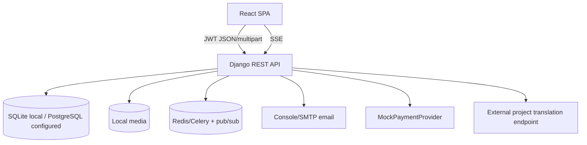
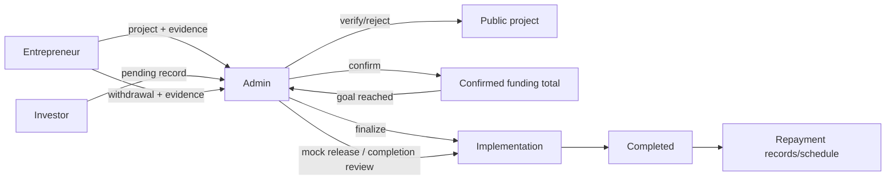
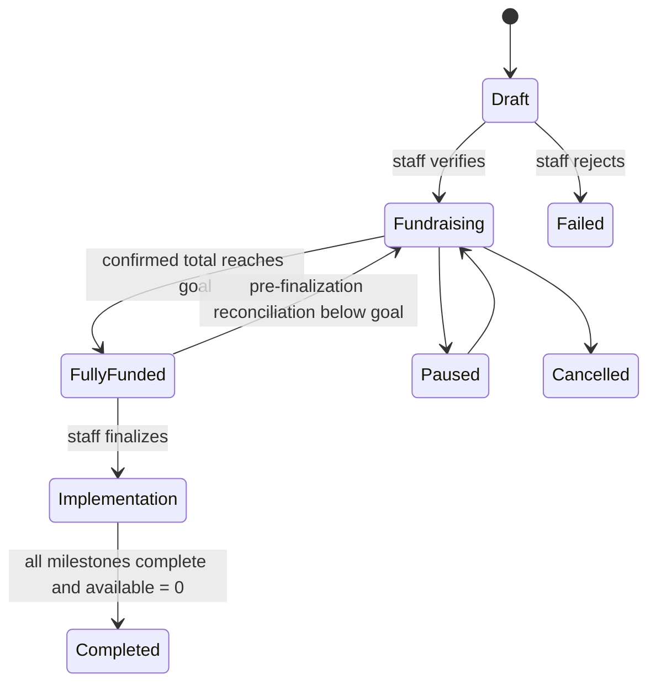
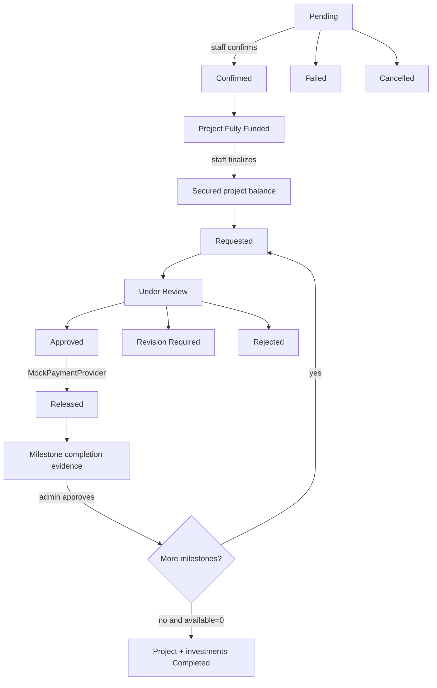
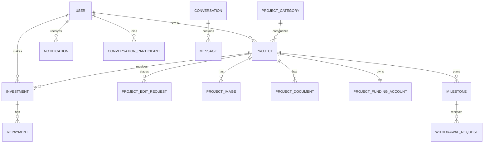

# Sahmi current implementation evidence handoff

**Evidence date:** 2026-08-14, Asia/Hebron  
**Inspected scope:** the complete current working tree at `C:\Users\Dell\OneDrive\Documents\MyProjects\Sahmi`  
**HEAD:** `528c436e31aa5df1448149fbe94e469a5f6b3bfd` (`528c436`), commit time `2026-08-14T17:53:14+03:00`, subject `Merge branch 'feature/backend-messaging-security-hardening'`  
**Evidence standard:** a statement is included as implemented only when supported by current source, configuration, migrations, or a test run. Product copy and old documentation are not treated as proof.

## 1. Critical baseline warning

This package describes the **current filesystem**, not merely `HEAD`. The repository was materially dirty: 62 tracked files were modified and 20 paths were untracked before this evidence directory was excluded. Several current features and migrations—especially milestone disbursement—were untracked or differed from `HEAD`. Therefore, the commit hash does **not** reproduce this exact state by itself. See `repository-state.md`.

No existing source or documentation was edited. Only this evidence directory, its generated schema, and the final ZIP were created.

## 2. Purpose, scope, and honest classification

The repository describes Sahmi as connecting “hearts and capital” to support innovation in Palestine (`README.md:1`). The implemented application is a bilingual web platform where entrepreneurs propose projects, staff moderate them, investors create investment records, and all roles follow funding, implementation, communication, and return records.

Current classification:

| Label | Meaning in this handoff |
|---|---|
| **Implemented** | Executable UI/backend/data behavior exists and is supported by source; where named, tests passed. |
| **Simulated** | The workflow is real inside Sahmi, but an external-world effect is mocked. The main example is fund release through `MockPaymentProvider`. |
| **Partial** | Important pieces exist, but the complete operational/business capability does not. |
| **Configured, unverified** | Configuration exists, but it was not exercised in this inspection. |
| **Future / unsupported** | A field, string, prompt, or document mentions it, but working implementation was not found. |

Sahmi is currently a substantial development-stage academic prototype. It is **not verified** as a production deployment, licensed financial service, custodian, escrow service, or real payment processor. No participants, usability study, measured impact, real transactions, or evaluation results are present in code and none are asserted here.

## 3. Technology and dependency evidence

### Frontend

- React 18.3.1, React DOM, TypeScript 5.8.3 and Vite 5.4.19 (`package.json:13-14`, `package.json:44-45`, `package.json:66`, `package.json:75`).
- React Router 6.30.1 for SPA routing (`package.json:46`; route tree at `src/App.tsx:55-120`).
- TanStack React Query 5.83.0 and Axios 1.15.0 for server state/HTTP (`package.json:30-31`; API client at `src/services/api.ts:140-193`).
- Tailwind CSS 3.4.17, Radix UI primitives, shadcn-style local components, Lucide icons, Framer Motion and Recharts (`package.json:15-29`, `package.json:40-43`, `package.json:48`, `src/components/ui/`).
- i18next 26.3.6 and react-i18next 17.0.11 (`package.json:38`, `package.json:45`; initialization at `src/i18n/index.ts:7-33`).
- Vitest 3.2.4, Testing Library, jsdom, ESLint; Playwright packages/config are present but no E2E specs were found (`package.json:56-76`, `playwright.config.ts:1-10`, `playwright-fixture.ts:1-3`).
- Development server port 8080 and `@` alias to `src` (`vite.config.ts:7-16`). Vercel has a SPA rewrite (`vercel.json:2-7`), but deployment itself is unverified.

### Backend

- Django/DRF application with Django 4.2–5.2-compatible requirement, SimpleJWT, django-filter, drf-spectacular, CORS headers and Pillow (`backend/requirements.txt:1-18`). The test environment ran Django 5.2.x dependencies from the local virtual environment.
- PostgreSQL driver and `dj-database-url`; SQLite is the local default while Docker config supplies PostgreSQL 16 (`backend/config/settings/base.py:64-69`, `backend/.env.example:5`, `backend/docker-compose.yml:1-32`).
- Redis 7/Celery configuration supports broker/result configuration and project event pub/sub (`backend/config/settings/base.py:199-202`, `backend/config/celery.py:1-9`, `backend/apps/projects/views.py:484-519`). No worker/Redis integration test was run.
- Gunicorn/Docker production command on port 8000 (`backend/Dockerfile:1-20`, `backend/docker-compose.yml:1-18`). Production security settings force HTTPS, secure cookies, and HSTS (`backend/config/settings/prod.py:3-8`). No deployed environment was verified.
- Local media storage under `backend/media`; user/project/evidence files use Django `FileField`/`ImageField` (`backend/config/settings/base.py:88-89`). No object store, antivirus scanner, or retention job was found.
- Default email backend is console and SMTP can be configured; contact recipient defaults to `ikryyemala@gmail.com` (`backend/config/settings/base.py:180-190`). Thus contact validation/send logic is implemented, but real delivery depends on environment configuration.

## 4. Architecture and folders

The runtime is a React SPA calling a versioned DRF API. DRF services use Django ORM transactions against SQLite locally or PostgreSQL when configured. JWT is held in browser local storage. Uploads use local media. Redis is used for project SSE when available; notifications use an authenticated streaming response with database polling. Fund release calls a replaceable provider interface whose configured default is the mock provider.

Key folders:

| Path | Responsibility |
|---|---|
| `src/pages/` | Public and dashboard route components |
| `src/components/` | Shared UI, project cards, dashboard/admin dialogs, shadcn primitives |
| `src/services/` | Typed API clients for auth, projects, finance, funds, notifications, messages and contact |
| `src/hooks/` | Authentication and UI hooks |
| `src/i18n/` | EN/AR resources, formatting and translated labels |
| `src/lib/` | Mappers, validation/calculation helpers and polling policy |
| `src/test/` | Vitest component/unit tests |
| `backend/apps/users/` | Custom user/auth/profile/settings APIs |
| `backend/apps/projects/` | Projects, categories, assets, moderation and edit approval |
| `backend/apps/investments/` | Investments, milestones, funding account, withdrawals, repayments and mock payout provider |
| `backend/apps/messaging/` | Conversations, participants and persistent messages |
| `backend/apps/notifications/` | Notifications, preferences, email/in-app delivery and stream |
| `backend/apps/audit/` | Audit records, sanitization and staff read API |
| `backend/apps/core/` | Shared UUID timestamps, pagination, throttles, renderer and contact endpoint |
| `backend/config/` | URLs, settings, ASGI/WSGI and Celery setup |

Standalone source: `diagrams/architecture.mmd`.

## 5. Roles, authorization, and workflows

The custom user model exposes `investor`, `entrepreneur`, and `admin` user types (`backend/apps/users/models.py:12-16`). Administrative authorization is based on Django's server-controlled `is_staff`, not merely the `user_type` string; model save explicitly avoids auto-promoting admin-type users (`backend/apps/users/models.py:62-67`). Public registration only accepts investor/entrepreneur, and profile updates cannot promote privilege (`backend/apps/users/serializers.py:77-120`; tests at `backend/apps/users/tests.py:122-167`).

### Entrepreneur

Implemented abilities:

- Create projects; creation is restricted to entrepreneur-type users or staff (`backend/apps/projects/permissions.py:4-11`, `backend/apps/projects/views.py:60-63`).
- Complete the multi-step project form with description, category/location, cost items, goal/minimum/ROI, implementation milestones, required PDF documents, media and FAQs (`src/pages/StartProject.tsx:52-427`; validation in `backend/apps/projects/serializers.py:252-487`). A serializable draft is stored in session storage and unload warns when dirty (`src/pages/StartProject.tsx:74-119`). File objects themselves cannot be restored from JSON.
- View own projects including non-public states through `/projects/my/` (`backend/apps/projects/views.py:84-105`, `backend/apps/projects/views.py:411-420`).
- Edit an owned project. Non-staff edits are staged in a `ProjectEditRequest` and return HTTP 202; published data changes only after staff approval (`backend/apps/projects/views.py:158-247`, `backend/apps/projects/admin_views.py:226-263`). The frontend also redirects a loaded non-owner/non-staff user (`src/pages/EditProject.tsx:46-65`).
- Dashboard, analytics scoped to owned projects, investor list derived from real investment query data, messages, notifications, persisted settings and funds page (`src/App.tsx:85-91`; `src/pages/dashboard/EntrepreneurAnalyticsPage.tsx:193-594`; `src/pages/dashboard/InvestorsPage.tsx:72-604`; `src/pages/dashboard/FundsPage.tsx:30-255`).
- After funding finalization: inspect secured/released/available totals, request the current milestone allocation with amount/purpose/evidence, cancel eligible requests, submit milestone completion evidence, and see request history (`src/pages/dashboard/FundsPage.tsx:30-255`; `src/services/fundsService.ts:43-65`).

### Investor

Implemented abilities:

- Browse/retrieve verified public projects in fundraising, fully funded, implementation and completed states (`backend/apps/projects/views.py:55-98`).
- Create a pending investment record for a verified fundraising project, subject to minimum and remaining/reserved capacity (`backend/apps/investments/serializers.py:38-57`, `backend/apps/investments/views.py:42-65`).
- View/edit own pending investment records and cancel a pending record; confirmed status is staff-controlled (`backend/apps/investments/permissions.py:4-13`, `backend/apps/investments/views.py:91-157`).
- Use investor dashboard and transactions/detail view; browse messages, notifications and persisted settings (`src/App.tsx:77-82`; `src/pages/dashboard/InvestorDashboard.tsx:1-409`; `src/pages/dashboard/InvestorTransactionsPage.tsx:39-427`).
- Track public project milestones/updates and see a privacy-safe repayment schedule only after implementation completion (`backend/apps/projects/views.py:452-478`; `src/pages/ProjectDetails.tsx:40-711`).

Important authorization gap: the investment create endpoint requires authentication but does not enforce `user_type == investor`; it assigns whichever authenticated caller creates it (`backend/apps/investments/permissions.py:4-7`, `backend/apps/investments/views.py:42-65`). The frontend presents investment primarily to investors, but backend role enforcement is incomplete.

### Admin/staff

Implemented abilities:

- Access a protected React admin workspace; routes use `requireStaff` (`src/App.tsx:62-75`, `src/components/ProtectedRoute.tsx:1-39`).
- Dashboard overview and “needs attention”; full project queue/detail review, verify/reject/status changes, final funding reconciliation, and edit-request approval/rejection (`src/pages/dashboard/AdminDashboard.tsx:1-317`, `src/pages/dashboard/admin/AdminProjectsPage.tsx:59-541`, `backend/apps/projects/admin_views.py:44-289`).
- Review requested edit fields, category display, computed cost table, readable milestone timeline, and per-upload metadata/review state (`src/components/admin/AdminProjectReviewDetails.tsx:1-123`, `src/components/admin/AdminEditImageReviews.tsx:1-76`, `backend/apps/projects/admin_views.py:179-224`).
- CRUD/administer users, categories, projects/assets, investments, milestones and repayments (`src/App.tsx:64-71`; backend admin viewsets at `backend/apps/users/admin_views.py:18-107`, `backend/apps/projects/admin_views.py:26-308`, `backend/apps/investments/admin_views.py:20-215`). These APIs are `IsAdminUser`.
- Confirm pending investments (`backend/apps/investments/views.py:159-238`).
- Review/approve/reject/request-revision/release withdrawal requests and review milestone completion evidence (`backend/apps/investments/views.py:365-538`, `backend/apps/investments/views.py:659-793`; admin UI at `src/pages/dashboard/FundsPage.tsx:30-255`).
- Read audit logs (`backend/apps/audit/views.py:8-19`), use messages/notifications/settings routes, and access Django admin (`backend/config/urls.py:9-23`).

Standalone source: `diagrams/role-workflows.mmd`.

## 6. Complete route/page inventory

All routes come from `src/App.tsx:55-120`.

### Public/shared shell

| Route | Page | Verified purpose |
|---|---|---|
| `/` | `HomePage` | Landing content, featured projects, funding status; project query refreshes every 5 s (`src/pages/HomePage.tsx:62-83`). |
| `/projects` | `BrowseProjects` | Active opportunities and funded-success grids, search/category/sort URL params, 300 ms search debounce and pagination (`src/pages/BrowseProjects.tsx:16-220`). |
| `/projects/:id` | `ProjectDetails` | Public/owner project detail, funding, timeline, updates, investments/repayments as allowed; shadcn delete confirmation (`src/pages/ProjectDetails.tsx:40-711`). |
| `/start-project` | `StartProject` | Protected entrepreneur/admin project wizard. |
| `/projects/:id/edit` | `EditProject` | Protected edit form with frontend ownership guard and dirty unload warning. Backend remains the authority. |
| `/about` | `AboutPage` | Marketing/about content. |
| `/contact` | `ContactPage` | Contact details/social links and form posting to backend email endpoint (`src/pages/ContactPage.tsx:87-710`). |
| `/privacy` | `PrivacyPolicyPage` | Localized legal-document component, eight sections (`src/pages/PrivacyPolicyPage.tsx:1-5`). |
| `/terms` | `TermsPage` | Localized legal-document component, ten sections (`src/pages/TermsPage.tsx:1-5`). |
| `/how-it-works` | `HowItWorksPage` | Public process explanation. |
| `/login` | `LoginPage` | JWT login; no inert Remember Me option. |
| `/forgot-password` | `ForgotPasswordPage` | Generic reset request. |
| `/reset-password` | `ResetPasswordPage` | UID/token reset and password checklist. |
| `/register` | `RegisterPage` | Investor/entrepreneur registration with confirm password; successful response auto-signs in (`src/hooks/useAuth.tsx:55-65`). |
| `*` | `NotFound` | 404 page. |

### Admin dashboard

`/dashboard/admin`, `/projects`, `/projects/new`, `/projects/:projectId/edit`, `/categories`, `/users`, `/investments`, `/milestones`, `/repayments`, `/funds`, `/messages`, `/settings`, `/notifications`. These map respectively to overview; project moderation/editing; category CRUD; user CRUD/reset; investment administration; milestone administration; repayment administration; withdrawal/milestone release review; persistent messages; account settings; and notifications.

### Investor dashboard

`/dashboard/investor`, `/transactions`, `/settings`, `/messages`, `/notifications` provide overview, investment transaction history/details, persisted profile/security preferences, persistent messaging and notifications.

### Entrepreneur dashboard

`/dashboard/entrepreneur`, `/analytics`, `/settings`, `/messages`, `/investors`, `/funds`, `/notifications` provide project overview, owned-project analytics, persisted account settings, messaging, real project-investor aggregation, disbursement/milestone completion workflow and notifications.

Route titles are updated on navigation by `RouteTitle` (`src/App.tsx:55`, `src/components/RouteTitle.tsx:1-39`). Dashboard data uses a shared 30-second interval that pauses when `document.hidden`; message polling follows it (`src/lib/dashboardPolling.ts:1-8`, `src/pages/dashboard/MessagesPage.tsx:60-61`).

## 7. Project lifecycle and moderation

Canonical project statuses are `draft`, `fundraising`, `fully_funded`, `implementation`, `completed`, plus `failed`, `paused`, and `cancelled` (`backend/apps/projects/models.py:35-43`).

1. **Creation / Draft.** Entrepreneur creates a project. Serializer validates cost rows and total, FAQ shape, timeline count/order/allocation, goal/minimum/duration and documents (`backend/apps/projects/serializers.py:252-499`).
2. **Moderation.** Staff verifies, setting `is_verified`, verifier/time/notes, and status to fundraising; rejection sets failed and stores notes (`backend/apps/projects/views.py:314-382`; parallel admin actions at `backend/apps/projects/admin_views.py:90-133`). Verification requires all three core PDF documents (`backend/apps/projects/tests.py:471-495`).
3. **Funding.** Pending investment rows reserve capacity, but displayed/stored funded totals use only confirmed or completed investments (`backend/apps/investments/views.py:52-63`, `backend/apps/investments/services.py:14-30`). Overfunding is blocked under locks on create and confirm (`backend/apps/investments/views.py:42-64`, `backend/apps/investments/views.py:167-205`).
4. **Fully funded.** When confirmed/completed total reaches goal, totals sync changes status to `fully_funded`, records reach time, and opens a 24-hour pending-payment completion deadline (`backend/apps/investments/services.py:33-75`). New investment creation/confirmation is stopped because only fundraising accepts it (`backend/apps/investments/serializers.py:49-56`, `backend/apps/investments/views.py:178-179`).
5. **Reconciliation / Implementation.** Admin finalization refuses an underfunded/non-fully-funded project. Pending rows still in their completion window block finalization; after it, pending rows become failed. Confirmed funding is copied to server-owned secured balance net of released/refunded, project becomes implementation, and first milestone becomes in progress (`backend/apps/investments/services.py:119-195`).
6. **Milestone disbursement.** Only the current ordered milestone can request funds. Request/review/release rules are in Section 8.
7. **Milestone completion.** Entrepreneur submits a >=10-character completion summary and PDF/image evidence after the entire milestone allocation has been released. Admin moves submission through review/revision/rejection/approval. Approval marks actual date/status and unlocks the next milestone (`backend/apps/investments/views.py:290-478`).
8. **Completed.** After all milestones are complete **and** secured available balance is zero, the project becomes completed and confirmed investments become completed (`backend/apps/investments/views.py:477-514`). Public visibility continues for completed success stories (`backend/apps/projects/views.py:55-98`). Project cards/detail suppress investment actions for non-fundraising statuses (`src/components/ProjectCard.tsx:86-140`, `src/pages/ProjectDetails.tsx:273-711`).
9. **Repayment.** Repayment rows represent a schedule/result after implementation. The public endpoint returns records only when the project is funded and every milestone has completed with an actual completion date (`backend/apps/projects/views.py:452-478`). Repayment generation and real bank transfer are not automated.

Standalone source: `diagrams/project-lifecycle.mmd`.

## 8. Investment, funding-account, release, refund, and repayment truth table

### Investment lifecycle — implemented internal records

Statuses are Pending → Confirmed → Completed, with Failed, Cancelled and Refunded alternatives (`backend/apps/investments/models.py:10-16`).

- Creation generates a pending database record and a 24-hour expiry timestamp (`backend/apps/investments/models.py:44-49`). It does **not** charge a card/bank/PayPal account.
- `card`, `bank_transfer`, and `paypal` are enum labels only (`backend/apps/investments/models.py:18-21`). No gateway SDK, webhook, settlement, receipt, idempotency, or external confirmation is implemented.
- Staff confirmation is an internal action protected by `IsAdminUser`, row locking and remaining-goal validation (`backend/apps/investments/views.py:159-238`).
- Expiry is **opportunistic**, called on investment creation and finalization; no scheduled Celery task calling it was found (`backend/apps/investments/services.py:98-116`, call sites `backend/apps/investments/views.py:51` and `backend/apps/investments/services.py:124`).
- At project completion, confirmed investments become completed (`backend/apps/investments/views.py:484-506`).

### Project funding account — implemented server-calculated ledger totals

`ProjectFundingAccount` is one-to-one with project and stores nonnegative `secured`, `released`, and `refunded`; `available` currently equals remaining `secured` (`backend/apps/investments/models.py:52-73`). These fields are exposed read-only through project serializers and are not accepted from fund-request clients (`backend/apps/investments/serializers.py:112-176`; project serializer funding methods at `backend/apps/projects/serializers.py:168-249`).

Calculation semantics:

- `funded_amount = SUM(amount where status in {confirmed, completed})`.
- `funding_percent = funded_amount / goal_amount * 100`, not capped in data (`backend/apps/investments/services.py:20-30`).
- UI caps only bar width while displaying the real percentage (`src/lib/fundingProgress.ts:1-13`; passing tests `src/test/funding-progress-components.test.tsx:6-55`).
- On finalization, remaining secured is `confirmed funded amount - released - refunded` (`backend/apps/investments/services.py:150-161`).
- On release, `secured -= amount`, `released += amount`; therefore `available == secured` is the remaining unreleased amount (`backend/apps/investments/views.py:758-770`).

### Withdrawal/disbursement — implemented workflow, simulated payout

Statuses: Requested → Under Review → Approved → Released; alternatives Revision Required, Rejected, Cancelled (`backend/apps/investments/models.py:77-84`).

Creation input: `milestone`, positive `amount`, `evidence_description`, `planned_expenses`, optional evidence PDF/PNG/JPG/JPEG/WebP up to 10 MB (`backend/apps/investments/serializers.py:124-175`). Project/requester/status/review/release/reference fields are server-controlled. Evidence text and planned expenses must each be at least 10 characters.

Integrity controls:

- only the entrepreneur who owns an implementation project can request (`backend/apps/investments/serializers.py:145-160`);
- earlier milestones must be complete (`backend/apps/investments/views.py:621-623`);
- one open requested/under-review/approved request per milestone, enforced in model and transaction (`backend/apps/investments/models.py:101-110`, `backend/apps/investments/views.py:608-639`);
- amount cannot exceed current milestone allocation or project available secured balance (`backend/apps/investments/views.py:624-637`);
- admin transitions are ordered; reject/revision require notes (`backend/apps/investments/views.py:659-706`);
- release requires approved status, implementation state, unfinished current milestone, prior milestone completion and sufficient balance; it rechecks allocation under row locks (`backend/apps/investments/views.py:726-751`);
- release invokes `PaymentProvider.release`; configured default `MockPaymentProvider` returns a `MOCK-...` transaction reference (`backend/apps/investments/payments.py:11-43`, `backend/config/settings/base.py:201-204`);
- release atomically updates balances/milestone, actor/time/reference, audit log and notifications (`backend/apps/investments/views.py:752-793`).

The database and UI workflow is **implemented**. The payout is **simulated**; no money reaches an entrepreneur.

### Refunds — incomplete/future

The investment enum includes `refunded` and the funding account contains a `refunded` total, and failed projects preserve unreleased secured funds (`backend/apps/investments/models.py:10-16`, `backend/apps/investments/models.py:60-66`; test `backend/apps/investments/tests.py:513-545`). No refund command, endpoint, provider method, transaction transition, investor allocation, or UI workflow was found. Do not state refunds are implemented.

### Repayments / return of investment — partial records, no real transfer

`Repayment` stores investment, amount, scheduled/actual date, pending/paid/overdue/canceled status, method label, transaction ID and notes (`backend/apps/investments/models.py:166-184`). Staff has CRUD; related investor/entrepreneur can read and, through the generic API, create/update related records while status/date/reference remain serializer read-only (`backend/apps/investments/permissions.py:24-33`, `backend/apps/investments/views.py:541-590`, `backend/apps/investments/serializers.py:88-109`). There is no scheduler, bank/provider transfer, accounting reconciliation, or automatic ROI-plan generation. `expected_return` is calculated once from amount × project expected ROI when an investment saves if empty (`backend/apps/investments/models.py:44-49`).

Standalone source: `diagrams/investment-disbursement.mmd`.

## 9. Data model inventory

All domain models inherit UUID primary key plus `created_at`/`updated_at` unless they explicitly redefine the UUID (`backend/apps/core/models.py:6-12`).

| Model | Important fields and relationships | Rules/statuses |
|---|---|---|
| `User` | email login, full name/contact/location/site/timezone, profile image, language; verification/KYC fields; investor tier/totals/risk; entrepreneur business/totals/reputation (`backend/apps/users/models.py:7-67`) | Types investor/entrepreneur/admin. Email unique. `is_staff` remains separate authority. KYC fields exist, but no complete submission/review workflow was found. |
| `ProjectCategory` | unique name/slug, description (`backend/apps/projects/models.py:17-31`) | Public read, staff write. |
| `Project` | entrepreneur, category, text/location; goal/funded/minimum/ROI/cost JSON/FAQ JSON; dates/status; moderation; three core PDFs; image/video; AI placeholder fields; aggregate metrics; soft-delete timestamp (`backend/apps/projects/models.py:34-114`) | Status lifecycle above. Unique global slug already makes entrepreneur+slug constraint redundant. AI fields are storage only; no classifier/generator implementation found. |
| `ProjectImage` | project, image, alt text (`backend/apps/projects/models.py:117-120`) | Admin CRUD route; images prefetched/publicly serialized. |
| `ProjectDocument` | project, randomized PDF file path, title (`backend/apps/projects/models.py:123-126`) | PDF validator. Public serializer omits private documents. |
| `ProjectEditRequest` | project, submitter, proposed payload, normalized changes, image-review JSON, proposed files, pending/approved/rejected, notes/reviewer/time (`backend/apps/projects/models.py:129-185`) | Conditional unique constraint: one pending request per project. |
| `Investment` | investor/project, amount/quantity/date, status/expiry/reference/method label, expected/actual return/date/notes (`backend/apps/investments/models.py:9-49`) | Status server-controlled in public serializer; no DB positive-amount constraint, though serializer/minimum checks normal API creation. |
| `ProjectFundingAccount` | one-to-one project; secured/released/refunded; computed available (`backend/apps/investments/models.py:52-73`) | Nonnegative DB checks. Server-owned. |
| `WithdrawalRequest` | project/milestone/requester, amount/evidence/planned expenses/file, review/release actors/times/notes, simulated reference (`backend/apps/investments/models.py:76-111`) | Positive amount DB check; one open per milestone. |
| `Milestone` | project, title/description/deliverables, target/actual date, percentage allocation, released amount/order, execution and completion-review evidence/status/actor/time (`backend/apps/investments/models.py:114-163`) | Execution pending/in progress/completed/delayed; completion not submitted/submitted/under review/revision required/rejected/approved. Ordered in service logic, but no database uniqueness on `(project, order)`. |
| `Repayment` | investment, amount, dates, status, method label/reference/notes (`backend/apps/investments/models.py:166-184`) | Pending/paid/overdue/canceled. No positive DB check or automatic scheduler found. |
| `Conversation` | direct/project/group kind, creator, optional project, direct dedupe key, archive/last message (`backend/apps/messaging/models.py:12-64`) | Direct conversation deduplication. |
| `ConversationParticipant` | conversation/user, read time, mute/archive (`backend/apps/messaging/models.py:67-94`) | Unique conversation+user. |
| `Message` | conversation/sender/body, edit/delete time (`backend/apps/messaging/models.py:97-125`) | Body max 5,000; soft deletion. |
| `Notification` | recipient/optional actor, type/title/body/target, read and delivery/email state (`backend/apps/notifications/models.py:9-74`) | Per-user read visibility; in-app/email delivery status. |
| `NotificationPreference` | one-to-one user, in-app/email and domain toggles (`backend/apps/notifications/models.py:77-94`) | User-editable persisted preferences. |
| `AuditLog` | optional actor, action/target/result, sanitized metadata, request ID/IP/UA (`backend/apps/audit/models.py:9-41`) | Staff read-only API; records are ordinary mutable DB rows, not tamper-evident. |

Standalone source: `diagrams/database-relationships.mmd`.

## 10. API inventory, contracts, permissions, transitions

The authoritative generated inventory is `openapi-schema.yml`, created from the current code. It contains warnings/errors described in `test-results.md`, so source remains authoritative for endpoints the generator could not infer. Root wiring is at `backend/config/urls.py:9-23`; routers are in each app's `urls.py`.

Common behavior: `/api/v1/` base; JSON response renderer; JWT bearer auth; `IsAuthenticatedOrReadOnly` default; django-filter/search/order; page size 12 (`backend/config/settings/base.py:127-178`).

### Authentication/account

| Endpoint | Methods / permission | Input → output / effect |
|---|---|---|
| `/auth/register/` | POST AllowAny | email, full name, password/confirmation, investor or entrepreneur type → user + access/refresh tokens (`backend/apps/users/serializers.py:77-124`, `backend/apps/users/views.py:40-59`). |
| `/auth/login/` | POST AllowAny | email/password → JWT pair + user (`backend/apps/users/views.py:61-99`). |
| `/auth/refresh-token/` | POST AllowAny | refresh → rotated access/refresh; blacklist settings enabled (`backend/config/settings/base.py:102-111`). |
| `/auth/logout/` | POST authenticated | refresh token → blacklist (`backend/apps/users/views.py:107-137`). |
| `/auth/me/` | GET/PATCH authenticated | public editable profile/business/risk/language/timezone fields → current user; privilege/totals/verification read-only (`backend/apps/users/serializers.py:14-66`, `backend/apps/users/views.py:139-191`). |
| `/auth/change-password/` | POST authenticated | current/new/confirm → validates Django password policy and changes password (`backend/apps/users/serializers.py:126-151`). |
| `/auth/password-reset/`, `/confirm/` | POST AllowAny | email; then UID/token/new password → generic request response and password reset (`backend/apps/users/views.py:193-258`). Email delivery depends on backend configuration. |

### Projects/categories

| Endpoint family | Methods / permission | Contract/effect |
|---|---|---|
| `/categories/`, `/{id}/` | GET public; write staff | category list/detail and staff CRUD (`backend/apps/projects/permissions.py:14-25`). |
| `/projects/`, `/{slug}/` | GET public scoped; POST entrepreneur/staff; update/delete owner/staff | List only verified public lifecycle states; owner can see own; create/update accepts project form/multipart; normal entrepreneur edit is staged; delete is soft delete (`backend/apps/projects/views.py:45-118`, `backend/apps/projects/views.py:158-247`, `backend/apps/projects/views.py:271-312`). |
| `/projects/my/` | GET authenticated | current entrepreneur's project list. |
| `/projects/{slug}/translation/` | GET public, throttled | `language=en|ar` → translated public content; external service failure → 503 (`backend/apps/projects/views.py:252-269`). |
| `/projects/{slug}/payments/` | GET authenticated | confirmed/completed investment id, public investor name, amount/date/method; logs access (`backend/apps/projects/views.py:423-450`). |
| `/projects/{slug}/repayments/` | GET public | privacy-safe repayment list only after completed implementation (`backend/apps/projects/views.py:452-478`). |
| `/projects/{slug}/events/` | GET public | Redis-backed SSE for project events; emits error event if Redis unavailable (`backend/apps/projects/views.py:480-520`). |
| `/projects/{slug}/verify|reject|set-status/` | POST staff | moderation/status transitions with validation/audit (`backend/apps/projects/views.py:314-409`). |

### Investments, milestones, withdrawals and repayments

| Endpoint family | Methods / permission | Contract/effect |
|---|---|---|
| `/investments/`, `/{id}/` | CRUD authenticated and object-scoped | Investor sees own, entrepreneur sees own-project rows, staff sees all; create pending record; status is read-only. Delete is hard delete and recalculates totals (`backend/apps/investments/views.py:20-120`). |
| `/investments/{id}/cancel/` | POST owner or staff | pending → cancelled. |
| `/investments/{id}/confirm/` | POST staff | pending → confirmed, or expired → failed; locks/rechecks goal; repeated confirmed call is idempotent response (`backend/apps/investments/views.py:159-238`). |
| `/milestones/`, `/{id}/` | CRUD authenticated, staff/own-project scope | Core execution status/released amount/completion fields are read-only through this serializer (`backend/apps/investments/serializers.py:60-85`). |
| `/milestones/{id}/submit-completion/` | POST owning entrepreneur | summary + optional/replacement evidence → submitted after full allocation release. |
| `/milestones/{id}/review-completion/` | POST staff | submitted/revision/rejected → under review. |
| `/milestones/{id}/request-completion-revision/` | POST staff | under review → revision required, notes required. |
| `/milestones/{id}/reject-completion/` | POST staff | under review → rejected, notes required. |
| `/milestones/{id}/approve-completion/` | POST staff | under review → approved/completed; unlock next or complete project (`backend/apps/investments/views.py:365-538`). |
| `/withdrawals/`, `/{id}/` | GET/POST only; authenticated | Staff sees all; entrepreneur sees own projects. POST fields described in Section 8. No generic PATCH/DELETE (`backend/apps/investments/views.py:593-639`). |
| `/withdrawals/{id}/review/` | POST staff | requested → under review. |
| `/withdrawals/{id}/approve/` | POST staff | under review → approved. |
| `/withdrawals/{id}/reject/` | POST staff | under review → rejected; notes required. |
| `/withdrawals/{id}/request-revision/` | POST staff | under review → revision required; notes required. |
| `/withdrawals/{id}/cancel/` | POST requester | requested/revision required → cancelled. |
| `/withdrawals/{id}/release/` | POST staff | approved → released; mock reference, ledger/milestone/audit/notification update. |
| `/repayments/`, `/{id}/` | CRUD authenticated/object-scoped | Related investor/project entrepreneur and staff visibility; staff also has separate admin CRUD. Status/date/reference server controlled in normal serializer. |

### Admin APIs

- `/admin/users/` + detail/reset-password: staff CRUD/search/filter/order and password reset (`backend/apps/users/admin_views.py:18-107`).
- `/admin/categories/`, `/admin/projects/`, `/admin/project-images/`, `/admin/project-documents/`: staff CRUD (`backend/apps/projects/admin_views.py:26-308`).
- Project actions: verify, reject, set-status, finalize-funding, review-edit-image, approve-edit, reject-edit (`backend/apps/projects/admin_views.py:90-289`).
- `/admin/investments/`, `/admin/milestones/`, `/admin/repayments/`: staff CRUD with finance-specific serializers and audit/notification behavior (`backend/apps/investments/admin_views.py:20-215`).
- `/audit-logs/`: staff list/retrieve only, filter/search/order (`backend/apps/audit/views.py:8-19`).

### Messaging, notifications, contact

- `/conversations/`: authenticated list/create direct/project conversation; detail; archive/unarchive; mute/unmute; mark-read; unread-count; user-search; nested messages GET/POST (`backend/apps/messaging/views.py:46-253`). Querysets require participation and sender is derived server-side (`backend/apps/messaging/permissions.py:6-40`, `backend/apps/messaging/tests.py:155-222`).
- `/messages/{id}/`: authenticated sender-only edit/soft-delete (`backend/apps/messaging/views.py:255-296`).
- `/notifications/`, unread-count, mark-read, mark-all-read, preferences: authenticated and owner scoped (`backend/apps/notifications/views.py:23-127`).
- `/notifications/stream/`: authenticated SSE. It polls for new DB notifications every three seconds inside the streaming response; it is not WebSocket push (`backend/apps/notifications/views.py:129-175`).
- `/contact/`: POST public but throttled; validates name/email/subject/message and sends a Django `EmailMessage` to configured recipient; returns 503 if delivery unavailable (`backend/apps/core/contact.py:15-61`).

## 11. Internationalization, numbers, and direction

- UI resources are complete JSON namespaces for English and Arabic at `src/i18n/locales/en/common.json` and `src/i18n/locales/ar/common.json`; initialization uses English fallback and only supports `en`/`ar` (`src/i18n/index.ts:21-29`).
- Language choice is stored as `sahmi.language`; changing language sets `<html lang>` and `<html dir>` to LTR/RTL (`src/i18n/index.ts:7-17`, `src/i18n/index.ts:31-35`). Authenticated users also persist `preferred_language` to `/auth/me/` (`src/components/LanguageSwitcher.tsx:10-17`, `src/pages/dashboard/SettingsPage.tsx:79-91`).
- Logical CSS (`ms`, `me`, `text-start`) and `rtl-flip`/RTL rotations are used throughout, while currency, IDs and percentages use `dir="ltr"`/`bdi` to retain readable English-number formatting (examples: `src/components/dashboard/FundingProgressBar.tsx:42-71`, `src/pages/dashboard/DashboardLayout.tsx:411-427`).
- Locale helpers format dates, numbers, currency and percentages (`src/i18n/format.ts:1-15`); API errors and status labels are translated through `src/services/api.ts:29-136` and `src/i18n/labels.ts:1-54`.
- Automated tests verify direction switching/persistence, authenticated language synchronization, Arabic notification rendering and EN/AR key coverage (`src/test/localization.test.tsx:26-59`, `src/test/auth-language-sync.test.tsx:18-23`, `src/test/notifications.test.tsx:16-32`, `src/test/localization-resources.test.ts:15-22`).
- Project user-authored content has a separate server translation endpoint backed by an external Google Translate URL (`backend/apps/projects/translation.py:1-89`). Availability/accuracy was not integration-tested, and user names/numbers are intentionally not translated (`backend/apps/projects/tests.py:950-970`).

## 12. Authentication, security, privacy, uploads, messaging, notifications, audit

### Authentication and authorization

- Email is the username field; case normalization is tested (`backend/apps/users/models.py:28-60`, `backend/apps/users/tests.py:182-232`).
- SimpleJWT access lifetime is 15 minutes and refresh lifetime seven days; rotation and blacklisting are enabled (`backend/config/settings/base.py:102-111`; tests `backend/apps/users/tests.py:234-256`).
- Frontend attaches bearer access token and serializes concurrent refresh attempts; failure clears stored credentials (`src/services/api.ts:140-193`). Tokens are in `localStorage`, which is persistent but exposed to successful XSS; no HttpOnly cookie auth is implemented.
- Public profile/register serializers prevent changing staff/verification/totals fields; admin APIs require server-side staff (`backend/apps/users/serializers.py:14-66`, `backend/apps/users/admin_views.py:18-20`).
- DRF has global authentication/read rules and scoped custom permissions, but the investment-create user-type gap and related-party repayment writes should be reviewed (`backend/config/settings/base.py:127-178`, `backend/apps/investments/permissions.py:4-33`).

### Rate limiting and transport

Configured default throttles include anonymous 60/min, user 180/min, login 5/min, register 3/min, refresh 10/min, password change/reset 5/hour, messages 30/min, conversation creation 10/hour, notification reads 120/min, admin verification 30/hour, translation 60/hour and contact 5/hour (`backend/config/settings/base.py:113-156`). These are configuration evidence, not load-test evidence. Production HTTPS/HSTS settings exist but deployment is unverified.

### Password/reset privacy

Django password validators are applied at registration/change/reset (`backend/apps/users/serializers.py:2`, `backend/apps/users/serializers.py:79`, `backend/apps/users/serializers.py:137-148`, `backend/apps/users/serializers.py:161-193`). Password-reset requests return a generic response for unknown emails, tested at `backend/apps/users/tests.py:281-331`.

### Uploads/privacy

- Core project documents: maximum 10 MB, `.pdf`, accepted PDF MIME types, and `%PDF-` signature; randomized filenames (`backend/apps/projects/validators.py:6-25`, `backend/apps/projects/models.py:12-14`). Tests cover oversized/spoofed MIME/invalid signatures and cross-user replacement (`backend/apps/projects/tests.py:382-469`).
- Withdrawal and milestone completion evidence: maximum 10 MB and extension allowlist for PDF/common images (`backend/apps/investments/serializers.py:135-143`, `backend/apps/investments/views.py:282-288`). These paths do not perform MIME/signature validation or malware scanning: a documented gap.
- Profile image validation limits file size/type through serializer logic (`backend/apps/users/serializers.py:41-58`).
- Public project serializer omits private owner/document fields, covered by `backend/apps/projects/tests.py:934-949`. Authenticated project payments expose investor display names and amounts by design (`backend/apps/projects/views.py:423-450`).
- Legal Privacy/Terms pages exist, but their text is application copy, not legal review evidence (`src/components/LegalDocumentPage.tsx:1-56`).

### Notifications and messaging

Notifications persist in-app records, preferences, delivery/read state and optional email attempt result (`backend/apps/notifications/models.py:9-94`, `backend/apps/notifications/services.py:1-140`). Goal reach, investment confirmation, withdrawal transitions/releases, milestone submissions/completions, messages and repayment changes produce notifications at their source call sites. Email is off by default per preference and environment backend matters. Two configured demo emails intentionally keep only the newest “Investment confirmed” notification (`backend/config/settings/base.py:193-197`, `backend/apps/notifications/tests.py:101-122`); this is demo-specific behavior, not a general rule.

Messaging persists direct/project/group conversations and messages. UI currently supports list/search/start/send/read and polls; backend also supports edit/delete/archive/mute (`src/pages/dashboard/MessagesPage.tsx:28-184`, `backend/apps/messaging/views.py:141-296`). It has no attachments, blocking/reporting/moderation policy, end-to-end encryption or WebSocket transport.

### Audit

Audit logs record selected authentication, moderation, financial and message-sensitive actions with actor/target/result/request context. Metadata sanitizer recursively removes key names containing password, token, authorization, secret, message/body and document/content fragments (`backend/apps/audit/services.py:11-98`). Staff-only read access and sanitizer tests pass (`backend/apps/audit/views.py:8-19`, `backend/apps/audit/tests.py:3-23`). Audit coverage is partial, bulk-created records may omit request metadata, rows are not append-only/tamper-evident, and no external log sink exists.

## 13. Functional requirements evidenced by current code

| ID | Supported requirement | State | Primary evidence |
|---|---|---|---|
| FR-01 | Public can browse verified fundraising/funded/implementation/completed projects with search/filter/sort/pagination. | Implemented | `backend/apps/projects/views.py:45-98`; `src/pages/BrowseProjects.tsx:16-220` |
| FR-02 | Users register/login/logout/reset/change password and persist profile/language/settings. | Implemented | `backend/apps/users/views.py:40-278`; `src/hooks/useAuth.tsx:27-93`; user tests |
| FR-03 | Entrepreneur creates costed project with timeline, FAQs and required evidence. | Implemented | `src/pages/StartProject.tsx`; `backend/apps/projects/serializers.py:252-499` |
| FR-04 | Staff moderates projects and entrepreneur edits before publication. | Implemented | `backend/apps/projects/views.py:158-247`; `backend/apps/projects/admin_views.py:90-289` |
| FR-05 | Authenticated caller creates pending investment; staff confirms; totals use confirmed/completed only and prevent overfund. | Implemented with role gap | `backend/apps/investments/views.py:42-238`; `backend/apps/investments/services.py:14-76` |
| FR-06 | Fully funded projects stop investment and await final reconciliation. | Implemented | `backend/apps/investments/services.py:33-75`; serializers/views |
| FR-07 | Finalization creates/updates secured account and starts implementation/current milestone. | Implemented | `backend/apps/investments/services.py:119-195` |
| FR-08 | Entrepreneur requests milestone funds with evidence and allocation/balance validation. | Implemented | `backend/apps/investments/serializers.py:112-176`; `backend/apps/investments/views.py:593-657` |
| FR-09 | Staff reviews and mock-releases funds, with actor/time/reference/balance/audit/notifications. | Implemented + simulated external effect | `backend/apps/investments/views.py:659-793`; `backend/apps/investments/payments.py:11-43` |
| FR-10 | Milestone completion evidence is reviewed in order and final completion closes project. | Implemented | `backend/apps/investments/views.py:290-538` |
| FR-11 | Completed projects remain visible and can expose a privacy-safe repayment schedule. | Implemented records/display | `backend/apps/projects/views.py:55-98`, `:452-478` |
| FR-12 | All roles have persistent messaging and notifications; staff also has messages page. | Implemented | `src/App.tsx:73-91`; messaging/notification apps |
| FR-13 | Contact form validates and attempts configured email delivery. | Implemented, environment-dependent | `backend/apps/core/contact.py:15-61`; `backend/apps/core/tests.py:26-56` |
| FR-14 | English/Arabic direction, persisted preference and localized major workflows. | Implemented | `src/i18n/index.ts:7-35`; localization tests |

## 14. Non-functional requirements supported—or not supported—by evidence

| ID | Requirement/evidence | Assessment |
|---|---|---|
| NFR-01 | Responsive UI and RTL logical styling | Implemented in component classes and localization tests; no device matrix/accessibility audit was run. |
| NFR-02 | Authorization/least exposure | Substantial server-side staff/object scoping and public serializers; incomplete because investment creation lacks role check and audit/event coverage is not exhaustive. |
| NFR-03 | Financial concurrency/integrity | Transaction blocks, `select_for_update`, DB checks, ordered milestone logic and duplicate-open constraint exist; tests pass. SQLite tests do not prove PostgreSQL concurrency behavior. |
| NFR-04 | Internationalization | EN/AR resources, fallback, persisted preference, LTR/RTL and format helpers tested; native-speaker completeness/visual QA unverified. |
| NFR-05 | Maintainability/replaceability | Service separation and `PaymentProvider` protocol support replacement; OpenAPI inference errors and large frontend components/chunk are maintainability concerns. |
| NFR-06 | Performance | Pagination and query prefetch/select-related exist; dashboard polling pauses in hidden tabs. No load/performance result exists. Main JS chunk is 1.8 MB minified. |
| NFR-07 | Reliability | 164 automated tests passed and build passed; lint failed with four project/config errors plus third-party `venv/` scanning errors. No CI evidence, E2E specs, coverage, chaos/recovery or provider integration tests. |
| NFR-08 | Deployment portability | Docker/PostgreSQL/Redis/Gunicorn and Vercel configuration exist. No actual deployment, Docker smoke test, backups, observability or production run was verified. |
| NFR-09 | Auditability | Selected audit records and sanitization exist. Logs are incomplete and mutable. |
| NFR-10 | Privacy/upload safety | Public serializer minimization and core-PDF validation exist. No malware scanning, storage encryption evidence, retention/deletion workflow, consent audit or formal privacy impact assessment. |

## 15. Test evidence and actual results

On 2026-08-14 the following were run against the current working tree:

- `npm test -- --run`: **PASS**, 20 files / 53 tests, 22.75 seconds reported.
- `npm run build`: **PASS**, 3,110 modules, 39.65 seconds; main JS 1,799.40 kB minified / 497.74 kB gzip and a >500 kB warning.
- `npm run lint`: **FAIL**, 83 findings (34 errors, 49 warnings). Four errors are in repository frontend/config source: empty interfaces in `src/components/ui/command.tsx:24` and `src/components/ui/textarea.tsx:5`, explicit `any` in `src/pages/dashboard/InvestorDashboard.tsx:90`, and CommonJS `require` in `tailwind.config.ts:110`. Most other errors are vendor/template files under `venv/` because ESLint does not exclude that directory.
- `manage.py test apps --settings=config.settings.test`: **PASS**, 111 tests in 38.150 seconds; system check zero issues.
- `manage.py makemigrations --check --dry-run --settings=config.settings.test`: **PASS**, no model/migration drift detected.
- Default local database reports all current migrations applied through users 0004, projects 0009, investments 0006 and notifications 0005.
- OpenAPI schema generated, but validation reported 54 warnings/16 errors; see `test-results.md`.

Backend coverage includes user settings/auth privilege/JWT/reset/language; project costs/timelines/documents/moderation/edit approval/privacy/translation; investment totals/capacity/status, funding finalization/disbursement/milestone completion; admin CRUD/permissions; messaging; notifications; contact; audit (`backend/apps/*/tests.py`, class/method inventory in the package test report context).

Frontend coverage includes auth registration/language/logout/reset/token rotation; admin access/review detail; project costs/documents/milestones/edit draft; funding calculations/components/funds service; messaging/notifications/preferences/localization (`src/test/`).

Coverage percentage: **not available**. E2E: Playwright config exists but no specs were found and browser binary is absent. No load, accessibility, penetration, SMTP, Redis, PostgreSQL concurrency, Docker, external translation or deployment test was run.

## 16. Current limitations, known defects, and unsupported documentation claims

### High-importance limitations

1. **Current state is not committed/reproducible by hash.** Preserve/commit the dirty tree.
2. **No real incoming or outgoing payment integration.** Investment confirmation is staff-controlled database state; milestone payout is explicitly mock; payment-method labels do not prove gateway support.
3. **Refund workflow absent.** Only enum/account placeholders and preservation behavior exist.
4. **Repayment is record management, not money movement.** No automatic schedule generation/provider execution.
5. **Investment backend role gap.** Any authenticated user can create a pending investment, not only investor-type users.
6. **Pending expiry has no scheduler.** It runs when selected investment/finalization code paths invoke it.
7. **Audit incomplete/non-immutable.** Not every mutation is covered; no append-only guarantee.
8. **Evidence upload validation differs.** Core project PDFs inspect MIME/signature; milestone/withdrawal evidence only checks size/extension.
9. **AI fields are dormant.** `ai_*` project fields exist without an implemented classifier/generator.
10. **KYC is partial storage/admin data.** Flags/document fields exist; no complete applicant/reviewer lifecycle or external verification.
11. **External services unverified.** SMTP, Redis/SSE, Celery workers, Google translation, PostgreSQL and Docker were not integration-tested.
12. **No production evidence.** Vercel/Docker/prod settings are configuration, not proof of hosting.
13. **No E2E/coverage/quality-study results.** No participant data or measured usability, accessibility, security, performance or impact outcomes.
14. **Frontend bundle warning.** Main JS is about 1.8 MB minified; code splitting is advisable.
15. **OpenAPI is partial.** Several APIViews lack explicit schema serializer metadata.
16. **Public GET detail changes view count.** Retrieving a visible/owned project increments `view_count` (`backend/apps/projects/views.py:107-118`), so it is not strictly side-effect-free.
17. **Model-level gaps.** Investment/repayment positive amounts and milestone order uniqueness rely partly on serializer/service logic rather than comprehensive DB constraints.
18. **SSE scalability.** Notification stream polls the DB in a per-connection loop; project SSE depends on Redis and emits an error event when unavailable.
19. **Lint is not clean.** The current command fails on four project/config errors and on third-party files under `venv/`; ESLint scope/ignores need correction before lint can be a reliable gate.

### Documentation/code mismatches to correct before academic reuse

- `sahmi_backend_prompt_1.md:925` claims payment integration as complete; current code has no Stripe/PayPal gateway and uses `MockPaymentProvider` only for simulated outbound release.
- Older graduation audit/handoff documents state no disbursement workflow exists (for example `docs/graduation-audit/03-technical-documentation.md:468` and `docs/chatgpt-handoff/01-complete-system-knowledge.md:29`). That statement is stale for the current working tree: internal milestone disbursement now exists, but remains simulated externally.
- `SRS.md:141` says backend/frontend are deployed with compatible CORS. CORS configuration exists, but deployment was not verified; phrase this as configured, not deployed.
- `SRS.md:402-406` correctly treats real processor/refund work as target/future, while `sahmi_backend_prompt_1.md:553-571` contains intended external transfer behavior that is not implemented.
- Old audit documents describe settings wallet/2FA/session UI as active mocks. The current `SettingsPage` shows only server-backed profile/password/notifications/language and explicitly says unsupported simulations were removed (`src/pages/dashboard/SettingsPage.tsx:28-239`, string at `src/i18n/locales/en/common.json:818`). Unused legacy locale strings for billing/wallet/2FA remain at `src/i18n/locales/en/common.json:769-941`; strings alone are not pages/features.
- Statements claiming real-time chat should be revised: messages use HTTP queries and polling; only project/notification event endpoints use SSE, not WebSockets (`src/pages/dashboard/MessagesPage.tsx:38-61`).
- Any “80% coverage” statement is a target, not a result (`SRS.md:934-935`). No coverage metric was collected.

## 17. Requirement traceability matrix

| Requirement | Frontend implementation | Backend/model implementation | API | Tests/evidence |
|---|---|---|---|---|
| Authentication and auto-login registration | `src/pages/LoginPage.tsx:56-401`; `src/pages/RegisterPage.tsx:60-568`; `src/hooks/useAuth.tsx:55-65` | `backend/apps/users/serializers.py:77-124`; `backend/apps/users/views.py:40-137` | `/auth/register/`, `/login/`, `/refresh-token/`, `/logout/` | `backend/apps/users/tests.py:113-256`; `src/test/auth-register.test.tsx:44`; `src/test/logout.test.ts:7-18` |
| Profile/settings persistence | `src/pages/dashboard/SettingsPage.tsx:28-239` | `backend/apps/users/models.py:28-57`; `backend/apps/users/serializers.py:14-66` | `/auth/me/`, `/change-password/`, notification preferences | `backend/apps/users/tests.py:17-111`; `src/test/preferences.test.tsx:17-53` |
| EN/AR RTL/LTR | `src/components/LanguageSwitcher.tsx:10-21`; `src/i18n/index.ts:7-35` | `preferred_language` field/API | `/auth/me/`; project translation | `src/test/localization.test.tsx:26-59`; `backend/apps/projects/tests.py:950-982` |
| Browse/filter/paginate projects | `BrowseProjects.tsx` | `ProjectFilter`, public queryset | GET `/projects/`, `/categories/` | build; source inspection (no dedicated browse integration test) |
| Project creation/cost/timeline/FAQ/docs | `src/pages/StartProject.tsx:52-427`; `src/lib/projectCosts.ts:1-64`; `src/lib/projectMilestones.ts:1-59` | `backend/apps/projects/models.py:34-96`; `backend/apps/projects/serializers.py:252-499` | POST `/projects/` multipart | `backend/apps/projects/tests.py:57-495`; `src/test/project-costs.test.tsx:19-101`; `src/test/project-milestones.test.tsx:39-108` |
| Moderation | `src/pages/dashboard/admin/AdminProjectsPage.tsx:59-541` | `backend/apps/projects/admin_views.py:44-178`; audit service | verify/reject/set-status | `backend/apps/projects/tests.py:539-678`; `backend/apps/core/tests.py:248-435` |
| Edit approval and image reviews | `src/pages/EditProject.tsx:36-303`; `src/components/admin/AdminProjectReviewDetails.tsx:1-123`; `src/components/admin/AdminEditImageReviews.tsx:1-76` | `backend/apps/projects/models.py:129-185`; `backend/apps/projects/views.py:158-247` | project PATCH returns 202; admin review/approve/reject edit | `backend/apps/projects/tests.py:680-933`; `src/test/admin-project-review-details.test.tsx:52-71`; `src/test/project-edit-draft.test.tsx:88-141` |
| Investment create/cancel/confirm | `src/pages/ProjectDetails.tsx:40-711`; `src/pages/dashboard/InvestorTransactionsPage.tsx:39-427` | `backend/apps/investments/models.py:9-49`; `backend/apps/investments/views.py:20-238` | `/investments/`; cancel; confirm | `backend/apps/investments/tests.py:61-296`; `backend/apps/core/tests.py:436-527` |
| Confirmed-only totals/goal status | cards/progress components | `get_project_funding_snapshot`, `sync_project_totals` | reflected in project serializers | funding progress frontend tests; investment tests |
| Funding finalization/secured balance | `src/pages/dashboard/FundsPage.tsx:30-255` | `backend/apps/investments/models.py:52-73`; `backend/apps/investments/services.py:119-195` | admin `/projects/{id}/finalize-funding/` | `backend/apps/investments/tests.py:298-408` |
| Withdrawal request/review/release | `src/pages/dashboard/FundsPage.tsx:30-255`; `src/services/fundsService.ts:43-65` | `backend/apps/investments/models.py:76-111`; `backend/apps/investments/views.py:593-793` | `/withdrawals/` and six actions | `backend/apps/investments/tests.py:333-578`; `src/test/funds-service.test.ts:13-59` |
| Milestone completion/unlock/project close | `src/pages/dashboard/FundsPage.tsx:30-255` | `backend/apps/investments/views.py:290-538` | five milestone completion actions | `backend/apps/investments/tests.py:409-503`; `src/test/project-milestones.test.tsx:39-108` |
| Repayment display/admin | `src/pages/ProjectDetails.tsx:40-711`; `src/pages/dashboard/admin/AdminRepaymentsPage.tsx:57-364` | `backend/apps/investments/models.py:166-184`; `backend/apps/projects/views.py:452-478` | `/repayments/`; project repayment action; admin CRUD | `backend/apps/core/tests.py:436-527`; `backend/apps/investments/tests.py:247-296` |
| Persistent messaging | `src/pages/dashboard/MessagesPage.tsx:28-184`; dashboard nav | `backend/apps/messaging/models.py:12-125` | conversations/message endpoints | `backend/apps/messaging/tests.py:27-315`; `src/test/messages.test.tsx:20-66` |
| Notifications/preferences | `src/pages/dashboard/NotificationsPage.tsx:17-66`; dashboard bell | `backend/apps/notifications/models.py:9-94`; `backend/apps/notifications/services.py:1-140` | list/read/preferences/stream | `backend/apps/notifications/tests.py:15-122`; `src/test/notifications.test.tsx:16-32` |
| Contact email | `src/pages/ContactPage.tsx:87-710`; `src/services/contactService.ts:1-15` | `backend/apps/core/contact.py:15-61` | POST `/contact/` | `backend/apps/core/tests.py:26-56` (locmem test backend, not SMTP) |
| Audit access/sanitization | no full audit dashboard route; API available | `backend/apps/audit/models.py:9-41`; `backend/apps/audit/services.py:11-98` | `/audit-logs/` staff read | `backend/apps/audit/tests.py:3-23`; call-site inspection |
| Responsive/route titles/poll optimization | shared layouts, Tailwind, `RouteTitle`, dashboard polling helper | N/A | query behavior | build + localization/component tests; no browser matrix |

## 18. Screenshots and plan for Chapters 4–6

Four public desktop screenshots are included: English home, English project browser, English contact, and Arabic RTL home. They were captured with the repository's Playwright library and installed system Chrome against local Vite/Django servers using only public GET/list routes. The browse capture shows current public project data and both active/funded sections. Animation-driven lower sections on home/contact were blank at capture time, so those images must not be used as evidence that the missing sections rendered. Authenticated screens were not fabricated; see `screenshots/README.md` and `capture-public-screenshots.mjs`.

Recommended academic grouping:

- **Chapter 4 — design/implementation:** architecture/ER/lifecycle diagrams; public navigation; EN/AR same page; project wizard; dashboard navigation per role; API docs.
- **Chapter 5 — feature demonstration:** moderation/edit diff; investor pending/confirmed flow; fully funded badge; secured account; requested→reviewed→approved→released request with visible `MOCK-...` reference; milestone evidence review/unlock; completed success story/repayment schedule; messaging/notifications/settings.
- **Chapter 6 — verification/evaluation:** terminal captures of the exact test/build commands, migration drift result, OpenAPI warnings, responsive/RTL visual matrix, and explicitly labeled limitations. Do not present simulated values as participant/evaluation results.

Capture metadata and the exact route/state checklist are in `screenshots/README.md`.

## 19. Recommended documentation language

Safe summary:

> Sahmi is an English/Arabic React and Django REST academic prototype for moderated project funding records in Palestine. It implements role-aware project creation/review, confirmed-investment accounting, a server-owned secured funding account, ordered milestone withdrawal and completion reviews, persistent messaging/notifications, and repayment record display. Incoming payment settlement, outbound entrepreneurial payout, refunds, and repayments are not connected to financial providers; milestone release is simulated through a replaceable mock provider. Current automated suites pass, while production deployment, external integrations, E2E coverage, accessibility/performance/security evaluation, and user-impact results remain unverified.

## 20. Package contents

- `SAHMI_CURRENT_IMPLEMENTATION_HANDOFF.md` — this consolidated source-of-truth handoff.
- `openapi-schema.yml` — generated API schema; partial warnings documented.
- `test-results.md` — exact commands, pass counts and warnings.
- `repository-state.md` — commit/dirty-tree reproducibility warning.
- `diagrams/*.mmd` — architecture, ER, roles, project lifecycle, and finance flow.
- `screenshots/*.png` — four verified public desktop captures; `screenshots/README.md` documents capture limitations and the authenticated-screen checklist.
- `capture-public-screenshots.mjs` — reproducible public screenshot script using installed Chrome.

Before another AI updates the thesis, instruct it to treat this file and cited source as primary, preserve every implementation-state label, and never convert configuration, mock behavior, fields, UI strings or old planned requirements into claims of completed real-world capability.
